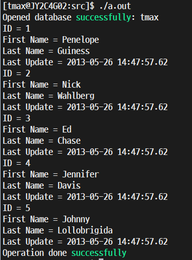

= libpqxx (C++ Interface)
:toc:
:toc-title:
:setnums:
:sectnums:

== libpqxx 지원 범위
[width="500%",options="header", cols="1,2,2"]
|==================
|libpqxx|C++|g++
|4.x|C++ 14|g++ 4.8~4.9
|7.x|C++ 17|g++ 6.1~
|8.x|C++ 20|
|==================

* libpqxx의 가장 최신 버전은 7.7.4 버전 (2022.05.23 기준)
* Centos 7 에서 지원하는 g++은 4.8.5 버전까지기 때문에 최신버전의 libpqxx는 사용할 수 없음
* g++ 버전 확인

   $ g++ --version
   g++ (GCC) 4.8.5 20150623 (Red Hat 4.8.5-44)
   Copyright (C) 2015 Free Software Foundation, Inc.
   This is free software; see the source for copying conditions.  There is NO
   warranty; not even for MERCHANTABILITY or FITNESS FOR A PARTICULAR PURPOSE

== 설치 환경
[width="500%",cols="1a,2"]
|==================
|*OS*|CentOS 7.6
|*PostgreSQL*|PostgreSQL 11.14
|*g++*|4.8.5
|*C++*|C++ 14
|*libpqxx*|4.0
|==================

== libpqxx 설치
=== 사전 설치
----
yum install gcc-c++ libpqxx-devel
----

=== libpqxx 4.0 버전 설치
----
wget http://pqxx.org/download/software/libpqxx/libpqxx-4.0.tar.gz

tar xvfz libpqxx-4.0.tar.gz

./configure
make
make install
----

=== 프로젝트 파일 생성
- pgtest.cpp
----
#include <iostream>
#include <pqxx/pqxx>

using namespace std;
using namespace pqxx;

int main(int argc, char* argv[]) {
   const char * sql;

   try {
      connection C("dbname = tmax user = postgres password = hypersql \
      hostaddr = 127.0.0.1 port = 5432");
      if (C.is_open()) {
         cout << "Opened database successfully: " << C.dbname() << endl;
      } else {
         cout << "Can't open database" << endl;
         return 1;
      }

      /* Create SQL statement */
      sql = "SELECT * from actor limit 5";

      /* Create a non-transactional object. */
      nontransaction N(C);

      /* Execute SQL query */
      result R( N.exec( sql ));

      /* List down all the records */
      for (result::const_iterator c = R.begin(); c != R.end(); ++c) {
         cout << "ID = " << c[0].as<int>() << endl;
         cout << "First Name = " << c[1].as<string>() << endl;
         cout << "Last Name = " << c[2].as<string>() << endl;
         cout << "Last Update = " << c[3].as<string>() << endl;
      }
      cout << "Operation done successfully" << endl;
      C.disconnect ();
   } catch (const std::exception &e) {
      cerr << e.what() << std::endl;
      return 1;
   }

   return 0;
}
----

=== 프로젝트 파일 컴파일
----
g++ pgtest.cpp -lpqxx -lpq
----
-> 컴파일 실행후 a.out 파일이 생성 되었는지 확인

=== 실행
----
./a.out
----

=== 실행 결과

