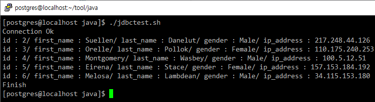
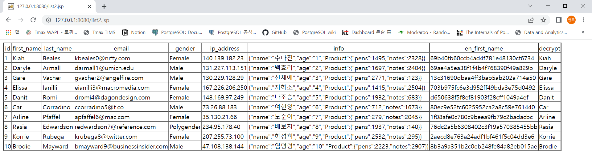

= PostgreSQL JDBC Driver 테스트
:toc:
:toc-title:

== *1. 테스트환경*
|=======
| OS | CentOS 7.6
| PostgreSQL Version | PostgreSQL 11.15
| JDBC Driver | postgresql-42.3.3.jar
| Java Version | OpenJDK 1.8
|=======

== *2. 제한사항*
=== *JDBC 버전과 JDK 호환성*
JDK 1.1 - JDBC 1. Note that with the 8.0 release JDBC 1 support has been removed, so look to update your JDK when you update your server. +
JDK 1.2, 1.3 - JDBC 2. +
JDK 1.3 + J2EE - JDBC 2 EE. This contains additional support for javax.sql classes. +
JDK 1.4, 1.5 - JDBC 3. This contains support for SSL and javax.sql, but does not require J2EE as it has been added to the J2SE release. +
JDK 6 - JDBC 4.0 Support for JDBC4 methods is not complete, but the majority of methods are implemented. +
JDK 7 - JDBC 4.1 Support for JDBC4 methods is not complete, but the majority of methods are implemented. +
JDK 8 - JDBC 4.2 Support for JDBC4 methods is not complete, but the majority of methods are implemented. +

|=======
| Driver Version | JDBC 4.0 (JDK 1.6 이상) | JDBC 4.1 (JDK 1.7 이상) | JDBC 4.2 (JDK 1.8 이상) 
|42.3.3||| 지원
|42.3.2||| 지원
|42.2.25|지원|지원| 지원
|42.3.1||| 지원
|42.3.0||| 지원
|42.2.24|지원|지원| 지원
|...|지원|지원| 지원
|42.0.0|지원|지원| 지원
|=======

== 3. 테스트 방법
1. 공식 사이트에서 jdbc 다운로드 https://jdbc.postgresql.org/ + 
2. 연동할 OS에서 연동할 프로그램의 라이브러리에 넣는다. + 
3. 테스트 환경에서 접속이 가능하도록 pg_hba.conf를 수정한다. + 
4. 샘플 코드등을 이용해 연동 테스트를 진행한다. + 
   -> 이 과정에서, 저는 간단하게 테스트 하기 위해서 아래의 java 코드를 사용하였습니다. +
   -> 아래의 테스트 방법을 따라 하시려면, yum으로 java-1.8.0-openjdk / java-1.8.0-openjdk-devel 설치 또는 소스 방식 설치가 필요합니다. +
   -> 소스 설치 방식으로 진행하실 경우 아래의 링크에서 OpenJDK1.8을 받아서 서버에 업로드 후, 압축을 풀어주세요. + 
   -> /hypersql/tool/jdk1.8 디렉토리에 압축을 풀었다는 기준으로 환경변수 설정을 진행하겠습니다. + 
   + 
*OpenJDK 1.8 다운로드* + 
https://github.com/ojdkbuild/contrib_jdk8u-ci
   
----  
vi ~/.bash_profile
   
제일 하단에 아래의 내용 추가
export JAVA_HOME=/hypersql/tool/jdk1.8
export PATH=$PATH:$JAVA_HOME/bin
   
:wq 명령어로 저장
   
source ~/.bash_profile
----

테스트를 진행할 디렉토리에 jdbc.java / compile.sh / jdbctest.sh 파일을 만들어주세요. +
파일에 작성할 코드는 아래에 있습니다. + 
sh 파일에 실행 권한을 부여한 다음, compile.sh 실행 후 jdbc.class 파일 생성을 확인후에 jdbctest.sh 파일을 실행하면 됩니다. + 
    + 
   
    
*jdbc.java* + 
아래의 접속 정보를 기준으로 작성하였습니다. + 
db명 : tmax / 계정 : tmax / 패스워드 : 1234 / table명: dummy / 추출컬럼명 : id, first_name, last_name, gender, ip_address

[source, java]
----
import java.sql.*;

public class jdbc{
    public static void main(String[] args) {
        Connection db = null;
        PreparedStatement pstmt = null;
        ResultSet rs = null;
        try{
                String url = "jdbc:postgresql:tmax"; // 데이터베이스 URL jdbc:postgresql:데이터베이스명" 형식을 취함
                String user = "tmax"; // 데이터베이스 접속 계정
                String pwd = "1234"; // 데이터베이스 접속 계정의 패스워드
                Class.forName("org.postgresql.Driver"); // PostgreSQL JDBC의 패키지안에 있는 Driver 클래스를 불러옴
                db = DriverManager.getConnection(url, user, pwd);
                System.out.println("Connection Ok");

                pstmt = db.prepareStatement("SELECT id,first_name,last_name,gender,ip_address from dummy limit 5"); // 실행할 SQL
                rs = pstmt.executeQuery();

                while(rs.next()){ // SQL문을 실행 결과 값을 출력하는 부분
                        System.out.println("id : " + rs.getString(1) + "/ first_name : " + rs.getString(2) + "/ last_name : " + rs.getString(3) + "/ gender : " + rs.getString(4) + "/ ip_address : " + rs.getString(5));
                }
                rs.close();
                pstmt.close();
                db.close();
        }catch(Exception e){
                System.out.println("e :"+e);
                if(rs != null){
                        try{rs.close();} catch(Exception re){System.out.println("re : "+re);}
                }
                if(pstmt != null){
                        try{pstmt.close();} catch(Exception pe){System.out.println("pe : "+pe);}
                }
                if(db != null){
                        try{db.close();} catch(Exception de){System.out.println("de : "+de);}
                }
        }
        finally{
                System.out.println("Finish");
        }
    }
}
----

*compile.sh*
[source, sh]
----
javac -cp ".:./postgresql-42.3.3.jar" jdbc.java
----

*jdbctest.sh*
[source, sh]
----
java -cp ".:./postgresql-42.3.3.jar" jdbc
----
   
== *4. 테스트 결과*
 + 

==== WAS

