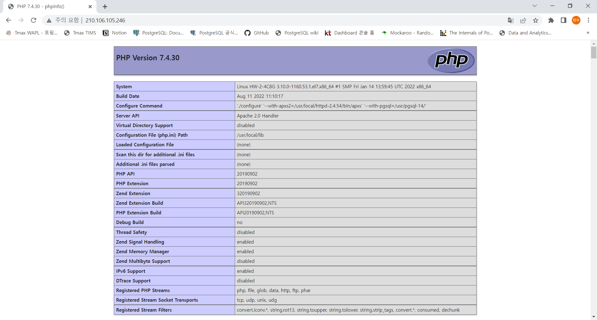
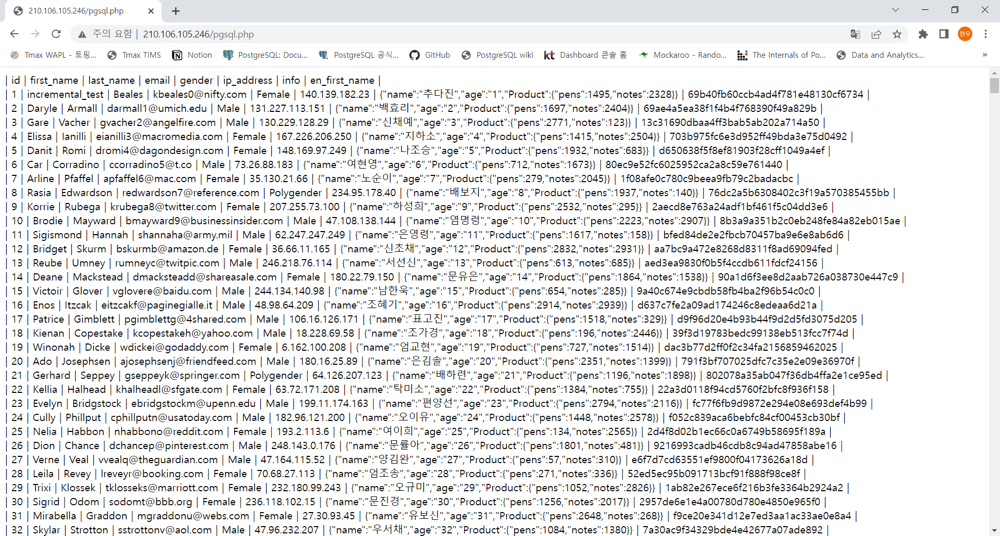

= PHP
:toc:
:toc-title:
:setnums:
:sectnums:

== 설치 환경
[width="500%",cols="1a,2"]
|==================
|*OS*|CentOS 7.6
|*PostgreSQL*|PostgreSQL 14.4
|*php*|7.4.30
|*Apache*|2.4.54
|==================

== 설치 과정
=== Apache 설치
* PHP 테스트를 진행하기 위해 Apache를 설치 합니다. + 
* 테스트 계정은 hypersql 계정에 sudo 권한을 부여하여 진행 하였고, root 계정으로 진행 하셔도 됩니다.
* 테스트 디렉토리는 /hypersql/interface/php 기준으로 작성되었습니다.

==== Requirements
[source, sh]
----
sudo yum -y install gcc make gcc-c++ pcre-devel expat-devel sqlite-devel
----

==== Apache Portable Runtime 설치
[source, sh]
----
cd /hypersql/interface/php
wget https://mirror.navercorp.com/apache/apr/apr-1.7.0.tar.gz

tar xvzf apr-1.7.0.tar.gz

cd apr-1.7.0
cp libtool ilbtoolT
./configure --prefix=/usr/local/apr-1.7.0
make
sudo make install
----

==== Apache Portable Runtime 설치
[source, sh]
----
cd /hypersql/interface/php
wget https://mirror.navercorp.com/apache/apr/apr-1.7.0.tar.gz

tar xvzf apr-1.7.0.tar.gz

cd apr-1.7.0
cp libtool ilbtoolT
./configure --prefix=/usr/local/apr-1.7.0
make
sudo make install
----

==== Apache Portable Runtime Utility 설치
[source, sh]
----
cd /hypersql/interface/php
wget https://mirror.navercorp.com/apache//apr/apr-util-1.6.1.tar.gz

tar xvzf apr-1.6.1.tar.gz

cd apr-util-1.6.1
./configure --prefix=/usr/local/apr-util-1.6.1 --with-apr=/usr/local/apr-1.7.0
make
sudo make install
----

==== Perl Compatible Regular Expressions 설치
[source, sh]
----
cd /hypersql/interface/php
wget https://sourceforge.net/projects/pcre/files/pcre/8.45/pcre-8.45.tar.gz/download

tar xvzf pcre-8.45.tar.gz

cd pcre-8.45
./configure --prefix=/usr/local/pcre-8.45
make
sudo make install
----

==== Apache 2.4.54 설치
[source, sh]
----
cd /hypersql/interface/php
wget https://mirror.navercorp.com/apache//httpd/httpd-2.4.54.tar.gz

tar xvzf httpd-2.4.54.tar.gz

cd httpd-2.4.54.tar.gz
./configure --prefix=/usr/local/httpd-2.4.54 \
--with-apr=/usr/local/apr-1.7.0 \
--with-apr-util=/usr/local/apr-util-1.6.1 \
--with-pcre=/usr/local/pcre-8.45 \
--enable-mpms-shared=all \
--enable-so

# make를 진행하기 이전에 아래 파일 수정
vi build/config_vars.mk

# AP_LIBS 가장 마지막에 -lexpat 추가
# AP_LIBS는 환경에 따라 내용이 다를 수 있으므로 줄의 마지막에 -lexpat만 넣어 주시면 됩니다.
AP_LIBS = $(MOD_SO_LDADD) $(MOD_HTTP_LDADD) /usr/local/apr-util-1.6.1/lib/libaprutil-1.la /usr/local/apr-1.7.0/lib/libapr-1.la -lrt -lcrypt -lpthread -ldl -lexpat

# 저장

# make시 코어 수는 환경에 맞게 조정해주세요.
make -j 4 
sudo make install

# php 설정을 해야하므로 apache를 종료 해줍니다.
sudo /usr/local/httpd-2.4.54/bin/apachectl stop
----

=== PHP 설치 및 연동
==== 설치
* 설치 시 요구 라이브러리는 Apache 설치시에 같이 설치하였습니다.

[source, sh]
----
wget https://www.php.net/distributions/php-7.4.30.tar.gz

tar xvzf php-7.4.30.tar.gz

cd php-7.4.30
./configure --with-apxs2=/usr/local/httpd-2.4.54/bin/apxs --with-pgsql=/usr/pgsql-14/

make
sudo make install
----

==== Apahce 연동
[source, sh]
----
# Apache의 config 파일인 httpd.conf를 열어서 수정
sudo vi /usr/local/httpd-2.4.54/conf/httpd.conf

# mod_mpm_event 주석 처리
# mod_mpm_prefork 주석 해제
#LoadModule mpm_event_module modules/mod_mpm_event.so
LoadModule mpm_prefork_module modules/mod_mpm_prefork.so
#LoadModule mpm_worker_module modules/mod_mpm_worker.so

# php 모듈 로딩 추가
# php 버전에 따라서 libphp7.so의 이름이 다릅니다.
# Ex) php 5버전일 경우 libphp5.so
LoadModule php5_module /usr/lib64/httpd/modules/libphp7.so

# dir_module 검색 하여 수정
# 메인 페이지로 읽어올 수 있도록 index.php 추가
<IfModule dir_module>
    DirectoryIndex index.html index.php
</IfModule>

# php 타입 추가
# AddType 검색 후 아래의 내용 추가
    AddType application/x-httpd-php .php .html .htm .inc
    AddType application/x-httpd-php-source .phps

# 파일 저장
# 아파치 기동

sudo /usr/local/httpd-2.4.54/bin/apachectl start
----

== 테스트

=== Apache - PHP 연동 테스트
.index.php 생성
[source, sh]
----
cd /usr/local/httpd-2.4.54/htdocs
vi index.php
----

.index.php
[source, php]
----
<?php
  phpinfo();
?>
----

*접속 확인* : http://ip/

=== PHP - PostgreSQL 연동 테스트
.pgsql.php 생성
[source, sh]
----
cd /usr/local/httpd-2.4.54/htdocs
vi pgsql.php
----

*Database 접속 정보 / Query를 변경하여 사용 하시기 바랍니다.*

.pgsql.php
[source, php]
----
<?php
  $db_host = "host=127.0.0.1";
  $db_port = "port=5432";

  $db_pw = "user=postgres";
  $db_name = "dbname=postgres";

  $connect_db = pg_connect("$db_host $db_port $db_name $db_pw") or die('Connection Failed');

  $query = 'SELECT * FROM one ORDER BY id';
  $rs = pg_query($connect_db, $query);

  $i = pg_num_fields($rs);
  echo "| ";
  for ($j = 0; $j < $i; $j++) {
      $fieldname = pg_field_name($rs, $j);
      echo "$fieldname |\n";
  }

  echo " \n";
  while($row = pg_fetch_row($rs)){
    echo "| ";
    for ($r = 0; $r < $i; $r++) {
       echo " $row[$r] |";
    }
    echo " \n";
  }

  pg_close($connect_db);
?>
----

*접속 확인* : http://ip/pgsql.php

