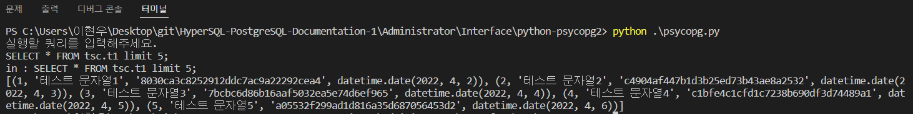
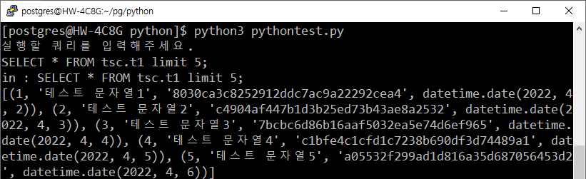

= Python-psycopg2
:toc:
:toc-title: 목차

== *1. 테스트환경*

=== Windows
|=======
| OS | Windows 10 21H2
| PostgreSQL Version | PostgreSQL 11.14
| Python Version | Python 3.10.4
| Driver Version | psycopg 2.9.3
|=======

=== Linux
|=======
| OS | CentOS 7.6
| PostgreSQL Version | PostgreSQL 11.14
| Python Version | Python 3.6.8
| Driver Version | psycopg 2.9.3
|=======

== *2. 지원범위*
OpenSource Interface. + 
psycopg1은 Python으로 작성되어있습니다. + 
빌드 과정이 어렵다 보니 이를 간략화한 것이 psycopg2이며, C언어로 작성되었습니다. + 
https://github.com/psycopg/psycopg2 + 
라이센스 : Free BSD, GNU Lesser General Public License + 
|===
|Python Version|3.6 ~ 3.10
|PostgreSQL Version|7.4 ~ 14
|===

== *3. 테스트 환경 구축*

=== Windows
*1. python3 설치* +
`https://www.python.org/downloads/` + 
 + 
*2. psycopg2 설치* + 
터미널(VS Code 또는 CMD 활용) 오픈
`pip3 install psycopg2` + 
 + 
 + 
 
=== Linux
*1. 종속성 라이브러리 설치* + 
`sudo yum install postgresql-devel` +
 + 
*2. python3 설치* +
`sudo yum install python3` + 
`sudo yum install python3-devel` + 
`sudo yum install python3-pip`  + 
 + 
*3. psycopg2 설치* + 

==== 2.1 소스방식

테스트 할 디렉토리에서 git clone + 
 `git clone https://github.com/psycopg/psycopg2.git` + 
 `cd psycopg2` + 
 `python3 setup.py build` + 
 `sudo python3 setup.py install` + 
 
==== 2.2 pip3를 이용한 패키지 설치 방식
아래의 명령어 실행(VS Code 또는 CMD 활용) + 
`pip3 install psycopg2` +  

==== 2.3 pip3를 이용하여 설치된 패키지 버전 확인
`pip3 show psycopg2`

[source, bash]
-----
$ pip3 show psycopg2
Name: psycopg2
Version: 2.9.3
Summary: psycopg2 - Python-PostgreSQL Database Adapter
Home-page: https://psycopg.org/
Author: Federico Di Gregorio
Author-email: fog@initd.org
License: LGPL with exceptions
Location: /usr/local/lib64/python3.6/site-packages
Requires: 
-----

=== *테스트 진행*
*1. `pgtest.py` 생성*
[source, python]
----
import psycopg2

try:
    con = psycopg2.connect("host=210.106.105.55 dbname=tmax user=tmax password=1234 port=5432")
    cur = con.cursor()
    query = input('실행할 쿼리를 입력해주세요. \n')
    print("in : "+query)
    cur.execute(query) 
    datas = cur.fetchall()
except Exception as e:
    print('Connection Error')
    print(e)
else:
    print(datas)
finally:
    if cur:
        cur.close()
    if con:
        con.close()
----

*2. 아래의 명령어로 pgtest.py 실행* + 
`python3 pgtest.py`
`실행할 쿼리를 입력해주세요.` 출력시, 쿼리 입력후 엔터

== 4. 테스트 결과
=== Windows 

=== Linux

== 5. 주의사항
출력 결과가 다른 인터페이스와 다르게 표준 출력이 아니므로, 출력을 확인 후에 사용 바랍니다.
