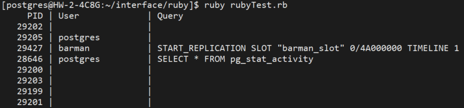

= Ruby
:toc:
:toc-title:
:setnums:
:sectnums:

== 설치 환경
[width="500%",cols="1a,2"]
|==================
|*OS*|CentOS 7.6
|*PostgreSQL*|PostgreSQL 14.4
|*Ruby*|3.1.2
|*Driver*|ruby-pg 1.4.3
|==================

== 설치 과정
=== 주의사항
* Ruby Client Interface를 테스트 하기 위해 Ruby를 설치 합니다. + 
* 테스트 계정은 hypersql 계정에 sudo 권한을 부여하여 진행 하였고, root 계정으로 진행 하셔도 됩니다.
* 테스트 디렉토리는 /hypersql/interface/ruby 기준으로 작성되었습니다.

=== Requirements
* Ruby > 2.4
* PostgreSQL > 9.3

=== Ruby 설치
[source, sh]
----
cd /hypersql/interface/ruby
wget https://cache.ruby-lang.org/pub/ruby/3.1/ruby-3.1.2.tar.gz
tar xvzf ruby-3.1.2

cd ruby-3.1.2
./configure
make -j 4
sudo make install
----

=== Ruby-pg 설치
[source, sh]
----
# pg_config의 위치를 본인의 환경에 맞게 변경해주시기 바랍니다.
# which pg_config
sudo gem install pg -- --with-pg-config=/usr/pgsql-14/bin/pg_config
sudo로 설치 안된다면, root 계정에서 수행
gem install pg -- --with-pg-config=/usr/pgsql-14/bin/pg_config
----

== 테스트
.rubyTest.rb 생성
[source, sh]
----
cd /hypersql/interface/ruby
vi rubyTest.rb
----

.rubyTest.rb
[source, ruby]
----
#!/usr/bin/env ruby

require 'pg'

# Output a table of current connections to the DB
conn = PG.connect( dbname: 'postgres' )
conn.exec( "SELECT * FROM pg_stat_activity" ) do |result|
  puts "     PID | User             | Query"
  result.each do |row|
    puts " %7d | %-16s | %s " %
      row.values_at('pid', 'usename', 'query')
  end
end
----

*Database 접속 정보를 변경하여 사용 하시기 바랍니다.*

