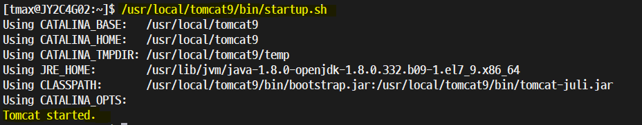
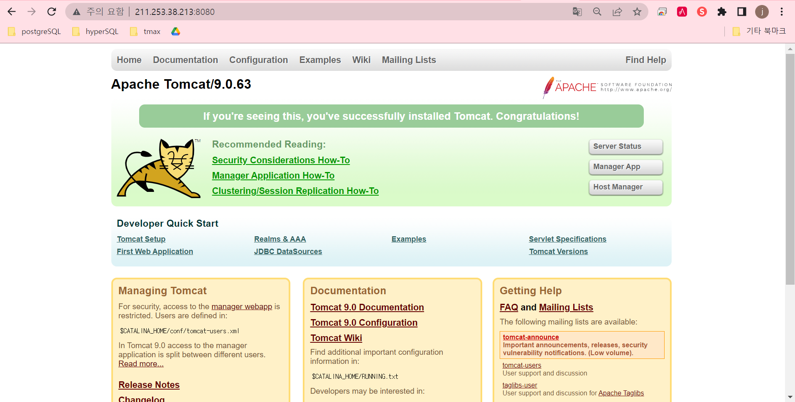
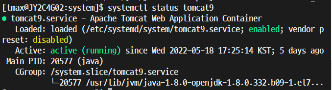
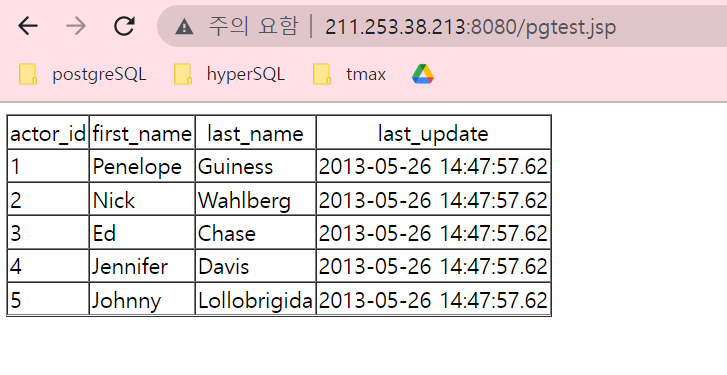

= Tomcat (WAS)
:toc:
:toc-title:
:setnums:
:sectnums:

== 설치 환경
[width="500%",cols="1a,2"]
|==================
|*OS*|CentOS 7.6
|*PostgreSQL*|PostgreSQL 11.14
|*jdbc driver*|42.3.5
|*java*|OpenJDK 1.8
|*Tomcat*|9.0.63
|==================

== 설치 과정
=== Tomcat 설치 준비
==== jdk 설치
* Tomcat을 사용하기 위해 jdk를 설치 합니다.

===== open-jdk 1.8 설치
[source,bash]
----
yum install java-1.8.0-openjdk java-1.8.0-openjdk-devel
----

===== 실제 경로 확인
[source,bash]
----
[tmax@JY2C4G02:~]$ readlink -f /usr/bin/java

/usr/lib/jvm/java-1.8.0-openjdk-1.8.0.332.b09-1.el7_9.x86_64/jre/bin/java
----

===== 환경변수 설정
[source,bash]
----
JAVA_HOME=/usr/lib/jvm/java-1.8.0-openjdk-1.8.0.332.b09-1.el7_9.x86_64
PATH=$PATH:$JAVA_HOME/bin
CLASSPATH=$JAVA_HOME/jre/lib:$JAVA_HOME/lib/tools.jar
export JAVA_HOME PATH CLASSPATH
----

=== Tomcat 설치
==== Tomcat 다운로드 및 압축 해제
- Tomcat 사이트에 가서 직접적으로 tar.gz파일을 다운받아도 됨.
[source,bash]
----
wget https://dlcdn.apache.org/tomcat/tomcat-9/v9.0.63/bin/apache-tomcat-9.0.63.tar.gz

tar -zxvf apache-tomcat-9.0.63.tar.gz
----
==== 디렉토리 설정
- 압축해제한 파일을 /usr/local 로 옮긴 후 폴더이름을 *tomcat9* 로 바꿔줍니다.
[source,bash]
----
mv apache-tomcat-9.0.63 /usr/local/tomcat9
----

==== Tomcat 설정 및 환경변수 등록
===== tomcat 설정
[source,bash]
----
vi /usr/local/tomcat9/conf/server.xml

<Connector port="8080" protocol="HTTP/1.1"
               connectionTimeout="20000"
               redirectPort="8443"
                URIEncoding="UTF-8" />
----

===== 환경변수 등록
[source,bash]
----
vi ~/.bash_profile

CATALINA_HOME=/usr/local/tomcat9

export PATH=$PATH:$JAVA_HOME/bin:$CATALINA_HOME/bin
CLASSPATH=$JAVA_HOME/jre/lib:$JAVA_HOME/lib/tools.jar:$CATALINA_HOME/lib/jsp-api.jar:$CATALINA_HOME/lib/sevelt-api.jar

export CLASSPATH CATALINA_HOME
----

=== Tomcat 실행
[source,bash]
----
/usr/local/tomcat9/bin/startup.sh
----

==== 포트확인
- 8080 포트가 열려있는지 확인합니다.
[source,bash]
netstat -ntl | grep 8080

=== 접속 확인
__http://[IP Address]:8080/__

=== systemctl 등록
- 매번 `/usr/local/tomcat9/bin/startup.sh` 을 사용하지 않고 서버를 보다 쉽게 실행하기 위해서 systemctl 을 등록해줍니다.
- 톰캣의 상태를 쉽게 확인할 수 있습니다.

[source,bash]
----
vi /etc/systemd/system/tomcat9.service

#systemd unit file for tomcat
[Unit]
Description=Apache Tomcat Web Application Container
After=syslog.target network.target
#systemd unit file for tomcat
[Unit]
Description=Apache Tomcat Web Application Container
After=syslog.target network.target

[Service]
Type=forking

Environment="JAVA_HOME=/usr/lib/jvm/java-1.8.0-openjdk-1.8.0.332.b09-1.el7_9.x86_64/"
Environment="CATALINA_HOME=/usr/local/tomcat9"
Environment="CATALINA_BASE=/usr/local/tomcat9"

ExecStart=/usr/local/tomcat9/bin/startup.sh
ExecStop=/usr/local/tomcat9/bin/shutdown.sh

User=root
Group=root
UMask=0007
RestartSec=10
Restart=always

[Install]
WantedBy=multi-user.target
----

==== 설정후 systemctl 리로드
[source,bash]
----
systemctl daemon-reload

systemctl enable tomcat9
----

==== tomcat9.service 실행
[source,bash]
----
systemctl start tomcat9
----

=== 실행 상태 확인
[source,bash]
----
systemctl status tomcat9
----

=== JDBC
- JDBC 파일을 tomcat 라이브러리 폴더에 넣습니다.
[source,bash]
----
cp  postgresql-42.3.5.jar /usr/local/tomcat9/lib
----

=== 프로젝트 파일 작성
- /usr/local/tomcat9/webapps/ROOT 디렉토리 안에 작성해야합니다.
- pgtest.jsp
[source,html]
----

<%@page contentType="text/html;charset=utf-8" import="java.sql.*" %>
<%

Connection db = null;
PreparedStatement pstmt = null;
ResultSet rs = null;
int columnCount = 0;

try{
    String url = "jdbc:postgresql://localhost/tmax";
    String user = "postgres";
    String pwd = "hypersql";
    Class.forName("org.postgresql.Driver");
    db = DriverManager.getConnection(url, user, pwd);

    pstmt = db.prepareStatement("SELECT * from actor limit 5;");
    rs = pstmt.executeQuery();
    ResultSetMetaData rsmd = rs.getMetaData();
    columnCount = rsmd.getColumnCount();

%><table border="1" cellspacing="0">

<tr align="center">
	<% for(int i=1; i<=columnCount; i++) { %>
		<td> <%=rsmd.getColumnName(i)%> </td>
	<%}%>
</tr>
<%
		while(rs.next()){
%>
	<tr>
		<% for(int j=1; j<=columnCount; j++) { %>
			<% if(rsmd.getColumnClassName(j).contains("Integer")) { %> <td><%=rs.getInt(j)%></td>
			<% } else  { %> <td><%=rs.getString(j)%></td> <%}%>
		<%}%>
<%
	}
%>
</tr>
</table>

<%
	if(rs != null) try { rs.close(); } catch(Exception rse){ rse.printStackTrace();}  finally{ rs.close(); };
	if(pstmt != null) try { pstmt.close(); } catch(Exception pste){ pste.printStackTrace();}  finally{ pstmt.close(); };
	if(db != null) try { db.close(); } catch(Exception dbe){ dbe.printStackTrace();}  finally{ db.close(); };
}

catch (SQLException e){
out.println("err:"+e.toString());
}
%>
----
==== 데몬 재실행
[source,bash]
----
systemctl restart tomcat9.service
----

== 접속 및 DB 연결 확인
__http://[IP Address]:8080/pgtest.jsp__

