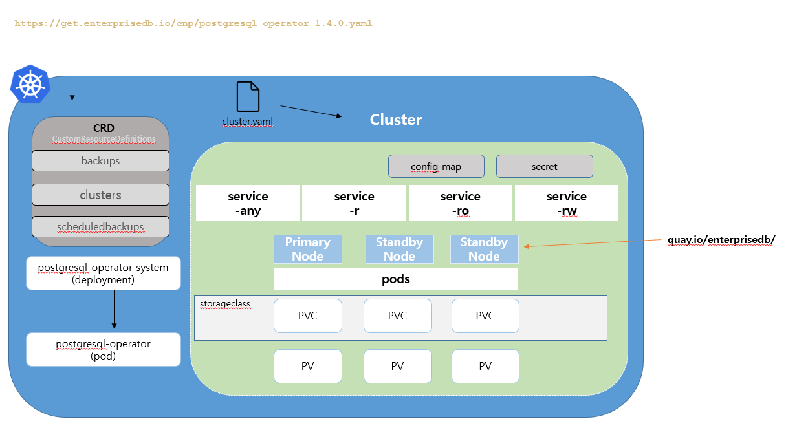
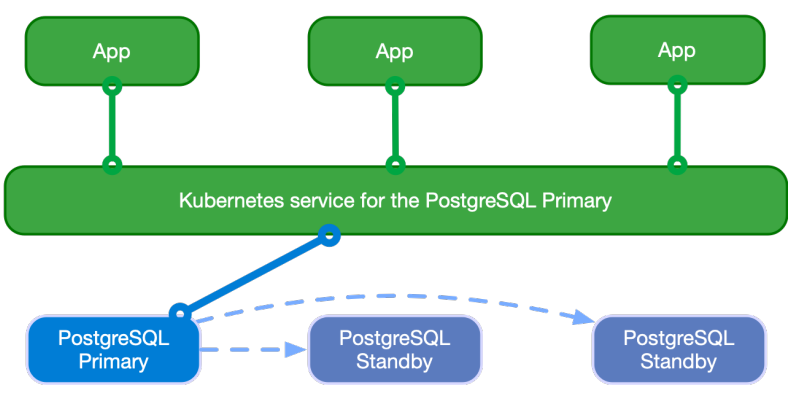
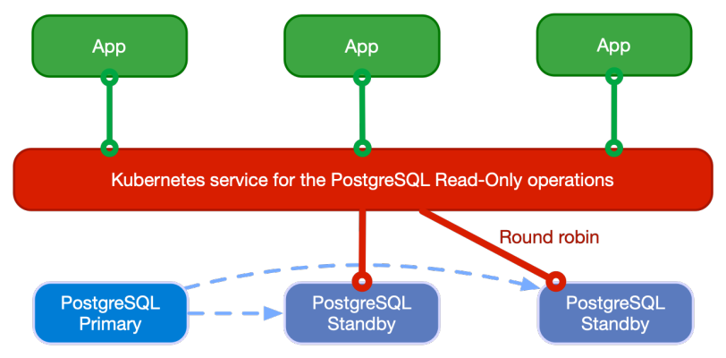

= Cloud Native PostgreSQL
:toc:
:toc-title:
:table-caption!:
:sectnums:

== 개요
- 참고 : https://docs.enterprisedb.io/cloud-native-postgresql/1.7.1/ +
Cloud Native PostgreSQL은 EnterpriseDB에서 제공하는 PostgreSQL을 Kubernetes Cluster의 여러가지 환경에서 사용할 수 있도록 해주는 operator입니다. +

=== license
무료로 사용할 수 있는 license는 30일까지 체험 라이센스를 사용할 수 있습니다. +
**company level license keys** 는 무제한으로 사용할 수 있습니다. + 
[source,bash]
kubectl get cluster cluster_example -o yaml
[...]
status:
[...]
licenseStatus:
licenseExpiration: "2021-11-06T09:36:02Z"
licenseStatus: Trial
valid: true
isImplicit: false
isTrial: true
[...]

== Cloud Native PostgreSQL 기능
- external tool 없이 Kubernetes API를 통하여 HA서버 통합
- Self-Healing 
  * faliover
  * replica의 자동 생성
- 복제본을 승격하여 Primary Instace로부터 Switchover
- Scale up/down
- Instance 수의 정의 (Min : 1 [Primary])
- Service(RW, RO, R)정의
- Read-Only 서비스 정의, 어플리케이션과의 연결
- PVC template으로 Local PVC 지원
- Pod에 PVC 재사용
- TLS 연결 및 클라이언트 연결 인증서 인증 지원
- 사용자 지정 TLS 인증서 지원(cert-manager)
- S3 호환 - 지속적인 백업, Full recovery와 Point-In-Time recovery 지원
- Synchronous Replicas 지원
- nodeSelector를 통한 node affinity 지원
- Prometheus에 대한 사용자 정의 metric 내보내기
- JSON 형식의 PostgreSQL 오류 메세지 표준 출력 로깅
- OpenShift에서 `restricted` security context constraint(SCC) 지원
- kubectl을 위한 `cnp` plugin 지원

=== 세부 기능
- link:https://docs.enterprisedb.io/cloud-native-postgresql/1.7.1/bootstrap/[bootstrap 기능]
 * Cluster 생성 시 initdb, recovery, pg_basebackup 기능 제공
- link:https://docs.enterprisedb.io/cloud-native-postgresql/1.7.1/security/[security]
 * Code 레벨 : CI/CD 파이프라인에서 직접 GolangCI-Lint를 사용하여 보안 문제 분석
 * Container 레벨 : CI/CD 파이프라인을 통해 컨테이너 이미지를 commit할 때마다 자동 빌드(operator, non-operator like PostgreSQL and EDB Postgre Advanced) +
 link:https://github.com/goodwithtech/dockle[Dockle], link:https://github.com/quay/clair[Clair]
 * Cluster 레벨 : control plane, node, Cluster 위에서 동작하는 Application +
 Pod Security Policy, Network Policy, Exposed Ports, PostgreSQL
- link:https://docs.enterprisedb.io/cloud-native-postgresql/1.7.1/scheduling/[cloud level Scheduling] +
 * pod affinity/anti-affinity
 * node selectors
 * tolerations
- link:https://docs.enterprisedb.io/cloud-native-postgresql/1.7.1/resource_management/[Resource Management]
 * CPU, RAM 사용량 allocate (shared_buffers 포함)
- https://docs.enterprisedb.io/cloud-native-postgresql/1.7.1/failure_modes/[Failure Mode 가이드(operator의 기능이 아님)]
 * 여러 pod의 장애상황을 가이드
- link:https://docs.enterprisedb.io/cloud-native-postgresql/1.7.1/rolling_update/][Rolling Update 기능]
- link:https://docs.enterprisedb.io/cloud-native-postgresql/1.7.1/replication/[Replication 기능]
 * replica를 통한 Streaming Replication, Synchronous Replication
- link:https://docs.enterprisedb.io/cloud-native-postgresql/1.7.1/backup_recovery/[Backup & Recovery]
 * WAL 및 기본 백업, S3 호환, 예약 백업
 * bootstrap을 이용한 recovery
- link:https://docs.enterprisedb.io/cloud-native-postgresql/1.7.1/postgresql_conf/[PostgreSQL 설정]
 * yaml 설정으로 postgresql.conf, pg_hba.conf 설정
- link:https://docs.enterprisedb.io/cloud-native-postgresql/1.7.1/operator_conf/[operator 설정]
 * EDB_LICENSE_KEY, annotation, lable 등을 secret과 configMap 오브젝트를 통해 관리
- link:https://docs.enterprisedb.io/cloud-native-postgresql/1.7.1/storage/[Storage]
 * storage(PV) 용량 설정, storage class 지정 및 설정, PVC template 제공, Storage 확장, PVC 재생성 
- link:https://docs.enterprisedb.io/cloud-native-postgresql/1.7.1/labels_annotations/[Labels and annotations]
 * Cluster의 Lable 및 Annotation 지원
- link:https://docs.enterprisedb.io/cloud-native-postgresql/1.7.1/samples/[Configuration Sample]
- link:https://docs.enterprisedb.io/cloud-native-postgresql/1.7.1/monitoring/[Monitoring]
 * Prometheus를 통한 HTTP(port:9187)을 이용해 metric 추출
- link:https://docs.enterprisedb.io/cloud-native-postgresql/1.7.1/logging/[Logging]
 * JSON 형식의 logging 지원, PGAaudit, EDB audit(EPAS)
- link:https://docs.enterprisedb.io/cloud-native-postgresql/1.7.1/certificates/[Certificates]
 * TLS 인증서 지원
- link:https://docs.enterprisedb.io/cloud-native-postgresql/1.7.1/ssl_connections/[Client TLS/SSL Connections]
 * cnp 플러그인을 통한 TLS 클라이언트 인증서 발급 및 연결 가능
- link:https://docs.enterprisedb.io/cloud-native-postgresql/1.7.1/kubernetes_upgrade/[Kubernetes Upgrade]
- link:https://docs.enterprisedb.io/cloud-native-postgresql/1.7.1/expose_pg_services/[PostgreSQL Service 노출]
 * NGINX Ingress Controller를 이용하여 서비스를 외부로 노출 지원
- link:https://docs.enterprisedb.io/cloud-native-postgresql/1.7.1/cnp-plugin/[Cloud Native PostgreSQL Plugin]
 * kubectl의 plugin인 `cnp` 제공 (상태조회, promote, certficate, restart, reload)

== Architecture

HA(High Availability)를 위한 PostgreSQL database management system입니다. WAL(Write Ahead Log) shipping 을 이용한 물리적 복제로 관리합니다. 비동기/동기 streaming replication으로 멀티 hotstandby replicas를 지원합니다. 

-  하나의 Primary와 Multi-Standby를 이용한 Replication
- Application 접근을 위한 서비스 제공
 * -rw : application은 Read/Write를 위해 Primary Instance에 접근
 * -ro : application은 Read-Only를 위해 Hot Standby Instance에만 접근
 * -r : application은 Read-Only를 위해 모든 Instance에 접근
- PostgreSQL의 복원력을 위한 Shared-nothing 아키텍쳐
 * PostgreSQL는 Work Node에만 존재해야하며 네트워크만을 공유합니다.
 * PostgreSQL은 같은 region 안에서만 다른 zone에 존재합니다.
 * 모든 노드의 PostgreSQL Cluster는 모두 같은 region에 있어야 합니다.

=== Read-Write workloads

=== Read-only workloads

=== Application deployments
kube-proxy로 해당 서비스들을 위한 VIP를 이용하여 관리합니다. link:https://kubernetes.io/docs/concepts/services-networking/service/#virtual-ips-and-service-proxies[Kubernetes Service]

- [cluster name]-rw
- [cluster name]-ro
- [cluster name]-r

=== DNS resolution
Kubernetes의 DNS service를 이용하여 operator에 server들을 지정할 수 있게 합니다. Application들은 PostgreSQL Cluster에 배포될 경우 동일한 namespace를 사용하면 service name으로 사용할 수 있습니다. 만약 다른 PostgreSQL Cluster에 존재할 경우에는 `service-name.namespace-name`으로 사용할 수 있습니다.

=== Environment variables
PostgreSQL Cluster와 같은 namespace에 application을 배포할 경우 환경변수를 통해 database 접근이 가능합니다.

- PG_DATABASE_R_SERVICE_HOST : Read-Only 를 위한 PostgreSQL Instance의 IP주소
- PG_DATABASE_RO_SERVICE_HOST : 모든 hot-standby PostgreSQL Instance의 IP주소
- PG_DATABASE_R_WSERVICE_HOST : Primary PostgreSQL Instance의 IP주소 

=== Secrets
Secret은 username, password, .pgpass file과 같은 database의 중요정보들을 가지고 있습니다.

- [cluster name]-superuser
- [cluster name]-app

`superuser`는 admin을 위한 secret이고, app은 application에 연결할 때 사용하는 PostgreSQL Cluster입니다.

== Installation and upgrades
=== kubernetes 환경에서 설치
yaml로 작성된 manifest를 이용하여 operator를 설치할 수 있습니다.
[source, bash]
kubectl apply -f \
https://get.enterprisedb.io/cnp/postgresql-operator-1.4.0.yaml

설치 후 kubectl을 통해 설치가 이루어진 것을 확인 할 수 있습니다. 
[source, bash]
[root@PG-Kube-Node1 ~]# kubectl get deploy -n postgresql-operator-system postgresql-operator-controller-manager
NAME                                     READY   UP-TO-DATE   AVAILABLE   AGE
postgresql-operator-controller-manager   1/1     1            1           3m1s

=== OpenShift 환경에서 설치
<추후 추가 예정>

=== operator deployment 설명
operator는 "postgresql-operator-system" namespace의 "postgresql-operator-controller-manager" deployment를 확인 할 수 있습니다.
[source, bash]
kubectl describe deploy -n postgresql-operator-system postgresql-operator-controller-manager
kubectl get pods -n postgresql-operator-system

- 결과 +
다른 deploy와 마찬가지로 롤링 업그레이드를 지원하며, 기본적으로 1개의 replica만 지원합니다. 향후에는 multi-replicas 와 leader election, taints, toleration도 지원할 예정입니다.
[source, bash]
[root@PG-Kube-Node1 ~]# kubectl describe deploy -n postgresql-operator-system postgresql-operator-controller-manager
Name:                   postgresql-operator-controller-manager
Namespace:              postgresql-operator-system
CreationTimestamp:      Thu, 12 May 2022 20:01:11 +0900
Labels:                 app.kubernetes.io/name=cloud-native-postgresql
Annotations:            deployment.kubernetes.io/revision: 1
Selector:               app.kubernetes.io/name=cloud-native-postgresql
Replicas:               1 desired | 1 updated | 1 total | 1 available | 0 unavailable
StrategyType:           RollingUpdate
MinReadySeconds:        0
RollingUpdateStrategy:  25% max unavailable, 25% max surge
Pod Template:
  Labels:           app.kubernetes.io/name=cloud-native-postgresql
  Service Account:  postgresql-operator-manager
  Containers:
   manager:
    Image:       quay.io/enterprisedb/cloud-native-postgresql:1.4.0
    Ports:       8080/TCP, 9443/TCP
    Host Ports:  0/TCP, 0/TCP
    Command:
      /manager
    Args:
      controller
      --enable-leader-election
      --config-map-name=postgresql-operator-controller-manager-config
    Limits:
      cpu:     100m
      memory:  1Gi
    Requests:
      cpu:      100m
      memory:   100Mi
    Liveness:   http-get https://:9443/readyz delay=0s timeout=1s period=10s #success=1 #failure=3
    Readiness:  http-get https://:9443/readyz delay=0s timeout=1s period=10s #success=1 #failure=3
    Environment:
      OPERATOR_IMAGE_NAME:  quay.io/enterprisedb/cloud-native-postgresql:1.4.0
      OPERATOR_NAMESPACE:    (v1:metadata.namespace)
    Mounts:
      /controller from scratch-data (rw)
  Volumes:
   scratch-data:
    Type:       EmptyDir (a temporary directory that shares a pod's lifetime)
    Medium:     
    SizeLimit:  <unset>
Conditions:
  Type           Status  Reason
  ----           ------  ------
  Available      True    MinimumReplicasAvailable
  Progressing    True    NewReplicaSetAvailable
OldReplicaSets:  <none>
NewReplicaSet:   postgresql-operator-controller-manager-6c5b66dc79 (1/1 replicas created)
Events:
  Type    Reason             Age   From                   Message
  ----    ------             ----  ----                   -------
  Normal  ScalingReplicaSet  9m8s  deployment-controller  Scaled up replica set postgresql-operator-controller-manager-6c5b66dc79 to 1
[root@PG-Kube-Node1 ~]# kubectl get pods -n postgresql-operator-system

=== Upgrade
Cloud Native PostgreSQL operator는 2-step으로 Upgrade를 진행합니다.

1. controller와 Kubernetes 자원과 연관된 것을 upgrade +
일반적으로 일반 Kubernetes 설치에 최신 버전의 매니페스트를 적용하거나 사용된 deploy의 기본 패키지 관리자를 사용하여 수행됩니다.
2. PostgreSQL pod 에서 동작하는 Instance manager를 upgrade +
controller를 업데이트한 후 자동으로 실행되어 배포된 모든 PostgreSQL instance가 새로운 instance management를 사용하도록 롤링 업데이트를 트리거합니다. primaryUpdateStrategy가 supervised로 설정된 경우 사용자는 kubectl용 cnp 플러그인을 통해 새 인스턴스를 수동으로 승격(promote)하여 롤링 업데이트를 완료해야 합니다.

==== 호환성
operator의 version은 release notes에 명시되지 않는 한 이전 버전과 호환됩니다. 보통의 경우에는 직접 upgrade가 manifest를 통해서 가능하지만 직접 upgrade가 불가한 경우에는 이전 버전의 operator를 삭제한 후에 새로 설치해야 합니다.
[source, bash]
kubectl delete deployments -n postgresql-operator-system postgresql-operator-controller-manager

--
NOTE: operator controller deployment를 삭제하더라도 PostgreSQL Cluster에서 deploy된 것들은 삭제되지 않습니다.
--

== Install Cloud Native PostgreSQL

=== PostgreSQL cluster 배포
[source,yaml]
-----
# Example of PostgreSQL cluster
apiVersion: postgresql.k8s.enterprisedb.io/v1
kind: Cluster
metadata:
name: cluster-example
spec:
instances: 3
# Example of rolling update strategy:
# - unsupervised: automated update of the primary once all
# replicas have been upgraded (default)
# - supervised: requires manual supervision to perform
# the switchover of the primary
primaryUpdateStrategy: unsupervised
# Require 1Gi of space
storage:
size: 1Gi
-----

해당 yaml로 PostgreSQL cluster를 배포할 수 있습니다.
[source,bash]
kubectl apply -f cluster-example.yaml

- 확인
[source,bash]
[hypersql@PG-Kube-Node1 ~]$ kubectl get pods
NAME                READY   STATUS    RESTARTS   AGE
cluster-example-1   1/1     Running   0          31s
cluster-example-2   1/1     Running   0          17s
cluster-example-3   1/1     Running   0          9s
[hypersql@PG-Kube-Node1 ~]$ kc get pvc
NAME                STATUS   VOLUME                                     CAPACITY   ACCESS MODES   STORAGECLASS   AGE
cluster-example-1   Bound    pvc-7ac1b5cd-c98a-4100-9005-54435eddbac2   1Gi        RWO            standard       77s
cluster-example-2   Bound    pvc-1a340950-5c3a-4c78-ab47-90e8f3a33b97   1Gi        RWO            standard       50s
cluster-example-3   Bound    pvc-0a23560c-9bcd-4254-91e5-6d6ae133c2ca   1Gi        RWO            standard       36s
[hypersql@PG-Kube-Node1 ~]$ kc get pv
NAME                                       CAPACITY   ACCESS MODES   RECLAIM POLICY   STATUS   CLAIM                       STORAGECLASS   REASON   AGE
pvc-0a23560c-9bcd-4254-91e5-6d6ae133c2ca   1Gi        RWO            Delete           Bound    default/cluster-example-3   standard                39s
pvc-1a340950-5c3a-4c78-ab47-90e8f3a33b97   1Gi        RWO            Delete           Bound    default/cluster-example-2   standard                53s
pvc-7ac1b5cd-c98a-4100-9005-54435eddbac2   1Gi        RWO            Delete           Bound    default/cluster-example-1   standard                80s

== bootstrap
bootstrap이라는 기본적으로 제공되는 방법을 지원합니다.

[source,bash]
apiVersion: postgresql.k8s.enterprisedb.io/v1
kind: Cluster
metadata:
  name: cluster-example-initdb
spec:
  instances: 3
  bootstrap:
    initdb:
      database: appdb
      owner: appuser
    recovery:
      backup:
        name: backup-example
  storage:
    size: 1Gi

다음과 같이 bootstrap: 에 여러 옵션을 사용할 수 있습니다.
- initdb : PostgreSQL Database Cluster 초기화
- recovery : 
- pg_basebackup

=== initdb
initdb는 database 이름, owner(super uer) 이름, option을 통하여 설정할 수 있습니다. 여기서 initdb는 실제 PostgreSQL 명령에 의해 호출되기 때문에 `options` 를 통하여 여러가지 initdb 옵션을 부여할 수 있습니다.

다음 예시는 option으로 data checksum을 추가하고 locale을 변경하는 yaml입니다.
[source,bash]
apiVersion: postgresql.k8s.enterprisedb.io/v1
kind: Cluster
metadata:
  name: cluster-example-initdb
spec:
  instances: 3
  bootstrap:
    initdb:
      database: appdb
      owner: appuser
      options:
      - "-k"
      - "--locale=en_US"
  storage:
    size: 1Gi

`postinitSQL` 이라는 옵션으로 데이터베이스가 구성되고 바로 실행되는 쿼리입니다. 해당 옵션은 클러스터 전체에 영향을 줄 수 있으므로 주의하여 사용하여야 합니다.

[source,bash]
apiVersion: postgresql.k8s.enterprisedb.io/v1
kind: Cluster
metadata:
  name: cluster-example-initdb
spec:
  instances: 3
  bootstrap:
    initdb:
      database: appdb
      owner: appuser
      options:
      - "-k"
      - "--locale=en_US"
      postInitSQL:
        - CREATE ROLE angus
        - CREATE ROLE malcolm
  storage:
    size: 1Gi

- 호환성 +
Cluster를 생성할 때 link:https://www.enterprisedb.com/docs/epas/latest/[EDB PostgreSQL Advanced] 를 사용할 수 있습니다. 해당 기능은 Community 버전에서는 지원되지 않습니다.

[source,bash]
apiVersion: postgresql.k8s.enterprisedb.io/v1
kind: Cluster
metadata:
  name: cluster-example-initdb
spec:
  instances: 3
  imageName: <EPAS-based image>
  licenseKey: <LICENSE_KEY>
  bootstrap:
    initdb:
      database: appdb
      owner: appuser
      redwood: false
  storage:
    size: 1Gi

=== recovery

`recovery` bootstrap 모드를 사용하면 기존 백업에서 새 클러스터를 생성할 수 있습니다. +
bootstrap 방법을 이용하면 백업에 대한 참조만 지정할 수 있습니다. +
operator는 현재 기본 secret 백업을 시도하지 않습니다. +
superuserSecret이 없다면 자동으로 새로운 비밀번호로 생성됩니다. +
기본적으로 복구는 기본 대상 타임라인에서 사용 가능한 최신 WAL까지 계속됩니다.(PostgreSQL v11부터 v12 이상의 최신버전까지 지원)

[source,yaml]
-----------
apiVersion: postgresql.k8s.enterprisedb.io/v1
kind: Cluster
metadata:
  name: cluster-example-initdb
spec:
  instances: 3
  superuserSecret:
    name: superuser-secret
  bootstrap:
    recovery:
      backup:
        name: backup-example
  storage:
    size: 1Gi
-----------

==== Point in time recovery (시점복구)
모든 WAL를 최신버전까지 recovery할 수 있는 대신, 특정한 시점까지 WAL 재생을 중지하도록 요청할 수 있습니다.
operator는 복구 대상이 지정된 경우 이 기능이 동작하는데 필요한 구성 매개변수를 생성합니다.
[source, yaml]
-----------
apiVersion: postgresql.k8s.enterprisedb.io/v1
kind: Cluster
metadata:
  name: cluster-restore-pitr
spec:
  instances: 3
  storage:
    size: 5Gi
  bootstrap:
    recovery:
      backup:
        name: backup-example
      recoveryTarget:
        targetTime: "2020-11-26 15:22:00.00000+00"
-----------
targetTime은 다음과 같이 사용할 수 있습니다.

- targetXID : recovery가 될 transaction ID
- targetName : recovery 지점 지정
- targetLSN : recovery가 될 WAL LSN 지정
- targetImmediate : 일관된 상태에 도달하는 즉시 중지하도록 지정

복구 대상(recoveryTarget)은 위의 대상 중 하나만 선택할 수 있습니다. +
추가적으로 `targetTLI` 를 통해 특정한 timeline으로 복구할 수 있습니다.

그리고 `exclusive` 파라미터를 false로 설정하여 target의 직전에서 복구를 멈추지 않고 해당 target까지 복구한 후에 복구를 멈춥니다.

[source,yaml]
-----
apiVersion: postgresql.k8s.enterprisedb.io/v1
kind: Cluster
metadata:
  name: cluster-restore-pitr
spec:
  instances: 3
  storage:
    size: 5Gi
  bootstrap:
    recovery:
      backup:
        name: backup-example
      recoveryTarget:
        targetName: "maintenance-activity"
        exclusive: false
-----

=== pg_basebackup

`pg_basebackup` bootstrap 모드를 사용하면 streaming replication 연결을 통해 PostgreSQL 인스턴스를 물리적인 복사본(source)으로 새 복제 서버(target)으로 생성할 수 있습니다.

targetDB로부터 sourceDB에 인증받기 위한 절차가 두가지 방법이 있습니다. 하나는 username/password이고 다른 하나는 TLS 클라이언트 인증서를 통해 가능합니다.

==== 요구사항
- target과 source는 동일한 하드웨어 아키텍쳐이며 PostgreSQL Major 버전이 동일해야 합니다.
- source에는 tablespace가 정의되어 있지 않아야 합니다.
- source는 `max_wal_senders` 를 이용하여 데이터를 넘기기 때문에 하나 이상의 walsender 프로세스가 뜰 수 있게 준비되어야 합니다.
- target은 source와 네트워크가 서로 연결될 수 있는 환경이어야 합니다.
- source는 권한이 있는 role이 필요하며 REPLICATION과 LOGIN에 대한 권한이 필요합니다.
- target은 source의 role에 접근할 수 있어야 합니다.

== Security
CNP의 보안은 code, container, cluster 총 3개로 분류됩니다.

=== Code
CNP는 GolangCI-Lint라는 린터를 이용하여 CI/CD로 배포하는 코드에 대한 보안에 대한 분석을 진행합니다. Golang Security Checker 또는 `gosec` 으로 SQL Injection, Integer overflow, 하드 코딩 드으이 코드에 숨겨진 known 취약점, 위협 및 약점을 synthatic 소스트리로 스캔하는 린터입니다. +
그리고 Coverity Scan Synopsys를 통해서 주기적으로 Source Code에 대한 검사를 합니다.

=== Container
CNP에서 PostgreSQL에 대한 이미지를 커밋할 때마다 CI/CD 파이프라인을 통해 자동으로 빌드됩니다. 파이프라인의 이미지는 다음을 통해 스캔됩니다.

- Dockle : 컨테이너 빌드 프로세스의 모범사례
- Clair

=== Cluster
==== Pod 보안 정책
Kuberentes가 postgreSQL Cluster를 생성하여 Pod를 생성하는 규칙에 대한 보안입니다.

PostgreSQL 컨테이너는 `postgres` 라는 system user로 실행되며 root로 실행되는 것은 없습니다.

또한 볼륨 엑세스에서도 root에 대한 권한이 필요하지 않아 PostgreSQL 컨테이너느 읽기 전용의 root filesystem으로 실행됩니다.

==== Network 보안 정책
Cluster 의 리소스를 통해서 pod가 생성될 때 네트워크 정책을 inbound, outbound를 설정할 수 있습니다.

기본적으로 모든 복제본은 streaming_replica라는 사용자를 사용하여 연결되도록 구성됩니다. 노드간 연결은 암호화되고 인증은 TLS 클라이언트 인증서를 통해 이루어집니다.

==== 노출 포트
[options="header"]
|=================
|System	|Port number|	Exposing	|Name	|Certificates|	Authentication
|operator|	9443 |	webhook server|	webhook-server|	TLS	|Yes
|operator|	8080|	metrics	|metrics|	no |TLS|	No
|instance manager|	9187	|metrics|	metrics	|no TLS	|No
|instance manager|	8000|	status|	status|	no TLS	|No
|operand	|5432|	PostgreSQL instance|postgresql|	optional TLS|	Yes
|=================

==== PostgreSQL 보안 정책
현재 CNP는 postgres, superuser의 password와 .pgpass 파일을 자동으로 생성합니다.

== Scheduling
=== Pod Affinity & Pod Anti-Affinity
=== nodeSelector
`nodeSelector` 를 설정하면 pod를 실행할 수 있는 node를 선택하기 위해 레이블 목록(key-value)를 제공할 수 있습니다.

=== Toleration

== Backup & Restore
link:https://pgbarman.org/[Barman] 을 기반으로 지속적으로 백업 인프라를 운영할 수 있습니다. Barman 서버와 함께 `barman-cloud-wal-archive` , `barman-cloud-backup` tool을 사용합니다. 기본적인 백업은 tarball 형식으로 이루어집니다. 기본 백업과 WAL파일을 모두 압축하고 암호화할 수 있습니다. +
백업과 복구 기능을 사용하기 위해서는 `barman-cli-cloud` 가 설치된 이미지가 필요합니다. quay.io/enterprisedb/postgresql 에서 해당 이미지를 찾아 설치할 수 있습니다.

=== Cloud credential
AWS S3와 호환되는 모든 서비스에서 백업 파일을 아카이브할 수 있습니다.
- ACCESS_KEY_ID
- ACCESS_SECRET_KEY
- ACCESS_SESSION_TOKEN
[source, bash]
kubectl create secret generic aws-creds \
  --from-literal=ACCESS_KEY_ID=<access key here> \
  --from-literal=ACCESS_SECRET_KEY=<secret key here>
# --from-literal=ACCESS_SESSION_TOKEN=<session token here> # if required

=== Cluster 구성
==== S3
[source, bash]
apiVersion: postgresql.k8s.enterprisedb.io/v1
kind: Cluster
[...]
spec:
  backup:
    barmanObjectStore:
      destinationPath: "<destination path here>"
      s3Credentials:
        accessKeyId:
          name: aws-creds
          key: ACCESS_KEY_ID
        secretAccessKey:
          name: aws-creds
          key: ACCESS_SECRET_KEY

destination path는 WAL 파일을 업로드할 수 있는 폴더를 가르키는 모든 URL이 될 수 있습니다.

==== Other S3-compatible Object Storages providers
MinIO 또는 Linode Object Storage와 같은 S3 호환 객체 스토리지를 사용하는 경우 S3 대신 사용할 수 있습니다.
[source,bash]
apiVersion: postgresql.k8s.enterprisedb.io/v1
kind: Cluster
[...]
spec:
  backup:
    barmanObjectStore:
      destinationPath: "<destination path here>"
      endpointURL: bucket.us-east1.linodeobjects.com
      s3Credentials:
        [...]

=== MinIO Gateway
선택적으로 백업 개체를 S3, GCS 또는 Azure와 같은 다른 클라우드 스토리지 솔루션에 릴레이하는 공통 인터페이스로 link:https://docs.min.io/[MinIO] 게이트웨이를 사용할 수 있습니다. +
특히 Cloud Native PostgreSQL 클러스터는 이전에 생성된 자격 증명 및 서비스를 사용하여 로컬 MinIO 게이트웨이를 엔드포인트로 직접 가리킬 수 있습니다. +
MinIO Secret은 PostgreSQL 클러스터와 MinIO 인스턴스 모두에서 사용됩니다. 따라서 동일한 네임스페이스에 생성해야 합니다.
[source,bash]
kubectl create secret generic minio-creds \
  --from-literal=MINIO_ACCESS_KEY=<minio access key here> \
  --from-literal=MINIO_SECRET_KEY=<minio secret key here>

== PostgreSQL 설정
PostgreSQL Container는 직접 파일을 설정할 수 없습니다. 그래서 section 별로 파라미터를 지정하여 `postgresql.conf` , `pg_hba.conf` 를 설정할 수 있습니다.

아래는 PostgreSQL의 파라미터를 설정한 예시입니다.
[source, yaml]
-------
apiVersion: postgresql.k8s.enterprisedb.io/v1
kind: Cluster
metadata:
  name: cluster-example-custom
spec:
  instances: 3

  # Parameters and pg_hba configuration will be append
  # to the default ones to make the cluster work
  postgresql:
    parameters:
      max_worker_processes: "60"
    pg_hba:
      # To access through TCP/IP you will need to get username
      # and password from the secret cluster-example-custom-app
      - host all all all md5

  # Example of rolling update strategy:
  # - unsupervised: automated update of the primary once all
  #                 replicas have been upgraded (default)
  # - supervised: requires manual supervision to perform
  #               the switchover of the primary
  primaryUpdateStrategy: unsupervised

  # Require 1Gi of space per instance using default storage class
  storage:
    size: 1Gi
-------

== Monitoring
=== Monitoring Instance
9187 port를 이용하여 HTTP 통신으로 Prometheus에서 metrics를 내보내기 하는 것을 제공합니다. operator는 metrics set이 사전 정의되어 있고, ConfigMap과 Secret을 통해 추가적인 쿼리를 정의하는 구성 및 사용자 정의 가능한 시스템과 함께 제공됩니다. 

==== 모니터링 쿼리
- 각 트랜잭션 쿼리
- pg_monitor role로 실행된 것
- cnp_metrics_exporter로 설정된 application_name에서 실행된 것
- postgres User로 실행된 것

[source,bash]
-----
curl http://<pod_ip>:9187/metrics
-----

=== Prometheus Operator 예시

[source,yaml]
-----
apiVersion: monitoring.coreos.com/v1
kind: PodMonitor
metadata:
  name: cluster-example
spec:
  selector:
    matchLabels:
      postgresql: cluster-example
  podMetricsEndpoints:
  - port: metrics
-----

=== User 정의 metrics
[source,yaml]
-----
apiVersion: postgresql.k8s.enterprisedb.io/v1
kind: Cluster
metadata:
  name: cluster-example
  namespace: test
spec:
  instances: 3

  storage:
    size: 1Gi

  monitoring:
    customQueriesConfigMap:
      - name: example-monitoring
        key: custom-queries
-----

== Logging
== Certificates
CNP는 기본으로 TLS 인증을 지원합니다.

Cluster에 CA 인증서 및 

== Client TLS/SSL 연결

== Kubernetes Upgrade 
== PostgreSQL 외부 노출
NGINX Ingress Controller(예시)를 이용하여 PostgreSQL을 외부에 서비스를 통하여 노출시킵니다. Kubernetes Cluster의 외부에서 데이터베이스를 액세스할 수 있도록 합니다.

이 예에서는 NGINX Ingress Controller를 사용하여 Cluster를 설정하지만 더 많은 컨트롤러를 사용할 수 있습니다.

ConfigMap으로 5432를 default로 rw:5432로 설정합니다.
=== configmap 설정
[source,yaml]
-----
apiVersion: v1
kind: ConfigMap
metadata:
  name: tcp-services
  namespace: ingress-nginx
data:
  5432: default/cluster-example-rw:5432
-----

그리고 NGINX Ingress Controller를 설치했다면 ingress-nginx Service가 있어야 합니다. ingress-nginx를 노출시키려면 5432를 ConfigMap에서 정의한 것처럼 Database로 리다이렉션하여 설정됩니다.
=== Service 설정
[source,yaml]
-----
apiVersion: v1
kind: Service
metadata:
  name: ingress-nginx
  namespace: ingress-nginx
  labels:
    app.kubernetes.io/name: ingress-nginx
    app.kubernetes.io/part-of: ingress-nginx
spec:
  type: LoadBalancer
  ports:
    - name: http
      port: 80
      targetPort: 80
      protocol: TCP
    - name: https
      port: 443
      targetPort: 443
      protocol: TCP
    - name: postgres
      port: 5432
      targetPort: 5432
      protocol: TCP
  selector:
    app.kubernetes.io/name: ingress-nginx
    app.kubernetes.io/part-of: ingress-nginx
-----

