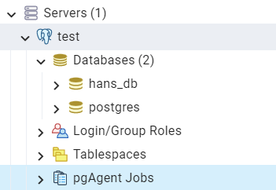

= pg_agent
:toc:
:toc-title:

== pg_agent 란?

pgAgent는 작업을 실행하고 관리하는 스케줄링 에이전트입니다. 각 작업은 하나 이상의 단계와 일정으로 구성됩니다. 두 개 이상의 작업이 동시에 실행되도록 예약된 경우 pgAgent는 작업을 병렬로 실행합니다.( 각각 고유한 스레드가 있음 )

수행 내용은 SQL 문 또는 운영 체제 배치/쉘 스크립트일 수 있습니다. 지정된 작업의 각 단계는 이전 단계가 완료되면 이름의 영숫자 순서로 실행됩니다. pgAgent 옵션의 스위치를 사용하면 필요에 따라 개별 단계를 활성화 또는 비활성화하여 작업을 수정할 수 있습니다.

각 작업은 하나 이상의 일정에 따라 실행됩니다. 작업 또는 일정이 변경될 때마다 작업의 다음 런타임이 다시 계산됩니다. pgAgent의 각 인스턴스는 과거에 다음 런타임 값이 있는 작업에 대해 데이터베이스를 주기적으로 폴링합니다. 1분에 한 번 이상 폴링하면 모든 작업이 일반적으로 지정된 시작 시간의 1분 이내에 시작됩니다. 작업의 다음 런타임에 실행 중인 pgAgent 인스턴스가 없는 경우 pgAgent가 다음에 시작되는 즉시 실행되고 이후 정상 일정으로 돌아갑니다.

== pg_agent install

1.*PostgreSQL v14 설치*

2.*pgagent 패키지 설치*
----
yum -y install pgagent_14
----

3.*서버 기동 및 pgAgent extension 생성*
----
# postgresql 기동
$ pg_ctl start
waiting for server to start....2022-05-18 16:26:40.922 KST [17200] LOG:  redirecting log output to logging collector process
2022-05-18 16:26:40.922 KST [17200] HINT:  Future log output will appear in directory "log".
 done
server started

$ psql
psql (14.2)
Type "help" for help.

postgres=# CREATE EXTENSION pgagent;
CREATE EXTENSION
----

4.*USER 생성*
----
CREATE USER "pgagent_user" WITH
  LOGIN
  SUPERUSER
  INHERIT
  NOCREATEDB
  NOCREATEROLE
  NOREPLICATION
  encrypted password 'pgagent';
 
GRANT USAGE ON SCHEMA pgagent TO pgagent_user;
GRANT ALL PRIVILEGES ON ALL TABLES IN SCHEMA pgagent TO pgagent_user;
GRANT ALL PRIVILEGES ON ALL SEQUENCES IN SCHEMA pgagent TO pgagent_user;
----

5.*암호 인증 파일 .pgpass 생성*
----
# postgres home 에서 수행
echo 127.0.0.1:5432:*:pgagent_user:pgagent >> ~/.pgpass
chmod 600 ~/.pgpass
chown postgres:postgres ~/.pgpass
----

6.*pgAgent 실행*
----
su - postgres
pgagent_14 hostaddr=127.0.0.1 dbname=postgres user=pgagent_user

$ ps -ef |grep pgagent
postgres  1551     1  0 11:13 pts/4    00:00:00 pgagent_14 hostaddr=127.0.0.1 dbname=postgres user=pgagent_user
postgres  1552 25953  0 11:13 ?        00:00:00 postgres: pgagent_user postgres 127.0.0.1(41596) idle
----

7.*아파치 설치 및 시작*
----
su - root

sudo yum -y install httpd

sudo systemctl start httpd
----

8.*아파치 확인*
----
# 80 포트로 올라온 것을 확인 가능
$ netstat -ntlp | grep httpd
tcp6       0      0 :::80        :::*      LISTEN      19784/httpd        
----

9.*브라우저 접속*
----
#브라우저 주소에 ip 주소:설정한 포트 로 접속
ex) 123.123.123.123:80
----
*접속이 되지 않는다면 80 포트를 열어주어야 한다.*

10.*pgadmin4 설치*
----
su - root
yum -y install pgadmin4
----

11.*아파치 재시작*
----
sudo systemctl restart httpd
----

12.*pgadmin4 세팅*

*setup-web.sh 수행 후 임의로 이메일과 패스워드 입력*

----
# sudo /usr/pgadmin4/bin/setup-web.sh
Setting up pgAdmin 4 in web mode on a Redhat based platform...
Creating configuration database...
NOTE: Configuring authentication for SERVER mode.

Enter the email address and password to use for the initial pgAdmin user account:

Email address: hypersql_tech@tmax.co.kr
Password: 
Retype password:
pgAdmin 4 - Application Initialisation
======================================

Creating storage and log directories...
Configuring SELinux...
setsebool:  SELinux is disabled.
setsebool:  SELinux is disabled.
The Apache web server is running and must be restarted for the pgAdmin 4 installation to complete. Continue (y/n)? y
Apache successfully restarted. You can now start using pgAdmin 4 in web mode at http://127.0.0.1/pgadmin4
----

13.*브라우저로 접속*
----
ip:아파치 포트/pgadmin4
ex) 123.123.123.123:80/pgadmin4

앞서 생성한 이메일 주소와 패스워드를 입력하여 웹에서 pgadmin4 접속
----

14.*pgadmin 접속 후 pgAgent Jobs 하위 폴더 확인*

== 작업 추가

pgAgent Jobs 우클릭 Create -> pgAgent Job

1.*General*

- NAME : 작업 이름을 입력합니다.
- Enabled : 스위치를 YES / NO 로 이동 하여 작업을 활성화 및 비활성화 합니다.
- Job Class : 작업 분류용 클래스를 선택합니다.
- Host Agent : 필드를 사용하여 pgAgent를 실행하는 시스템의 이름을 지정하여 해당 시스템만 작업을 실행할 수 있음을 나타냅니다. 모든 기계가 작업을 수행할 수 있도록 지정하려면 필드를 비워 둡니다.

2.*Steps(General)*

Steps(General) 탭을 사용하여 작업이 수행할 Step을 정의하고 관리합니다.

- NAME : step 의 이름을 입력합니다.
- Enabled : 스위치를 이동 하여 작업을 실행할 때 Step 을 포함하거나 미포함 합니다.
- Kind : 스위치를 이동 하여 작업을 실행할 때 SQL 코드 또는 배치 스크립트 호출 여부를 나타냅니다.
* SQL 을 선택하는 경우 코드 탭을 사용하여 각 Step 에 대한 SQL 코드 작성
* Batch 를 선택하는 경우 코드 탭을 사용하여 각 Step 에 실행될 배치 스크립트 작성
- Connection Type : 스위치를 사용 하여 단계가 Local 서버 또는 Remote 호스트에서 수행되는지 여부를 나타냅니다.
* Step 에 Remote 연결을 사용하도록 지정하면 Connection string  필드가 활성화되고 libpq 스타일 연결 문자열을 제공해야 합니다.
- Database : Step 이 수행될 데이터베이스를 선택합니다.
- Connection string : 필드를 사용 하여 단계가 수행될 원격 서버에 대한 libpq 스타일 연결 문자열을 지정합니다. 연결 문자열 작성에 대한 자세한 내용은 PostgreSQL 설명서 를 참조하십시오 .
- On Error : Step 을 실행하는 동안 오류가 발생하는 경우 pg Agent의 동작을 지정합니다.
* Fail : 해당 Step 을 수행하는 동안 오류가 발생하면 작업을 중지합니다.
* Success : Step 을 성공적으로 완료한 것으로 표시합니다.
* Ignore : 오류를 무시하고 계속합니다.

3.*Steps(Code)*

Steps(Code) 탭을 사용하여 상황에 맞는 필드를 사용하여 Step 중에 실행될 SQL 코드 또는 배치 크르립트를 제공하십시오.

- Step 에서 SQL 코드를 호출하는 경우 SQL 쿼리 필드에 하나 이상의 SQL 문을 제공합니다.
- Step 에서 배치 스크립트를 수행하는 경우 스크립트 필드에 스크립트를 제공하십시오.

Windows 서버에서 실행 중인 경우 표준 배치 파일 구문을 사용해야 합니다. Linux 서버에서 실행할 때 적절한 인터프리터가 첫 번째 줄(예: #!/bin/sh )에 지정되어 있으면 모든 셸 스크립트를 사용할 수 있습니다.

4.*Schedules(General)*

- NAME : 필드에 스케쥴 이름을 입력합니다.
- Enabled : 스위치를 사용 하여 pgAgent가 스케쥴을 활성하거나 비활성화 함을 나타냅니다.
- Start : 달력을 선택하여 스케쥴의 시작 날짜와 시간을 지정합니다.
- End : 달력을 선택하여 스케쥴의 종료 날짜와 시간을 지정합니다.

5.*Schedules(Repeat)*

Repeat 필드를 사용하여 cron 형식으로 스케쥴에 대한 세부 정보를 지정합니다.

6.*Schedules(Exceptions)*

Exceptions 필드를 사용하여 작업을 실행하지 않을 요일을 지정합니다.
예를 들어, 작업이 공휴일에 실행되지 않도록 할 수 있습니다.
