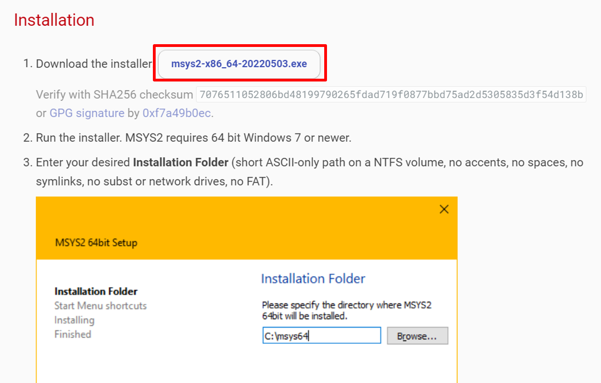
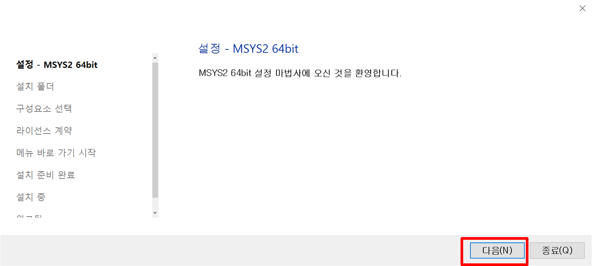
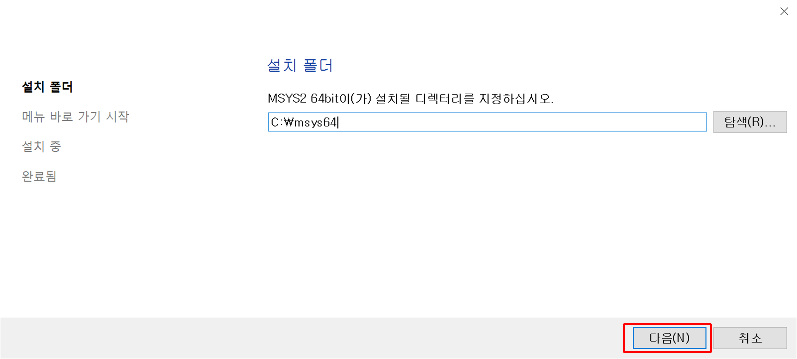
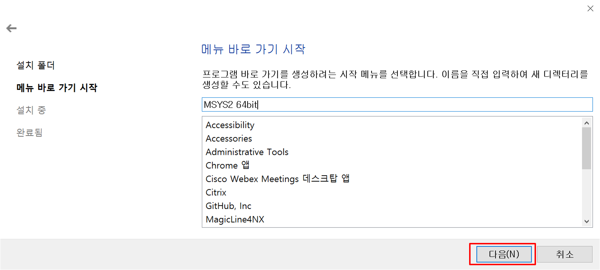
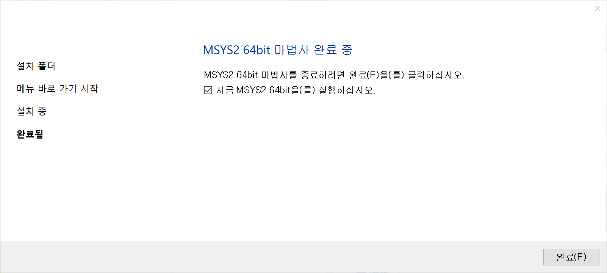
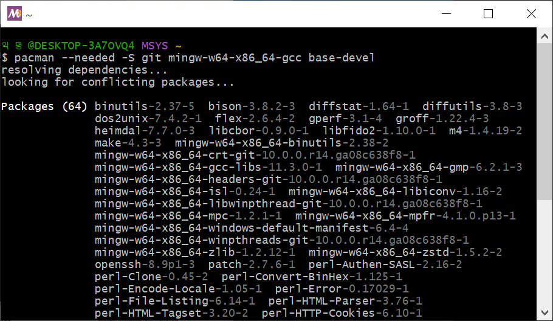
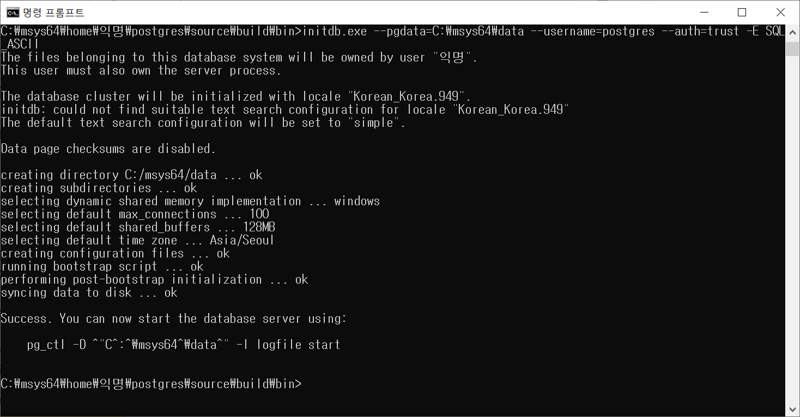

= PostgreSQL Install
:toc:
:toc-title:
:sectlinks:
:sectnums:

== 참고 메뉴얼

- PostgreSQL 공식 문서 : https://www.postgresql.org/docs/
- PostgreSQL 공식 위키 : https://wiki.postgresql.org/wiki/Main_Page

== 지원 플랫폼 및 OS

현재 link:https://buildfarm.postgresql.org/[PostgreSQL Build Farm] 에서 자동으로 테스트되고 있으니 참고 바랍니다.

[%header, cols="3,6"]
|==================
|OS | 지원 version
|Ubuntu | 16.04, 18.04, 20.04
|Debian | 7(Wheezy), 8(jessie) ,9(Stretch), 10(Buster), 11(Bullseye)
|CentOS | 7.1 ~ 7.9
|Fedora | 27, 35
|RHEL   | 7.1 ~ 8.1
//|SUSE Linux Enterprise  | 15 SP1
//|OpenSUSE   | 42.3 ~ 15.3
|Windows Server | 2016, 2019
|==================

- 공식 Ubuntu community - PostgreSQL 설치 : https://help.ubuntu.com/community/PostgreSQL

== 패키지

=== 필수 패키지
[source, bash]
yum install make gcc gcc-c++ tar zlib zlib-devel readline readline-devel gettext gettext-devel git libxslt libicu

- GNU Make 3.80 이상
- 컴파일러 : gcc 권장(C99 호환)
- 압축 패키지 : tar(or `gzip` or `bzip2`)
- 압축 라이브러리(pg_dump, pg_restore) : zlib
- 명령줄 SQL 인터프리터 : readline
- 영어 이외의 메시지 표시 : gettext
- 확장 모듈 : libxslt, libicu
- git

=== 선택 패키지
[source, bash]
yum install perl perl-libs tcl python python-devel openssl openssl-devel

- libperl 5.8.3 이상
- PL/Tcl : Tcl 8.4 이상
- PL/Python : python 2.7 이상, python 3 지원
- 암호화 클라이언트 연결 : openssl, openssl-devel
- 인증 관련 : Kerberos, OpenLDAP, PAM

== 최소 설치
=== 최소 설치 사양

- core : 1core
- Memory : 300MB
- Disk 공간 : **750MB** +
컴파일 시 source(350MB) +
PostgreSQL 설치 디렉토리(60MB) +
Database Cluster(40MB) +
regression Test(300MB) +

=== 최소 설치 방법 - 소스설치 (참고)
------
./configure  
make
su
make install
adduser postgres
mkdir /usr/local/pgsql/data
chown postgres /usr/local/pgsql/data
su - postgres
/usr/local/pgsql/bin/initdb -D /usr/local/pgsql/data
/usr/local/pgsql/bin/pg_ctl -D /usr/local/pgsql/data -l logfile start
/usr/local/pgsql/bin/createdb test
/usr/local/pgsql/bin/psql test
------

== Linux 환경에 HyperSQL PostgreSQL 설치

=== 패키지 설치
[source,bash]
yum install -y make gcc gcc-c++ tar zlib zlib-devel readline readline-devel gettext gettext-devel git libxslt libicu

=== yum 설치 시
- postgresql repository 설정
[source,bash]
yum install -y https://download.postgresql.org/pub/repos/yum/reporpms/EL-7-x86_64/pgdg-redhat-repo-latest.noarch.rpm

- postgresql 설치
[source,bash]
yum install -y postgresql14-server postgresql14-contrib

=== RPM 설치 시
해당 문서는 PostgreSQL v14를 기준으로 설치하며 다른 버전의 rpm 파일은 link:https://download.postgresql.org/pub/repos/yum/[해당 링크]를 참고 바랍니다.

[source,bash]
rpm -ivh https://yum.postgresql.org/14/redhat/rhel-7-x86_64/postgresql14-libs-14.4-1PGDG.rhel7.x86_64.rpm
rpm -ivh https://yum.postgresql.org/14/redhat/rhel-7-x86_64/postgresql14-14.4-1PGDG.rhel7.x86_64.rpm
rpm -ivh https://yum.postgresql.org/14/redhat/rhel-7-x86_64/postgresql14-server-14.4-1PGDG.rhel7.x86_64.rpm
rpm -ivh https://yum.postgresql.org/14/redhat/rhel-7-x86_64/postgresql14-contrib-14.4-1PGDG.rhel7.x86_64.rpm

=== user 생성 및 Directory 생성

[%header, cols="4,6"]
|======================
|경로 | 설명
|/hypersql/pg/14/data | PostgreSQL Database Cluster 경로
|/hypersql/pg/14/log/pg_log | PostgreSQL 관련 log 중에 PostgreSQL의 log 경로
|/hypersql/pg/14/pg_wal | PostgreSQL의 wal파일이 저장되는 경로
|/hypersql/pg/14/archive | PostgreSQL의 archive파일이 저장되는 경로
|/var/run/hypersql | PostgreSQL 통신을 위한 socket이 저장되는 경로
|======================

[source,bash]
groupadd hypersql -g 1008
useradd hypersql -u 1008 -g hypersql -c 'HyperSQL Database' -d /hypersql
echo "d /run/hypersql 0755 hypersql hypersql -" > /usr/lib/tmpfiles.d/hypersql.conf
mkdir -p /hypersql/pg/14/data
mkdir -p /hypersql/pg/14/log/pg_log
mkdir -p /hypersql/pg/14/pg_wal
mkdir -p /hypersql/pg/14/archive
mkdir -p /var/run/hypersql
chown -R hypersql:hypersql /hypersql
chown -R hypersql:hypersql /var/run/hypersql

=== 환경 변수 설정
해당 버전에 맞는 변수 $PGVERSION 을 수정하여 사용해야 합니다.

[source,bash]
[root@HyperSQL-PostgreSQL:~] su - hypersql
[hypersql@HyperSQL-PostgreSQL:~] vi ~/.bash_profile
#ref : https://www.postgresql.org/docs/current/libpq-envars.html
#HyperSQL-PostgreSQL ENV
PS1="[\u@\h:\W]$ "
export PGVERSION=14
if [ -f "/usr/pgsql-$PGVERSION/bin/pg_ctl" ]; then
        export PGINST=/usr/pgsql-$PGVERSION                                 #postgresql installe
        export MANPATH=/usr/pgsql-$PGVERSION/share/man:$MANPATH             #postgresql Man path
        export LD_LIBRARY_PATH=/usr/pgsql-$PGVERSION/lib:$LD_LIBRARY_PATH   #ld library path
        export PATH=/usr/pgsql-$PGVERSION/bin:$PATH                         #postgresql binary path
        export PGLIB=/usr/pgsql-$PGVERSION/lib                              #postgresql libary path
fi
export PGHOME=/hypersql/pg                   #hypersql engine directory
export PGDATA=/hypersql/pg/$PGVERSION/data   #hypersql database clsuter directory
export PGHOST=/var/run/hypersql              #hypersql socket directory
export PGUSER=postgres                       #hypersql Basic DB User Name
#HyperSQL-PostgreSQL ALIAS
alias pginst="cd $PGINST"
alias pglib="cd $PGLIB"
alias pghome="cd $PGHOME"
alias pgdata="cd $PGDATA"
alias pglog="cd $PGHOME/$PGVERSION/log/pg_log"
alias pgwal="cd $PGHOME/$PGVERSION/pg_wal"
alias pgconf="vi $PGDATA/postgresql.conf"
alias pghba="vi $PGDATA/pg_hba.conf"
[hypersql@HyperSQL-PostgreSQL:~] source ~/.bash_profile

=== Database Cluster 생성
[source,bash]
[hypersql@HyperSQL-PostgreSQL:~] initdb -U postgres -D $PGDATA -X /hypersql/pg/$PGVERSION/pg_wal

=== postgresql.conf 수정
[source,bash]
cat << EOF >> $PGDATA/postgresql.conf
listen_addresses = '*'
port = 5432
unix_socket_directories = '/var/run/hypersql'
logging_collector = on
log_directory = '/hypersql/pg/14/log/pg_log'
log_filename = 'postgresql-%Y-%m-%d-%H%M%S.log'
log_rotation_age = 0
log_rotation_size = 100MB
EOF

=== [선택] archive mode 설정
해당 archive 디렉토리가 없거나 권한이 없을 경우에 archive 파일을 write할 수 없으므로 해당 디렉토리를 생성한 후에 archive_command를 설정합니다.

[source,bash]
[hypersql@HyperSQL-PostgreSQL:~] cat << EOF >> $PGDATA/postgresql.conf
archive_mode = on
archive_command = 'test ! -f /hypersql/pg/14/archive/%f && cp %p /hypersql/pg/14/archive/%f'
EOF

== Windows 환경에 HyperSQL PostgreSQL 설치

1. msys2 설치 +
PostgreSQL 컴파일을 위하여 msys2를 설치하여야 합니다. (설치 링크 : https://www.msys2.org/)

- msys2 사이트 접속 후 설치 파일 다운로드
+

- 실행 후 설치 시작
+

- 설치할 폴더 설정
+

- 메뉴 바로가기 설정
+

- msys2 설치 완료
+

2. 패키지 설치
MinGW-w64(Windows GCC 컴파일러, GNU GPL License) +
PostgreSQL 컴파일(C,C++)을 위하여 MinGW-w64 설치하여야 합니다. (수동 설치 링크 : https://sourceforge.net/projects/mingw-w64/files/mingw-w64/)
+
[source]
pacman --needed -S git mingw-w64-x86_64-gcc base-devel

+

3. git clone
[source]
mkdir -p ~/postgres/source
git clone https://github.com/hypersql/HyperSQL-PostgreSQL14.git ~/postgres/source

4. 환경 변수 설정
[source]
nano ~/.bash_profile
...
PATH=/mingw64/bin:$PATH
...
source ~/.bash_profile

5. PostgreSQL 설치
[source]
cd ~/postgres
mkdir -p build
build=`pwd`/build
cd ~/postgres/source
./configure --host=x86_64-w64-mingw32 --prefix=$build
make && make install

6. initdb 실행 + 
cmd 창을 열어 실행합니다. PostgreSQL 바이너리를 환경변수로 설정하여 실행하거나 msys2에서 컴파일한 경로에서 실행합니다.
+
[source]
initdb.exe --pgdata=C:\msys64\data --username=postgres --auth=trust -E SQL_ASCII
+

7. database 실행
[source]
pg_ctl start --pgdata=C:\msys64\data

8. database 접속
[source]
psql --username=postgres

== 커널 파라미터

* 커널 파라미터 설정 위치 : /etc/sysctl.conf

[%header, cols="2,8"]
|=======================
|파라미터 | 값
|SHMMAX|	물리적 메모리 용량의 1/2 (단위: Byte)
|SHMMIN|	1
|SHMALL|	"Byte로 설정할 경우, SHMMAX와 동일 Page로 설정할 경우, ceil(SHMMAX/PAGE_SIZE)"
|SHMSEG|	최소 1 / OS 기본 값이 1보다 클 경우, OS 기본 값 사용
|SHMMNI|	SHMSEG와 동일
|SEMMNI|	ceil((max_connections + autovaccum_max_workers + max_worker_processes + 5) /16)
|SEMMNS|	ceil((max_connections + autovaccum_max_workers + max_worker_processes + 5) /16) * 17
|SEMMSL|	최소 17 / OS 기본 값이 17보다 클 경우, OS 기본 값 사용
|SEMMAP|	OS 기본 값 사용
|SEMVMX|	최소 1000 / OS 기본 값이 1000보다 클 경우, OS 기본 값 사용
|=======================

* /etc/systemd/logind.conf 설정

[%header, cols="2,8"]
|=======================
|파라미터 | 값
|RemoveIPC |	No
|=======================

== 원격 및 로컬 Client 접속 설정
- 원격의 PostgreSQL로 접속할 경우 $PGHOST, $PGPORT 환경변수를 지정합니다.
[source, bash]
[root@HyperSQL-PostgreSQL:~] su - hypersql
[hypersql@HyperSQL-PostgreSQL:~] vi $PGDATA/postgresql.conf
export PGHOST=원격 접속 IP
export PGPORT=원격 PostgreSQL의 Port

- pg_hba.conf +
허용할 IP 및 METHOD를 정의합니다.
[source,bash]
[hypersql@HyperSQL-PostgreSQL:~] vi $PGDATA/pg_hba.conf
# TYPE    DATABASE        USER        ADDRESS        METHOD

- [선택] 방화벽 설정 
[source, bash]
[root@HyperSQL-PostgreSQL:~] firewall-cmd --permanent --zone=public --add-port=5432/tcp
[root@HyperSQL-PostgreSQL:~] firewall-cmd --reload

== PostgreSQL 서버 실행

[source,bash]
[hypersql@HyperSQL-PostgreSQL:~] pg_ctl start -D $PGDATA -U postgres

== PostgreSQL 접속 (client tool : psql)

[source, bash]
[hypersql@HyperSQL-PostgreSQL:~] psql -D $PGDATA -U postgres

== PostgreSQL 서버 종료
[source, bash]
[hypersql@HyperSQL-PostgreSQL:~] pg_ctl stop -D $PGDATA

== PostgreSQL 제거
- 패키지 삭제 +
추가적으로 postgresql 관련 패키지가 있다면 확인 후 삭제합니다.

[source, bash]
[root@HyperSQL-PostgreSQL:~] yum -y remove postgresql14-server postgresql14 postgresql14-libs postgresql14-contrib libicu libxslt
rpm -qa | grep postgresql

- Data Cluster 삭제
[source, bash]
[root@HyperSQL-PostgreSQL:~] rm -rf $PGDATA

- 바이너리, 라이브러리 등 삭제
[source, bash]
[root@HyperSQL-PostgreSQL:~] rm -rf /usr/pgsql-14
