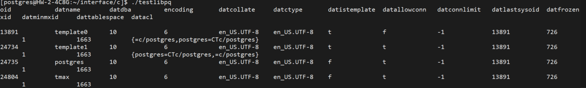

= C (libpq)
:toc:
:toc-title:
:setnums:
:sectnums:

== 테스트 환경
[width="500%",cols="1a,2"]
|==================
|*OS*|CentOS 7.6
|*PostgreSQL*|PostgreSQL 14.4
|*C-Compiler*|gcc version 4.8.5 20150623 (Red Hat 4.8.5-44) (GCC)
|*Driver*|libpq 14.4
|==================

== 주의사항
* 테스트 계정은 hypersql 계정에 sudo 권한을 부여하여 진행 하였고, root 계정으로 진행 하셔도 됩니다.
* 테스트 디렉토리는 /hypersql/interface/c 기준으로 작성되었습니다.
* PostgreSQL에서 제공하는 sample을 사용하여 테스트를 진행하였습니다.

* 클라이언트 인터페이스 사용시 libpq-fe.h를 사용하셔야 합니다.

*link:https://www.postgresql.org/docs/current/libpq.html[자세한 명세]는 링크 참조*

=== Requirements
* PostgreSQL > 9.1

== 테스트
.testlibpq.c 생성
[source, sh]
----
cd /hypersql/interface/c
vi testlibpq.c
----

.testlibpq.c
[source, c]
----
/*
 * src/test/examples/testlibpq.c
 *
 *
 * testlibpq.c
 *
 *              Test the C version of libpq, the PostgreSQL frontend library.
 */
#include <stdio.h>
#include <stdlib.h>
#include "libpq-fe.h"

static void
exit_nicely(PGconn *conn)
{
        PQfinish(conn);
        exit(1);
}

int
main(int argc, char **argv)
{
        const char *conninfo;
        PGconn     *conn;
        PGresult   *res;
        int                     nFields;
        int                     i,
                                j;

        /*
         * If the user supplies a parameter on the command line, use it as the
         * conninfo string; otherwise default to setting dbname=postgres and using
         * environment variables or defaults for all other connection parameters.
         */
        if (argc > 1)
                conninfo = argv[1];
        else
                conninfo = "dbname = postgres";

        /* Make a connection to the database */
        conn = PQconnectdb(conninfo);

        /* Check to see that the backend connection was successfully made */
        if (PQstatus(conn) != CONNECTION_OK)
        {
                fprintf(stderr, "%s", PQerrorMessage(conn));
                exit_nicely(conn);
        }

        /* Set always-secure search path, so malicious users can't take control. */
        res = PQexec(conn,
                                 "SELECT pg_catalog.set_config('search_path', '', false)");
        if (PQresultStatus(res) != PGRES_TUPLES_OK)
        {
                fprintf(stderr, "SET failed: %s", PQerrorMessage(conn));
                PQclear(res);
                exit_nicely(conn);
        }

        /*
         * Should PQclear PGresult whenever it is no longer needed to avoid memory
         * leaks
         */
        PQclear(res);

        /*
         * Our test case here involves using a cursor, for which we must be inside
         * a transaction block.  We could do the whole thing with a single
         * PQexec() of "select * from pg_database", but that's too trivial to make
         * a good example.
         */

        /* Start a transaction block */
        res = PQexec(conn, "BEGIN");
        if (PQresultStatus(res) != PGRES_COMMAND_OK)
        {
                fprintf(stderr, "BEGIN command failed: %s", PQerrorMessage(conn));
                PQclear(res);
                exit_nicely(conn);
        }
        PQclear(res);

        /*
         * Fetch rows from pg_database, the system catalog of databases
         */
        res = PQexec(conn, "DECLARE myportal CURSOR FOR select * from pg_database");
        if (PQresultStatus(res) != PGRES_COMMAND_OK)
        {
                fprintf(stderr, "DECLARE CURSOR failed: %s", PQerrorMessage(conn));
                PQclear(res);
                exit_nicely(conn);
        }
        PQclear(res);

        res = PQexec(conn, "FETCH ALL in myportal");
        if (PQresultStatus(res) != PGRES_TUPLES_OK)
        {
                fprintf(stderr, "FETCH ALL failed: %s", PQerrorMessage(conn));
                PQclear(res);
                exit_nicely(conn);
        }

        /* first, print out the attribute names */
        nFields = PQnfields(res);
        for (i = 0; i < nFields; i++)
                printf("%-15s", PQfname(res, i));
        printf("\n\n");

        /* next, print out the rows */
        for (i = 0; i < PQntuples(res); i++)
        {
                for (j = 0; j < nFields; j++)
                        printf("%-15s", PQgetvalue(res, i, j));
                printf("\n");
        }

        PQclear(res);

        /* close the portal ... we don't bother to check for errors ... */
        res = PQexec(conn, "CLOSE myportal");
        PQclear(res);

        /* end the transaction */
        res = PQexec(conn, "END");
        PQclear(res);

        /* close the connection to the database and cleanup */
        PQfinish(conn);

        return 0;
}

----

.컴파일 및 실행
[source, sh]
----
cd /hypersql/interface/c

# postgresql 버전 및 설치 디렉토리에 맞게 구문을 변경해서 테스트 해주시기 바랍니다.
# 컴파일
gcc -I/usr/pgsql-14/include -I/usr/pgsql-14/include/internal -L/usr/pgsql-14/lib -lpq -o testlibpq  testlibpq.c

# 실행
./testlibpq
----

*Database 접속 정보를 변경하여 사용 하시기 바랍니다.*

