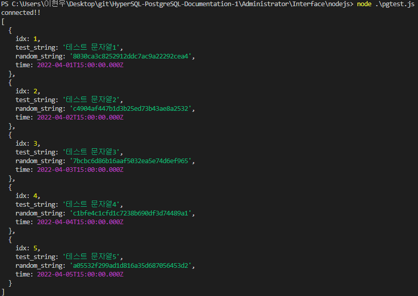
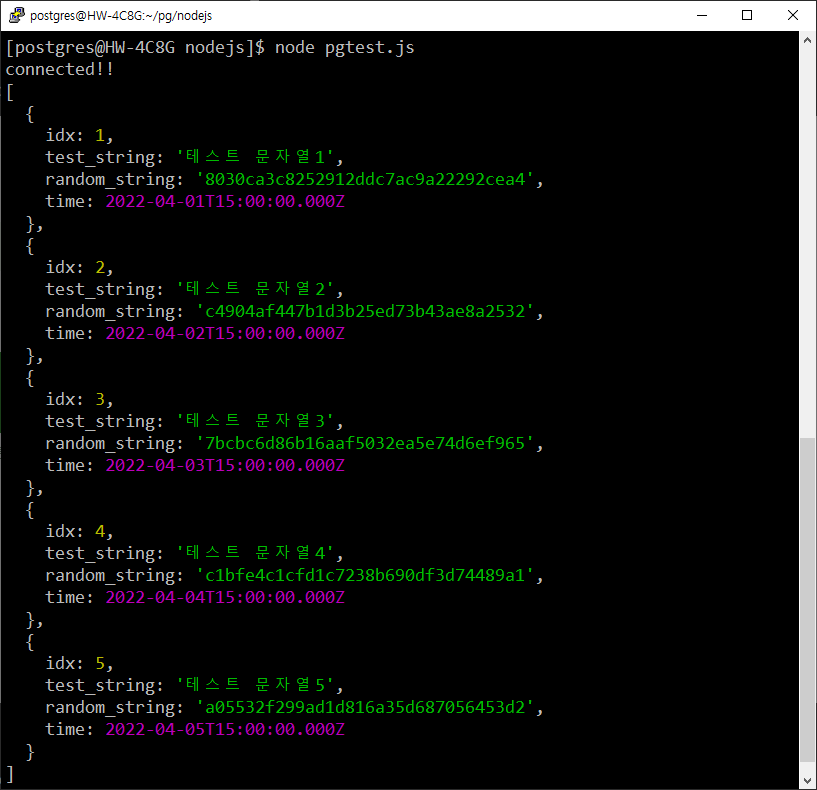

= node.js
:toc:
:toc-title: 목차

== *1. 테스트환경*

=== Windows
|=======
| OS | Windows 10 21H2
| PostgreSQL Version | PostgreSQL 11.14
| node.js version | 16.14.2
|=======

=== Linux
|=======
| OS | CentOS 7.6
| PostgreSQL Version | PostgreSQL 11.14
| node.js version | 16.14.1
|=======

== *2. 제한사항*
Windows의 경우 node.js의 최신 버전인 18.0.0이 아닌, 안정 버전인 16.14.2를 사용하였음. + 
CentOS의 경우 yum을 이용해 nodejs 16.14.1 설치를 진행하였음.

== *3. 테스트 방법*

=== Windows node.js 설치
아래의 링크에서 node.js 설치 +
`https://nodejs.org/ko/` + 
설치하고 나면, 패키지를 자동으로 설치해줄지 물어봄 + 
확인하면 Windows Powershell로 자동 설치 완료. + 
 + 
윈도우의 경우, 환경변수가 바로 적용되지 않기 때문에 아래의 방법 중에서 하나를 선택하여 환경변수 적용. + 
1. 재부팅 + 
2. 시작 - 검색 cmd - 관리자권한으로 실행 후 아래의 명령어 실행 + 
`taskkill /im explorer.exe`  + 
`explorer.exe`

=== Linux node.js 설치
nodejs, npm 설치 + 

`yum install nodejs` + 
`yum install npm` + 

- version 확인 +
`node --version`

=== 공통

*1. node.js도 패키지를 다운로드 하고 프로젝트를 진행할 디렉토리를 지정해주어야함* + 
*원하는 디렉토리에서 터미널을 열어서 `npm init`* + 
 + 
*2. `npm install pg` pg 드라이버 패키지 설치* + 
npm 로 설치한 패키지는 다음과 같이 version을 확인 할 수 있습니다. +
`npm show [package] version` +
`npm show pg version` 
 + 
*3. `pgtest.js` 생성*
[source, javascript]
----
const { Client } = require('pg');

const client = new Client({
    user:'tmax', // 데이터베이스 유저명
    host:'210.106.105.55', // 데이터베이스 서버 주소
    password:'1234', // 데이터베이스 유저 패스워드
    port:'5432' // 데이터베이스 포트
});

client.connect(err =>{
    if(err) console.log(err);
    else{
        console.log("connected!!");
    }
});

client.query("select * from tsc.t1 limit 5;",(err,res)=>{ // 실행할 쿼리
    if(err != null){
        console.log(err);
    }
    console.log(res.rows);
    client.end();
});
----

*4. js 파일이 있는 위치를 터미널(cmd 또는 vscode의 터미널)을 열어주고, 아래의 명령어 실행* + 
`node pgtest.js`

== 4. 테스트 결과
=== Windows 

=== Linux

