:toc:
:toc-title:
:sectnums:

== pgAdmin4
=== pgAdmin4란?
postgreSQL의 데이터베이스를 GUI로 손쉽게 관리할 수 있는 Tool

=== pgAdmin4 설치
==== Windows 설치
===== 설치 환경
[width="100%",cols="3,10"]
|==================
|OS|Windows 10 Pro
|postgreSQL|PostgreSQL 11.14
|pgAdmin4| pgAdmin4 v 6.8
|==================

===== pgAdmin4 다운로드 및 설치
`https://www.pgadmin.org/download/`
[width="500%", options="header"]
|====
|OS|pgAdmin4 version
|4 bit Windows™ 7 SP1 (desktop) or 2008R2 (server) 이상 | v 4.30까지
|Windows 8 (desktop) or 2012 (server) 이상| v 5.0이상
|====

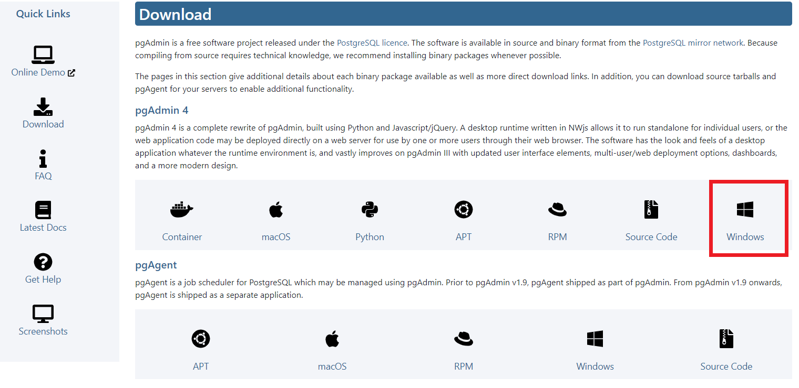

pgadmin 공식 홈페이지에서 Windows전용 pgadmin4 다운로드 후 설치

===== 실행

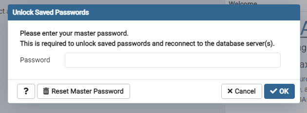

설치된 앱을 실행하고 master password를 입력한 후
서버를 연결하여 사용할 수 있습니다.

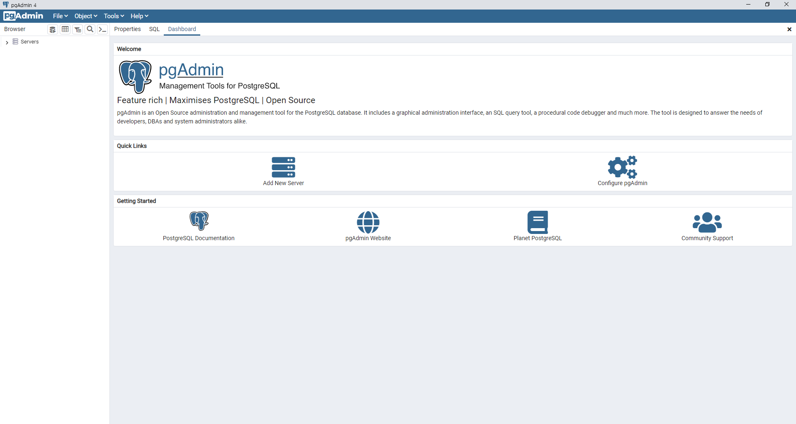

==== linux 설치
===== 설치 환경
[width="100%",cols="3,10"]
|==================
|OS|CentOS 7.6
|postgreSQL|PostgreSQL 11.14
|pgAdmin4| pgAdmin4 v 6.8
|==================

==== pgAdmin4 repository 추가

===== pgAdmin4 repository 추가
----
yum install https://ftp.postgresql.org/pub/pgadmin/pgadmin4/yum/pgadmin4-redhat-repo-2-1.noarch.rpm -y
----

===== 생성된 repository 파일 확인
----
cat /etc/yum.repos.d/pgadmin4.repo
----

==== pgAdmin4 패키지 설치
----
yum -y install pgadmin4
----
의존성으로 httpd2.4와 python3.7 이 같이 설치 됩니다.

==== pgAdmin4 configure
----
/usr/pgadmin4/bin/setup-web.sh
----
pgadmin4는 기본적으로 아파치 웹서버위에서 구동됩니다.

===== 방화벽 설정
----
firewall-cmd --zone=public --permanent --add-port=80/tcp
firewall-cmd --reload
----
===== pg_hba.conf 설정
----
# TYPE    DATABASE        USER        ADDRESS        METHOD
host      all             all         <IP>/<CIDR>      md5
----

===== pgAdmin4 접속
----
http://[IP]/pgadmin4
----
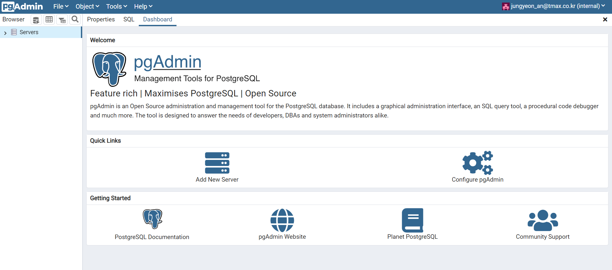

=== pgAdmin4의 기능

==== Dashboard

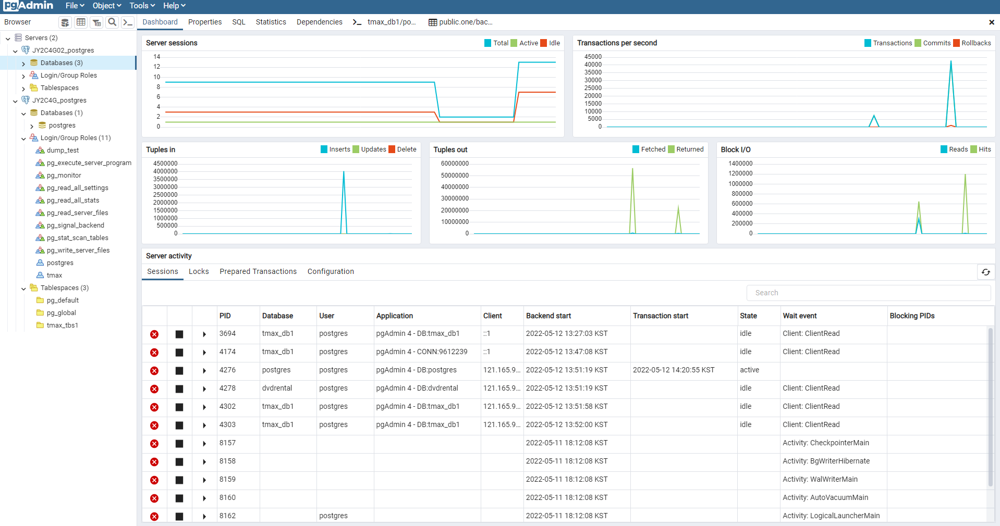

Dashboard는 선택한 서버 또는 데이터베이스에 대한 활동 통계 분석을 보여줍니다.

* 그래프 : 서버 또는 데이터베이스에 대한 통계를 표시하는 5가지 그래프가 있습니다.
** Server sessions/ Database sessions : 서버 또는 데이터베이스에 대한 Total, active, Idle 세션을 표시합니다.
** Transactions per second : 서버 또는 데이터베이스에서 발생하는 commit, roll back 또는 초당 Total transactions을 보여줍니다
** Tuples in : 서버 또는 데이터베이스에서 삽입, 업데이트 및 삭제된 튜플수를 표시합니다.
** Tuples out : 서버 또는 데이터베이스에서 fetch하거나 return한 튜플 수를 표시합니다.
** Block I/O : 서버 또는 데이터베이스에 대해 파일 시스템을 읽거나 버퍼캐시에서 가져온 블록수를 표시합니다.

* Server activity
** Sessions : 선택한 서버 또는 데이터베이스에 대한 모든 active 세션을 표시합니다.
** Locks : 서버 또는 데이터베이스의 모든 lock을 보여줍니다.
** Prepared Transactions : 서버 또는 데이터베이스의 prepared transactions을 보여줍니다.
** Configuration(only server) : 해당 서버의 configuration을 보여줍니다.

==== Management Basics

==== Backup & Restore

* 백업복구 명령어를 사용하기 위해서는 바이너리 경로를 설정해야합니다.

*File -> Preferences -> Paths -> Binary paths*

* psql Tool 은 Desktop 모드에서만 실행 가능합니다. 서버모드에서는 기본적으로 비활성화 되어있습니다.
활성화하려면 config.py 파일에서 ENABLE_PSQL 옵션을 True로 설정하여 사용할 수 있습니다.

===== Backup

pg_dump 유틸리티를 사용하여 일반 텍스트 또는 아카이브된 형식으로 백업을 해줍니다.

백업 후 psql 또는 Query Tool을 사용하여 일반 텍스트 백업 파일을 restore 하거나 pg_restore 유틸리티를 사용하여 아카이브된 백업을
restore할 수 있습니다. pg_dump 유틸리티에는 백업하려는 모든 데이터베이스 개체에 대한 읽기 액세스 권한이 있어야합니다.

단일 테이블, 스키마 또는 데이터베이스를 백업할 수 있습니다.

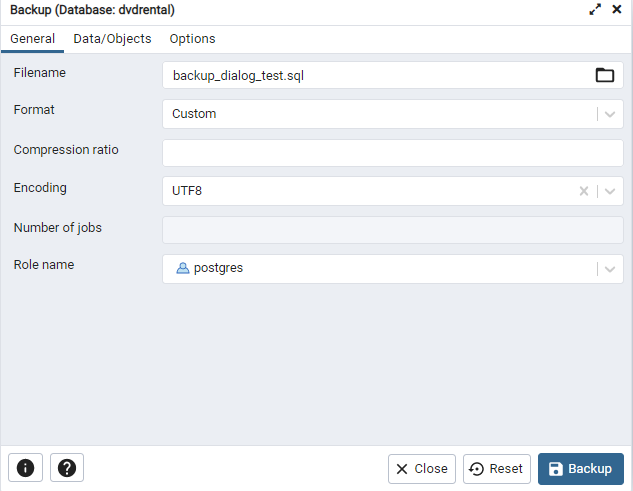

*Format*

* Custom : 사용자 정의 아카이브 파일. 기본적으로 압축되어 있으므로 중간 규모에서 대규모 데이터베이스에 권장됩니다.
* Tar : tar 아카이브 파일. 압축을 지원하지 않습니다.
* Plain : 일반 텍스트 스크립트 파일.
* Directory : 디렉토리 형식의 아카이브 파일.

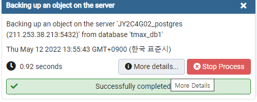

More Details.. 버튼을 누르면 입력된 커맨드를 볼 수 있고 파일이 저장된 경로도 -f 옵션에서 확인 가능

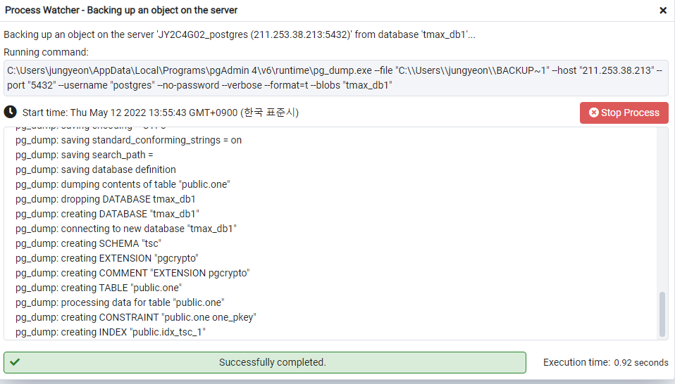

===== Backup Server Dialog
Backup Server를 이용하면 해당 서버를 재생성할 수 있는 plain-text script를 만듭니다.
pgAdmin Query Tool 을 이용하여 script를 실행시키면 서버를 재생성할 수 있습니다.

backup 버튼을 누르면 서버를 full backup합니다.

==== Restore

pgAdmin에서 Backup 기능으로 만들어진 custom, tar 또는 Directory 포맷을 이용하여
데이터베이스나 데이터베이스 object를 재생성 할 수 있게 해줍니다.
Backup dialog는 pg_dump 유틸리티를 호출하고, Restore dialog는 pg_restore 유틸리티를 호출합니다.

Backup dialog으로 만들어진 plain-text 스크립트는 Query Tool을 이용하여 복구할 수 있습니다.

1. 복구할 서버에서 데이터베이스를 생성합니다.
2. 생성한 데이터베이스를 우클릭 하여 restore를 선택합니다.

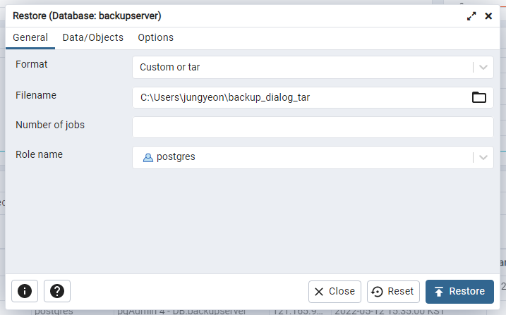

3. Format과 Filename을 설정하고 Restore 버튼을 누릅니다.

==== Developer Tools
===== ERD Tool
ERD Tool은 데이터베이스 테이블, 컬럼 및 상호관계의 그래픽 표현을 보여주는 데이터베이스 디자인 도구입니다.
데이터베이스 관리자가 데이터베이스를 개발 및 유지관리할 때 필요한 정보를 제공할 수 있습니다.

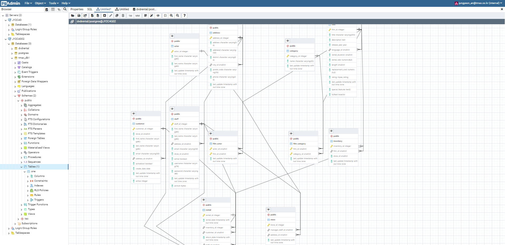

===== Grant Wizard

Grant Wizard는 쉽게 데이터베이스 개체의 권한을 관리할 수 있습니다.

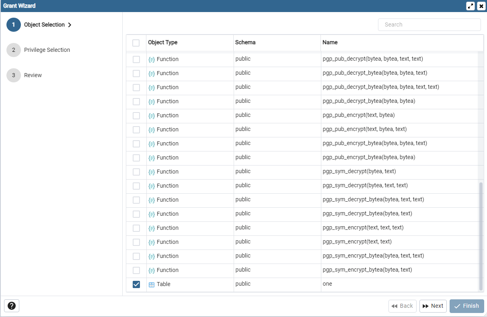

* Object Seletion : 권한을 수정할 개체를 선택합니다.

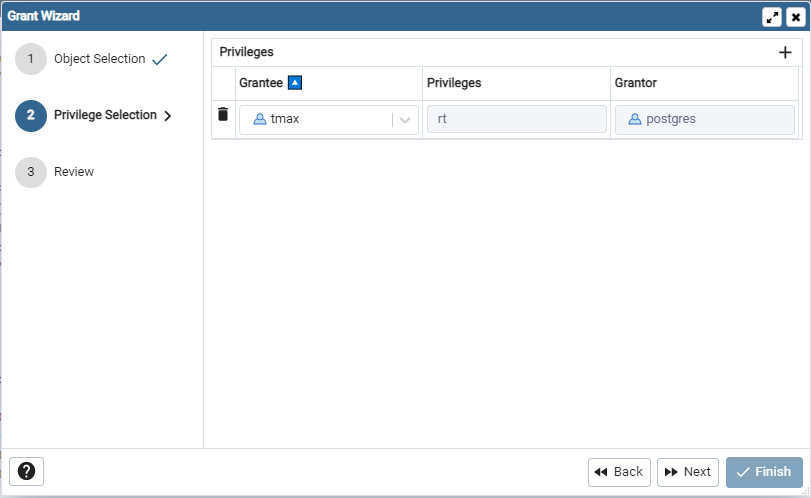

* Privilege Selection : 오른쪽 위 상단에 *+* 버튼을 클릭 후 역할을 선택하고 부여할 권한을 선택합니다.

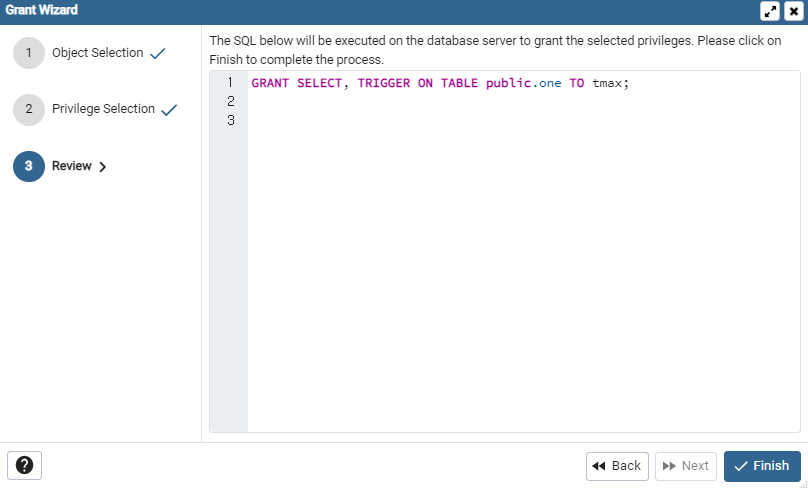

* Review Selection : 사용자 선택에 의해 생성된 SQL 명령문입니다.

===== Schema Diff
Schema Diff는 두 데이터베이스 또는 두 스키마 간의 개체를 비교할 수 있는 기능입니다.

단, source 와 target 데이터베이스의 서버는 major 버전이 동일해야 합니다.

. 데이터베이스 개체를 비교하고 동기화 합니다.(source → target)
. 데이터베이스 개체 간의 차이점을 시각화합니다.
. target 데이터베이스 개체에 대한 SQL문의 차이점을 보여줍니다.
. 동기화 스크립트를 생성합니다.

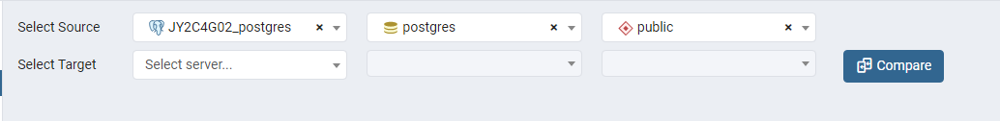

* 데이터베이스를 비교하려면 source 및 target 서버와 데이터베이스를 선택합니다.
* 스키마를 비교하려면 source 및 target 서버, 데이터베이스, 스키마를 선택합니다.
* 개체를 선택한 후 compare 버튼을 클릭합니다.

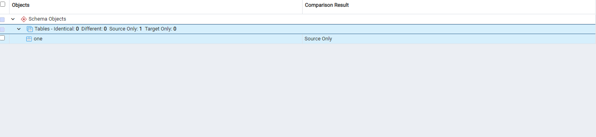

*Comparison Result*

* Identical : 개체가 두 데이터베이스에 있고 같은 SQL문을 가진 두 데이터베이스에서 발견되는 경우
* Different : 개체가 두 데이터베이스에서 모두 있지만 SQL문이 다른 경우
* Source Only : 개체가 source 데이터베이스에서만 발견되고 target 데이터베이스에서는 발견되지 않는 경우
* Target Only : 개체가 target 데이터베이스에서만 발견되고 source 데이터베이스에서는 발견되지 않는 경우

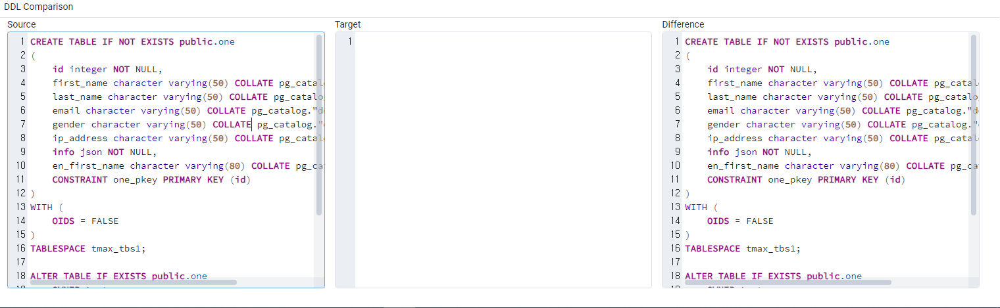

*DDL Comparison*

* Source : source 데이터베이스에 있는 개체의 DDL문
* target : target 데이터베이스에 있는 개체의 DDL문
* Difference : target 데이터베이스 개체의 SQL문의 차이
** 이 SQL 문을 target 데이터베이스에 적용하면 source 데이터베이스와 동기화 됩니다.
