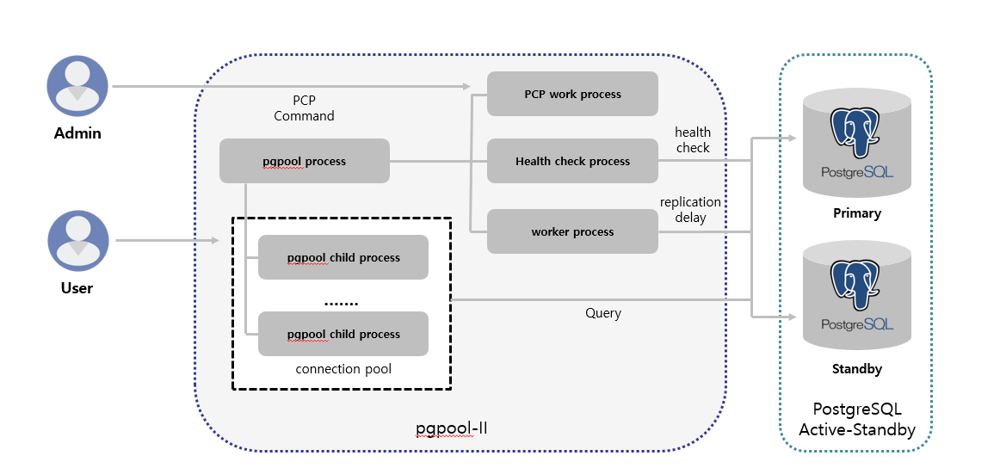
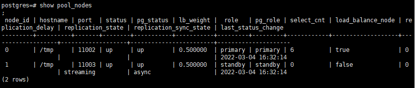

= pgpool
:toc: 
:toc-title: 목차
:sectlinks:
:sectnums:

== pgpool 개요
PostgreSQL 서버를 추가적으로 구성하기 위해 사용하는 Middle Ware의 한 종류입니다. DB Clustering을 하기 위해 자주 사용됩니다.

- pgpool wiki : https://www.pgpool.net/mediawiki/index.php/Main_Page

- pgpool documnetation(latest) : https://www.pgpool.net/docs/latest/en/html/index.html

== Install
pgpool rpm 파일 아카이브 사이트 : https://www.pgpool.net/yum/rpms/

=== pgpool-II 설치
----
yum install -y https://www.pgpool.net/yum/rpms/4.3/redhat/rhel-7-x86_64/pgpool-II-pg14-4.3.3-1pgdg.rhel7.x86_64.rpm
----

=== debugging_info, extension 설치
Extension 기능으로는 pgpool-recovery, pgpool-adm, pgpool-regclass 기능을 지원하도록 합니다.
----
yum install -y https://www.pgpool.net/yum/rpms/4.3/redhat/rhel-7-x86_64/pgpool-II-pg14-debuginfo-4.3.3-1pgdg.rhel7.x86_64.rpm

yum install -y https://www.pgpool.net/yum/rpms/4.3/redhat/rhel-7-x86_64/pgpool-II-pg14-extensions-4.3.3-1pgdg.rhel7.x86_64.rpm
----
설치 후 /etc/pgpool-II 디렉토리가 권한이 root이기 때문에 권한을 변경해줍니다.
-----
chown -R hypersql:hypersql /etc/pgpool-II
-----

== pgpool-II 실행 전 설정
=== SSH 설정
자동 failover 및 online recovery를 사용하려면 각 노드의 root와 사용자 간의 암호 없이 SSH 접속을 해야합니다.
----
mkdir ~/.ssh
chmod 700 ~/.ssh
cd ~/.ssh
ssh-keygen -t rsa

[all servers]# mkdir ~/.ssh
[all servers]# chmod 700 ~/.ssh
[all servers]# cd ~/.ssh
[all servers]# ssh-keygen -t rsa -f id_rsa_pgpool
[all servers]# ssh-copy-id -i id_rsa_pgpool.pub hypersql@[primary IP]
[all servers]# ssh-copy-id -i id_rsa_pgpool.pub hypersql@[standby IP]

[all servers]# su - postgres
[all servers]$ mkdir ~/.ssh
[all servers]$ chmod 700 ~/.ssh
[all servers]$ cd ~/.ssh
[all servers]$ ssh-keygen -t rsa -f id_rsa_pgpool
[all servers]$ ssh-copy-id -i id_rsa_pgpool.pub hypersql@[primary IP]
[all servers]$ ssh-copy-id -i id_rsa_pgpool.pub hypersql@[standby IP]

# 접속 확인
ssh hypersql@[primary IP]
ssh hypersql@[standby IP]
----

=== 유저 패스워드 설정 및 `pool_passwd` 파일 설정
----
psql
=# alter user postgres password '[PASSWORD]';
----

----
pg_md5 --md5auth -f /etc/pgpool-II/pgpool.conf -u postgres [PASSWORD]

cat /etc/pgpool-II/pool_passwd
----

=== `.pgpass` 파일 생성 및 설정
 * streaming replication 과 online recovery 수행을 위해 데이터베이스에 암호없이 접속하기 위해 설정합니다.
 * pgpool-II 사용자의 홈 디렉토리에 생성합니다.
 ** 홈 디렉토리에 설정하지 않을 경우 다음과 같이 설정해줍니다.
----
export PGPASSFILE='/hypersql/.pgpass'
----
* *hostname:port:database:username:password* 의 형식으로 설정합니다.
----
[primary IP]:5432:postgres:postgres:password
[primary IP]:5432:postgres:repluser:password
[standby IP]:5432:postgres:postgres:password
[standby IP]:5432:postgres:repluser:password
*:*:*:*:password
----
* 패스워드를 제외한 모든 항목은 *** 로 대체 가능합니다.
* 파일 생성 후 권한을 꼭 *600* 으로 변경해줍니다.
----
chmod 600 ~/.pgpass
----

=== pgpool-II 로그 디렉토리 생성 
----
mkdir /hypersql/pg/14/log/pgpool
----

=== `pcp.conf` 설정
- PCP클라이언트 도구는 pgpool-II설정과 독립적이고, PCP를 사용하기 위한 고유의 아이디와 password이기 때문에 postgreSQL과는 무관합니다.
----
echo 'hypersql:'`pg_md5 [PCP PASSWORD]` >>/etc/pgpool-II/pcp.conf
vi /etc/pgpool-II/pcp.conf
----

=== `pgpool_node_id` 설정
- watchdog을 사용하려면 node id를 설정해주어야합니다.
- primary 서버는 0, standby 서버는 1,2,3...을 입력
----
vi /etc/pgpool-II/pgpool_node_id
----

=== [선택] 방화벽 설정
- 9999 : pgpool-II 포트
- 9898 : PCP 포트
- 9000 : watchdog 포트
- 9694 : watchdog의 heartbeat 포트
----
firewall-cmd --permanent --zone=public --add-port=9999/tcp --add-port=9898/tcp --add-port=9000/tcp  --add-port=9694/udp
firewall-cmd --reload
----

== Authentication
pgpool-II은 PostgreSQL서버와 Client의 미들웨어이기 때문에 PostgreSQL서버에 접속을 하기 위해서는 특정 사용자로 인증을 해야합니다. 본 글에서는 postgres 유저로 인증하는 방법에 대하여 설명합니다.

=== Authentication methods in Pgpool-II
pgpool-II 에서는 여러 인증 방법을 지원합니다.

* Trust
    - 서버에 연결할 수 있는 모든 사람이 그들이 지정한 데이터베이스 사용자 이름으로 연결에 액세스할 수 있는 권한이 있음
* MD5 Password
* scram-sha-256
    - pgpool-II 4.0 부터 지원
    - 가장 안전한 비밀번호 기반 인증 방식이므로 *적극 권장*
* Certificate
    - SSL 클라이언트 인증서를 사용하여 인증을 수행
* PAM
    - PAM(플러그 가능 인증 모듈)을 인증 메커니즘으로 사용
* LDAP 

=== Pgpool-II authentication mechanism
. 사용자가 pgpool-II에 요청을 보냅니다.
. pgpool-II이 이 사용자에 대한 인증 방법을 가져옵니다.
    .. `enable_pool_hba`=on 이면 `pool_hba.conf` 에서 이 사용자에 대한 인증 방법을 가져옵니다.
    .. `enable_pool_hba`=off 이면 **PostgreSQL**에서 이 사용자에 대한 인증 방법을 가져옵니다.
. pgpool-II은 `pool_passwd` 파일에서 이 사용자의 비밀번호를 추출합니다.

    💡 .pgpass 파일을 생성하면 따로 암호를 입력 받지 않고 아래 과정을 생략하여 인증이 진행됩니다.  .pgpass에 입력된 암호와 `pool_passwd`에 저장된 암호와 일치하면 pgpool-II는 각 백엔드 인증에 대해 `pool_passwd`에 저장된 비밀번호를 사용합니다. 

. 사용자에게 비밀번호를 입력하라는 메시지가 표시됩니다.
. pgpool-II은 들어오는 사용자가 입력한 암호를 확인합니다. 사용자가 입력한 비밀번호가 `pool_passwd`에 저장된 비밀번호와 일치하면 pgpool-II는 각 백엔드 인증에 대해 `pool_passwd`에 저장된 비밀번호를 사용합니다.

==== Password File(pool_passwd)

- 인증을 수행하려면 pgpool-II에 데이터베이스 사용자 및 암호의 목록이 포함된 Password File이 필요합니다.
- *user:password* 의 형식으로 설정합니다.
- pgpool.conf의 pool_password 파라미터에 파일의 이름을 지정할 수 있습니다. 
** default = ‘pool_passwd’
----
pool_passwd = 'pool_passwd'
----
* 3가지 유형의 암호가 포함될 수 있습니다.
** pgpool-II은 접두사로 암호 형식유형을 식별하므로 *각 항목에는 암호 형식이 접두사로 추가되어야 합니다.*
** Plain text: *TEXT* 접두사를 사용하여 암호를 일반 텍스트 형식으로 저장합니다.
** AES256 encrypted password: *AES* 접두사를 사용하여 AES256암호화된 암호를 저장합니다.           
** MD5 hashed password: *md5* 접두사를 사용하여 MD5 해시 암호를 저장합니다.   
** 다음과 같은 형식의 텍스트 파일입니다.
----
user1:TEXTmypassword
user2:AESmzVzywsN1Z5GABhSAhwLSA==
user3:md5270e98c3db83dbc0e40f98d9bfe20972
...
----
* md5는 pg_md5명령어로 자동 생성 가능합니다.
----
pg_md5 --md5auth -f /etc/pgpool-II/pgpool.conf -u username [PASSWORD]
----

==== pool_hba.conf
* pool_hba.conf 라는 파일을 사용하여 pgpool-II 에서 액세스 제어 규칙을 설정할 수 있습니다. 
* 클라이언트가 pgpool-II를 통해 PostgreSQL 서버에 연결하기 때문에 PostgreSQL은 모든 액세스가 pgpool-II가 실행 중인 호스트에서 오는 것으로 간주합니다. 따라서 pgpool-II 측에서 클라이언트 인증을 제어해야 합니다.
* pool_hba.conf 을 사용하여 클라이언트와 pgpool-II간의 액세스 제어를 활성화하려면 `enable_pool_hba` 를 켜야합니다. 기본값은 꺼져있습니다.

----
enable_pool_hba = on
----

- pool_hba.conf 의 형식은 PostgreSQL의 pg_hba.conf 형식과 매우 비슷합니다.

-----
# TYPE  DATABASE    USER        CIDR-ADDRESS          METHOD

# "local" is for Unix domain socket connections only
local   all         all                               trust
# IPv4 local connections:
host    all         all         127.0.0.1/32          trust
host    all         all         ::1/128               trust
host    all         all         [Primary IP]          trust
host    all         all         [Standby IP]          trust
-----

==== pg_hba.conf 설정
-----
# TYPE  DATABASE    USER        CIDR-ADDRESS          METHOD

# "local" is for Unix domain socket connections only
local   all         all                               trust
# IPv4 local connections:
host    all         all         127.0.0.1/32          trust
host    all         all         ::1/128               trust
host    all         all         [Primary IP]          trust
host    all         all         [Standby IP]          trust
-----

=== Authentication for Pgpool-II internal tasks
- pgpool-II은 내부작업을 수행하기 위해 pgpool.conf(`health_check_user`,`sr_check_user`,`recovery_user`,`wd_lifecheck_user``)의 `*_password`` 파라미터에서 사용자의 암호를 지정해야합니다.
- 다음과 같이 지정할 수 있습니다.
----
health_check_user = 'postgres'
health_check_password = ''

sr_check_user = 'postgres'
sr_check_password = ''

Recovery_user = 'postgres'
recovery_password = 'password'

wd_lifecheck_user = 'postgres'
wd_lifecheck_password = ''
----
- `*_password` 가 비어 있으면 pgpool-II은 pool_passwd 파일에서 암호를 가져오려고 시도합니다.
- `*_password` 은 3가지의 암호 유형을 사용할 수 있습니다.
** AES256
** md5 hash
** Plain TEXT

   💡 단, `recovery_password` `wd_lifecheck_password` 에는 md5 해시 암호를 지정할 수 없습니다.

== Configuration

기본적으로 설치가 되면 `/etc/pgpool-II` 경로에 설정파일들이 생성이 됩니다.

- Path : /etc/pgpool-II
- pgpool-II 4.2 부터는 모든 구성 파라미터가 모든 호스트에서 동일하므로 하나의 pgpool 노드에서 pgpool.conf 를 편집하고 다른 pgpool 노드에 복사할 수 있습니다.

- pgpool.conf
----
#------------------------------------------------------------------------------
# BACKEND CLUSTERING MODE
#------------------------------------------------------------------------------
backend_clustering_mode = 'streaming_replication'     
#------------------------------------------------------------------------------
# CONNECTIONS
#------------------------------------------------------------------------------

# - pgpool Connection Settings -

listen_addresses = '*'
port = 9999
socket_dir = '/var/run/hypersql'

# - pgpool Communication Manager Connection Settings -

pcp_listen_address = '*'
pcp_port = 9898
pcp_socket_dir = '/var/run/hypersql'

# - Backend Connection Settings -
backend_hostname0 = '[primary IP]'
backend_port0 = 5432
backend_weight0 = 1
backend_data_directory0 = '/hypersql/pg/14/data'
backend_flag0 = 'ALLOW_TO_FAILOVER'
backend_application_name0 = '[primary IP]'

backend_hostname1 = '[standby IP]'
backend_port1 = 5432
backend_weight1 = 1
backend_data_directory1 = '/hypersql/pg/14/data'
backend_flag1 = 'ALLOW_TO_FAILOVER'
backend_application_name1 = '[standby IP]'

# - Authentication -
enable_pool_hba = on

#------------------------------------------------------------------------------
# LOGS
#------------------------------------------------------------------------------

# - Where to log -

log_destination = 'stderr'

# This is used when logging to stderr:

logging_collector = on

# -- Only used if logging_collector is on ---

log_directory = '/hypersql/pg/14/log/pgpool'
log_filename = 'pgpool-%Y-%m-%d_%H%M%S.log'
log_truncate_on_rotation = on
log_rotation_age = 1d
log_rotation_size = 10MB

#------------------------------------------------------------------------------
# FILE LOCATIONS
#------------------------------------------------------------------------------

pid_file_name = '/var/run/hypersql/pgpool.pid'

#------------------------------------------------------------------------------
# STREAMING REPLICATION MODE
#------------------------------------------------------------------------------

# - Streaming -

sr_check_period = 10                       
sr_check_user = 'postgres'                  
sr_check_password = ''                     
sr_check_database = 'postgres'             

# - Special commands -

follow_primary_command = '/etc/pgpool-II/follow_primary.sh %d %h %p %D %m %H %M %P %r %R'         

#------------------------------------------------------------------------------
# HEALTH CHECK PER NODE PARAMETERS (OPTIONAL)
#------------------------------------------------------------------------------

health_check_period = 10                   
health_check_timeout = 20                   
health_check_user = 'postgres'              
health_check_password = ''                  
health_check_database = 'postgres'          
health_check_max_retries = 3                

#------------------------------------------------------------------------------
# FAILOVER AND FAILBACK
#------------------------------------------------------------------------------

#failover_command = '/etc/pgpool-II/failover.sh %d %h %p %D %m %M %H %P %r %R'
                                   # Executes this command at failover

#------------------------------------------------------------------------------
# ONLINE RECOVERY
#------------------------------------------------------------------------------

recovery_user = 'postgres'
recovery_password = ''
recovery_timeout = 90
recovery_1st_stage_command = 'basebackup.sh'
load_balance_mode = on

#------------------------------------------------------------------------------
# WATCHDOG
#------------------------------------------------------------------------------

# - Enabling -

use_watchdog = on
                                    # Activates watchdog
                                    # (change requires restart)

# - Watchdog communication Settings -

hostname0 = '[primary IP]'
wd_port0 = 9000
pgpool_port0 = 9999

hostname1 = '[standby IP]'
wd_port1 = 9000
pgpool_port1 = 9999

wd_ipc_socket_dir = '/var/run/hypersql'
                                    # Unix domain socket path for watchdog IPC socket
                                    # The Debian package defaults to
                                    # /var/run/postgresql
                                    # (change requires restart)

# - Virtual IP control Setting -

delegate_IP = '[virtual IP]'
                                    # delegate IP address
                                    # If this is empty, virtual IP never bring up.
                                    # (change requires restart)
if_cmd_path = '/sbin'
                                    # path to the directory where if_up/down_cmd exists
                                    # If if_up/down_cmd starts with "/", if_cmd_path will be ignored.
                                    # (change requires restart)
if_up_cmd = '/usr/bin/sudo /sbin/ip addr add $_IP_$/24 dev [network device] label [virtual network device]'
                                    # startup delegate IP command
                                    # (change requires restart)
if_down_cmd = '/usr/bin/sudo /sbin/ip addr del $_IP_$/24 dev [network device]'
                                    # shutdown delegate IP command
                                    # (change requires restart)
arping_path = '/usr/sbin'
                                    # arping command path
                                    # If arping_cmd starts with "/", if_cmd_path will be ignored.
                                    # (change requires restart)
arping_cmd = '/usr/bin/sudo /usr/sbin/arping -U $_IP_$ -w 1 -I [network device]'
                                    # arping command
                                    # (change requires restart)

# - Behaivor on escalation Setting -

wd_escalation_command = '/etc/pgpool-II/escalation.sh'

# - Watchdog consensus settings for failover -

enable_consensus_with_half_votes = on
                                    # apply majority rule for consensus and quorum computation
                                    # at 50% of votes in a cluster with even number of nodes.
                                    # when enabled the existence of quorum and consensus
                                    # on failover is resolved after receiving half of the
                                    # total votes in the cluster, otherwise both these
                                    # decisions require at least one more vote than
                                    # half of the total votes.

# - Lifecheck Setting -
wd_lifecheck_method = 'heartbeat'
                                    # Method of watchdog lifecheck ('heartbeat' or 'query' or 'external')

wd_interval = 10

# -- heartbeat mode --
heartbeat_hostname0 = '[primary IP]'
heartbeat_port0 = 9694
heartbeat_device0 = ''

heartbeat_hostname1 = '[standby IP]'
heartbeat_port1 = 9694
heartbeat_device1 = ''

wd_heartbeat_keepalive = 2
wd_heartbeat_deadtime = 30

----

=== Configuration 설명

==== Clustering and Connection Settings
----
#------------------------------------------------------------------------------
# BACKEND CLUSTERING MODE
#------------------------------------------------------------------------------
backend_clustering_mode = 'streaming_replication'     
#------------------------------------------------------------------------------
# CONNECTIONS
#------------------------------------------------------------------------------

# - pgpool Connection Settings -

listen_addresses = '*'
port = 9999
socket_dir = '/var/run/hypersql'
----
* *backend_clustering_mode = 'streaming_replication'*
** 클러스터링 모드는 PostgreSQL 서버를 동기화 하는 방법입니다. 
** pgpool-II에는 스트리밍 복제모드, 논리적 복제모드, 주 복제모드(슬로니 모드), raw 그리고 스냅샷 격리 모드의 6가지 클러스터링 모드가 있습니다.
** 스트리밍 모드가 가장 많이 사용되며 pgpool-II을 사용할때 가장 권장하는 방법입니다.

* *listen_addresses = '*'*
** default = localhost
** pgpool 연결을 허용할 address를 지정합니다.
** '*'은 들어오는 모든 연결을 허용합니다.
** 이 파라미터는 서버 시작시에 설정해야합니다.

* *port = 9999*
** default = 9999
** pgpool의 연결을 수신하기 위한 port number를 설정합니다.
** 이 파라미터는 서버 시작시에 설정해야합니다.

* *socket_dir = '/var/run/hypersql'*
** default = '/tmp'
** pgpool-II 에 대한 연결을 수락하는 UNIX 도메인 소켓 이 생성될 디렉터리입니다.
** 이 소켓은 cron 작업에 의해 삭제될 수 있으므로 이 값을 /var/run/... 디렉토리로 설정하는 것을 권장합니다.
** 이 파라미터는 서버 시작시에 설정해야합니다.

==== PCP Settings
----
# - pgpool Communication Manager Connection Settings -

pcp_listen_address = '*'
pcp_port = 9898
pcp_socket_dir = '/var/run/hypersql'
----

* *pcp_listen_address = '*'*
** default = localhost
** pcp 프로세스가 TCP/IP 연결을 수락할 호스트 이름 또는 IP 주소를 지정합니다.
** '*'은 들어오는 모든 연결을 허용합니다.
** 이 파라미터는 서버 시작시에 설정해야합니다.

* *pcp_port = 9898*
** default = 9898
** PCP 프로세스가 연결을 수신 대기하는 데 사용하는 포트 번호입니다. 
** 이 파라미터는 서버 시작시에 설정해야합니다.

* *pcp_socket_dir = '/var/run/hypersql'*
** default = '/tmp'
** PCP 프로세스에 대한 연결을 수락하는 UNIX 도메인 소켓이 생성될 디렉터리입니다.
** 이 소켓은 cron 작업에 의해 삭제될 수 있으므로 이 값을 /var/run/... 디렉토리로 설정하는 것을 권장합니다.
** 이 파라미터는 서버 시작시에 설정해야합니다.

==== Backend Connection Settings
----
# - Backend Connection Settings -
backend_hostname0 = '[primary IP]'
backend_port0 = 5432
backend_weight0 = 1
backend_data_directory0 = '/hypersql/pg/14/data'
backend_flag0 = 'ALLOW_TO_FAILOVER'
backend_application_name0 = '[primary IP]'

backend_hostname1 = '[standby IP]'
backend_port1 = 5432
backend_weight1 = 1
backend_data_directory1 = '/hypersql/pg/14/data'
backend_flag1 = 'ALLOW_TO_FAILOVER'
backend_application_name1 = '[standby IP]'
----

   💡 [n]에 들어갈 숫자는 node id 입니다.

* *backend_hostname[n] = '[IP]'*
** 연결할 PostgreSQL 백엔드를 지정합니다 .

* *backend_port[n] = 5432*
** 백엔드의 포트 번호를 지정합니다. 매개변수 이름 끝에 숫자를 추가하여 여러 백엔드를 지정할 수 있습니다

* *backend_weight[n] = 1*
** 백엔드의 부하 분산 비율을 지정합니다. 0보다 크거나 같은 정수 또는 부동 소수점 값으로 설정할 수 있습니다. 

* *backend_data_directory[n] = '/hypersql/pg/14/data'*
** 백엔드의 데이터베이스 클러스터 디렉토리를 지정합니다.
** Online Recovery일 경우에만 해당 파라미터가 사용됩니다. 해당 기능을 사용하지 않을 경우에는 설정하지 않아도 됩니다.

* *backend_flag[n] = 'ALLOW_TO_FAILOVER'*
** 다양한 백엔드 동작을 제어합니다.
** '|' 를 사용하여 여러 플래그를 지정할 수 있습니다.
. `'ALLOW_TO_FAILOVER'` : 장애 조치 또는 백엔드 분리를 허용합니다. 이것이 default 값입니다. DISALLOW_TO_FAILOVER와 동시에 지정할 수 없습니다.
. `'DISALLOW_TO_FAILOVER'` : 백엔드 장애 조치 또는 분리 허용하지 않음 Heartbeat 또는 Pacemaker 와 같은 HA(고가용성) 소프트웨어를 사용하여 백엔드를 보호할 때 유용합니다 . ALLOW_TO_FAILOVER와 동시에 지정할 수 없습니다.
. `'ALWAYS_PRIMARY'` : 	스트리밍 복제 모드에서만 유용합니다. 플래그가 설정된 노드를 항상 Primary 노드로 간주합니다.

* *backend_application_name[n] = '[IP]]'*
** Primary 노드에서 WAL 로그를 수신하는 walreceiver의 애플리케이션 이름을 지정합니다.
** *SHOW POOL NODES* 및 *pcp_node_info* 명령 에서 "replication_state" 및 "replication_sync_state" 열을 표시하려면 이 매개변수가 필요 합니다.
** Standby node가 backend1 이고  backend1에 대한 backend_application_name이 "server1"이라고 가정하면 postgresql.conf 의 primary_conninfo 매개변수는 다음 과 같아야 합니다.
----
primary_conninfo = 'host=[Primary IP] port=5432 user=postgres application_name='[Standby IP]''
----

   💡 Backend Connection Settings의 각 파라미터에 새 파라미터를 추가한 후 config 파일을 reload 하면 추가할 수 있습니다.

   💡 기존값을 업데이트 하려면 pgpool-II 을 restart 해야합니다.

==== Authentication Settings
----
# - Authentication -
enable_pool_hba = on
----
*  *enable_pool_hba = on*

** `on` 이면 Pgpool-II 는 클라이언트 인증을 위해 pool_hba.conf 를 사용 합니다.
** default = off
** 기존값을 업데이트 하려면 pgpool-II 을 restart 해야합니다.

==== Logs Settings
----
#------------------------------------------------------------------------------
# LOGS
#------------------------------------------------------------------------------

# - Where to log -

log_destination = 'stderr'

# This is used when logging to stderr:

logging_collector = on

# -- Only used if logging_collector is on ---

log_directory = '/hypersql/pg/14/log/pgpool'
log_filename = 'pgpool-%Y-%m-%d_%H%M%S.log'
log_truncate_on_rotation = on
log_rotation_age = 1d
log_rotation_size = 10MB
----

*  *log_destination = 'stderr'*
** default = 'stderr'
** Pgpool-II 메시지 를 기록하기 위한 두 가지 대상을 지원 합니다. 지원되는 로그 대상은 `stderr` 및 `syslog` 입니다. 
** 여러 대상에 대한 로그 메시지를 원하는 경우 이 매개변수를 쉼표로 구분된 원하는 로그 대상 목록으로 설정할 수도 있습니다.
----
       log_destination = 'syslog,stderr'
----

*  *logging_collector = on*
** stderr로 전송된 로그 메시지를 캡처하고 로그 파일로 리디렉션하는 백그라운드 프로세스인 로깅 수집기를 활성화합니다.
** 이 파라미터는 서버 시작시에 설정해야합니다.

*  *log_directory = '/hypersql/pg/14/log/pgpool'*
** default = '/tmp/pgpool_logs'
** logging_collector가 활성화되면 이 매개변수는 로그 파일이 생성될 디렉토리를 결정합니다.
** 이 파라미터는 서버 시작시에 설정해야합니다.

*  *log_filename = 'pgpool-%Y-%m-%d_%H%M%S.log'*
** default = 'pgpool-%Y-%m-%d_%H%M%S.log'
** logging_collector 가 활성화된 경우 이 매개변수는 생성된 로그 파일의 파일 이름을 설정합니다.
** strftime 패턴으로 처리되므로 %-escape를 사용하여 시간에 따라 변하는 파일 이름을 지정할 수 있습니다.
** 이 파라미터는 서버 시작시에 설정해야합니다.

*  *log_truncate_on_rotation = on*
** logging_collector 가 활성화 되면 이 매개변수는 Pgpool-II 가 동일한 이름의 기존 로그 파일에 추가하지 않고 자르기(덮어쓰기)하도록 합니다. 
** 이 파라미터는 서버 시작시에 설정해야합니다.

*  *log_rotation_age = 1d*
** default = 1d
** logging_collector 가 활성화 되면 이 매개변수는 개별 로그 파일을 사용할 수 있는 최대 시간을 결정하고 이후에 새 로그 파일이 생성됩니다. 이 값이 단위 없이 지정되면 분으로 간주됩니다. 
** 이 파라미터는 서버 시작시에 설정해야합니다.

*  *log_rotation_size = 10MB*
** logging_collector 가 활성화 되면 이 매개변수는 개별 로그 파일의 최대 크기를 결정합니다.
** 이 파라미터는 서버 시작시에 설정해야합니다.

==== Pid File Location Settings
----
#------------------------------------------------------------------------------
# FILE LOCATIONS
#------------------------------------------------------------------------------

pid_file_name = '/var/run/hypersql/pgpool.pid'
----

* *pid_file_name = '/var/run/hypersql/pgpool.pid'*
** default =  "/var/run/pgpool/pgpool.pid"
** Pgpool-II 프로세스 ID 를 저장할 파일의 전체 경로를 지정합니다.
** 이 파라미터는 서버 시작시에 설정해야합니다.

==== Streaming Replication Mode Settings
. Pgpool-II 는 PostgreSQL 9.0 부터 사용할 수 있는 PostgreSQL 기본 스트리밍 복제 와 함께 작동할 수 있습니다. 스트리밍 복제로 Pgpool-II 를 구성하려면 backend_clustering_mode 를 `'streaming-replication'` 으로 설정 합니다.
. Pgpool-II 는 스트리밍 복제가 PostgreSQL의 Hot Standby로 구성되어 있다고 가정합니다. 즉, 대기 데이터베이스는 읽기 전용 쿼리를 처리할 수 있습니다.
----
#------------------------------------------------------------------------------
# STREAMING REPLICATION MODE
#------------------------------------------------------------------------------

# - Streaming -

sr_check_period = 10                       
sr_check_user = 'postgres'                  
sr_check_password = ''                     
sr_check_database = 'postgres'    
----
* *sr_check_period = 10*       
** default =  10
** 스트리밍 복제 지연을 확인하는 시간 간격(초)을 지정합니다. 
** 이 파라미터는 pgpool-II config 파일을 reload하여 변경할 수 있습니다.

* *sr_check_user = 'postgres'*     
** 스트리밍 복제 검사를 수행할 PostgreSQL 사용자 이름을 지정합니다. 
** 사용자는 LOGIN 권한이 있어야 하며 모든 PostgreSQL 백엔드에 존재해야 합니다.
** 이 파라미터는 pgpool-II config 파일을 reload하여 변경할 수 있습니다.

* *sr_check_password = ''*             
** 스트리밍 복제 검사를 수행할 `sr_check_user` PostgreSQL 사용자 의 암호를 지정 합니다. 사용자에게 암호가 필요하지 않은 경우 '' (빈 문자열)를 사용 합니다.
** sr_check_password 가 비어 있으면 Pgpool-II 는 빈 암호를 사용하기 전에 먼저 pool_passwd 파일 에서 sr_check_user 의 암호를 얻으려고 시도 합니다.
** Pgpool-II 는 sr_check_password 또는 pool_passwd 파일 에서 다음 형식의 암호를 허용 합니다.
*** AES256-CBC encrypted password
*** MD5 hashed password
*** Plain text password
** 이 파라미터는 pgpool-II config 파일을 reload하여 변경할 수 있습니다.

* *sr_check_database = 'postgres'*    
** default = 'postgres'
** 스트리밍 복제 지연 검사를 수행할 데이터베이스를 지정합니다. 
** 이 파라미터는 pgpool-II config 파일을 reload하여 변경할 수 있습니다.

==== Follow Primary Command Settings
----

# - Special commands -

follow_primary_command = '/etc/pgpool-II/follow_primary.sh %d %h %p %D %m %H %M %P %r %R'         
----
* *follow_primary_command = '/etc/pgpool-II/follow_primary.sh %d %h %p %D %m %H %M %P %r %R'*
** Primary 노드 failover 후 실행할 사용자 명령을 지정합니다. Standby 노드 failover의 경우 명령이 실행되지 않습니다. 
** 이 명령은 `pcp_promote_node` 명령 에 의해 노드 승격 요청이 발행된 경우에도 실행됩니다 . 이것은 스트리밍 복제 모드에서만 작동합니다.
** PostgreSQL 서버가 2대인 경우에는 follow_primary_command 설정이 필요하지 않습니다.

==== Health Check Settings
. Pgpool-II 는 구성된 PostgreSQL 백엔드에 주기적으로 연결하여 서버 또는 네트워크의 오류를 감지합니다. 이 오류 검사 절차를 "health check"라고 합니다. 
. 오류가 감지되면 Pgpool-II 는 구성에 따라 장애 조치(failover) 또는 퇴화(degeneration)를 수행합니다.
. health check 프로세스는 총 health check 횟수 등 다양한 통계 데이터를 수집합니다. 통계 데이터를 검사하려면 SHOW POOL_HEALTH_CHECK_STATS 명령을 사용하십시오. 데이터는 공유 메모리 영역에 저장되며 Pgpool-II 가 시작될 때 초기화됩니다.
. 다음 매개변수 이름은 각 이름 끝에 node id를 가질 수도 있습니다. 접미사가 없는 매개변수 이름은 "전역 변수"처럼 작동합니다.
.. 백엔드 노드 0의 health_check_timeout은 health_check_timeout0 입니다.

----
#------------------------------------------------------------------------------
# HEALTH CHECK PER NODE PARAMETERS (OPTIONAL)
#------------------------------------------------------------------------------

health_check_period = 10                   
health_check_timeout = 20                   
health_check_user = 'postgres'              
health_check_password = ''                  
health_check_database = 'postgres'          
health_check_max_retries = 3                
----
* *health_check_period = 10*    
** default = 0 (비활성화)
** 상태 확인 사이의 간격을 초 단위로 지정합니다.
** 이 파라미터는 pgpool-II config 파일을 reload하여 변경할 수 있습니다.

* *health_check_timeout = 20*                   
** default = 20
** TCP 연결이 이 시간 내에 성공하지 못한 경우 백엔드 PostgreSQL 연결을 포기할 시간 제한을 초 단위로 지정합니다.
** 이 파라미터는 pgpool-II config 파일을 reload하여 변경할 수 있습니다.

* *health_check_user = 'postgres'*
** 상태 확인을 수행할 PostgreSQL 사용자 이름을 지정합니다. 모든 PostgreSQL 백엔드 에 동일한 사용자가 있어야 합니다. 
** 이 파라미터는 pgpool-II config 파일을 reload하여 변경할 수 있습니다.

* *health_check_password = ''*     
** 상태 확인을 수행하기 위해 health_check_user 에 구성된 PostgreSQL 사용자 이름의 비밀번호를 지정합니다. 사용자와 비밀번호는 모든 PostgreSQL 백엔드에서 동일해야 합니다. 
** health_check_password 가 비어 있는 경우 Pgpool-II 는 빈 암호를 사용하기 전에 먼저 pool_passwd 파일 에서 health_check_user 의 암호를 얻으려고 시도 합니다.
** Pgpool-II 는 health_check_password 또는 pool_passwd 파일 에서 다음 형식의 암호를 허용 합니다.
*** AES256-CBC encrypted password
*** MD5 hashed password
*** Plain text password
** 이 파라미터는 pgpool-II config 파일을 reload하여 변경할 수 있습니다.

* *health_check_database = 'postgres'*      
** default = '' ("postgres" 데이터베이스를 먼저 시도한 다음 성공할 때까지 "template1" 데이터베이스를 시도)
** 상태 확인을 수행할 PostgreSQL 데이터베이스 이름을 지정합니다.
** 이 파라미터는 pgpool-II config 파일을 reload하여 변경할 수 있습니다.

* *health_check_max_retries = 3*
** default = 0 (재시도 하지않음)
** health_check를 실패하면 포기하고 장애 조치를 시작하기 전에 수행할 최대 재시도 횟수를 지정합니다.
** health Check에 실패하여 장애 조치(failover) 또는 퇴화(degenerate) 작업이 발생할 수 있습니다. 이러한 잘못된 상태 확인 감지를 방지하기 위해 `health_check_max_retries` = 3 으로 설정 합니다
** 이 파라미터는 pgpool-II config 파일을 reload하여 변경할 수 있습니다.

   💡 `health_check_max_retries` 를 활성화하려면 `failover_on_backend_error` 를 비활성화 하는 것이 좋습니다 .

==== Failover Command Settings
----
#------------------------------------------------------------------------------
# FAILOVER AND FAILBACK
#------------------------------------------------------------------------------

failover_command = '/etc/pgpool-II/failover.sh %d %h %p %D %m %M %H %P %r %R'
                                   # Executes this command at failover
----
* *failover_command = '/etc/pgpool-II/failover.sh %d %h %p %D %m %M %H %P %r %R'*
** `failover_command` 가 설정되어 있고 failover가 발생하면 `failover_command` 가 실행된다. `failover_command` 는 사용자가 제공해야 합니다. 
** Pgpool-II 는 다음 특수 문자를 백엔드 특정 정보로 바꿉니다.

[width="70%", options="header",cols="0,2"]
|========================
|%d | Detach된 DB node ID
|%h | Detach된 Node의 Hostname
|%p | Detach된 Node의 Port 번호
|%D | Detach된 Node의 Database cluster 디렉토리
|%m | 새로운 main node의 ID
|%H | 새로운 main node의 ID
|%M | 이전 main node ID
|%P | 이전 primary node ID
|%r | 새로운 main node의 Port 번호
|%R |  새로운 node의 Database cluster directory
|%N | Hostname of the old primary node (Pgpool-II 4.1 or after)
|%S | Port number of the old primary node (Pgpool-II 4.1 or after)
|%% | '%' character
|========================

==== Online Recovery Settings
----
#------------------------------------------------------------------------------
# ONLINE RECOVERY
#------------------------------------------------------------------------------

recovery_user = 'postgres'
recovery_password = ''
recovery_timeout = 90
recovery_1st_stage_command = 'basebackup.sh'
load_balance_mode = on
----

* *recovery_user = 'postgres'*
** 온라인 복구를 수행할 PostgreSQL 사용자 이름을 지정합니다.
** 이 파라미터는 pgpool-II config 파일을 reload하여 변경할 수 있습니다.

* *recovery_password = ''*
** 온라인 복구를 수행하기 위해 recovery_user 에 구성된 PostgreSQL 사용자 이름 의 암호를 지정합니다.
** `recovery_password` 가 비어 있으면 Pgpool-II 는 빈 암호를 사용하기 전에 먼저 pool_passwd 파일 에서 `recovery_user` 에 대한 암호를 얻으려고 시도 합니다.
** 이 파라미터는 pgpool-II config 파일을 reload하여 변경할 수 있습니다.

* *recovery_timeout = 90*
** 이 시간 내에 완료되지 않으면 온라인 복구를 취소할 시간 제한(초)을 지정합니다.
** 이 파라미터는 pgpool-II config 파일을 reload하여 변경할 수 있습니다.

* *recovery_1st_stage_command = 'basebackup.sh'*
** 온라인 복구의 첫 번째 단계에서 기본(기본) 노드에서 실행할 명령을 지정합니다. 명령 파일은 보안상의 이유로 데이터베이스 클러스터 디렉토리에 있어야 합니다.
** 이 파라미터는 pgpool-II config 파일을 reload하여 변경할 수 있습니다.

* *load_balance_mode = on*
** default = on
** on으로 설정하면 Pgpool-II 가 들어오는 SELECT 쿼리 에서 로드 밸런싱을 활성화 합니다. 즉 , 클라이언트의 SELECT 쿼리가 구성된 PostgreSQL 백엔드로 배포됩니다. 
** 이 파라미터는 서버 시작시에만 설정할 수 있습니다.

==== Watchdog Settings
----
#------------------------------------------------------------------------------
# WATCHDOG
#------------------------------------------------------------------------------

# - Enabling -

use_watchdog = on
                                    # Activates watchdog
                                    # (change requires restart)

# - Watchdog communication Settings -

hostname0 = '[primary IP]'
wd_port0 = 9000
pgpool_port0 = 9999

hostname1 = '[standby IP]'
wd_port1 = 9000
pgpool_port1 = 9999

wd_ipc_socket_dir = '/var/run/hypersql'
                                    # Unix domain socket path for watchdog IPC socket
                                    # The Debian package defaults to
                                    # /var/run/postgresql
----

* *use_watchdog = on*
** default = off
** 켜져있으면 watchdog을 활성화합니다.
** 이 파라미터는 서버 시작시에만 설정할 수 있습니다.

   💡 [n]에 들어갈 숫자는 node id 입니다.

* *hostname[n] = '[IP]'*
** Pgpool-II 서버 의 호스트 이름 또는 IP 주소를 지정 합니다.
** 쿼리 및 패킷을 송수신하는 데 사용되며 watchdog 노드의 식별자로도 사용됩니다. 
** 이 파라미터는 서버 시작시에만 설정할 수 있습니다.

* *wd_port[n] = 9000*
** default = 9000
** 감시 프로세스가 연결을 수신 대기하는 데 사용할 포트 번호를 지정합니다.
** 이 파라미터는 서버 시작시에만 설정할 수 있습니다.

* *pgpool_port[n]] = 9999*
** default = 9999
** Pgpool-II 포트 번호를 지정합니다 . 
** 이 파라미터는 서버 시작시에만 설정할 수 있습니다.

* *wd_ipc_socket_dir = '/var/run/hypersql'*
** default = '/tmp'
** Pgpool-II watchdog IPC 연결을 수락하는 UNIX 도메인 소켓 이 생성될 디렉터리 입니다. 
** 이 값을 '/var/run' 또는 그러한 디렉토리로 설정하는 것이 좋습니다.
** `wd_ipc_socket_dir` 은 Pgpool-II V3.5 이전 버전에서는 사용할 수 없습니다.
** 이 매개변수는 서버 시작 시에만 설정할 수 있습니다.

==== Virtual IP Control Settings
----
# - Virtual IP control Setting -

delegate_IP = '[virtual IP]'
                                    # delegate IP address
                                    # If this is empty, virtual IP never bring up.
if_cmd_path = '/sbin'
                                    # path to the directory where if_up/down_cmd exists
                                    # If if_up/down_cmd starts with "/", if_cmd_path will be ignored.
if_up_cmd = '/usr/bin/sudo /sbin/ip addr add $_IP_$/24 dev [network device] label [virtual network device]'
                                    # startup delegate IP command
if_down_cmd = '/usr/bin/sudo /sbin/ip addr del $_IP_$/24 dev [network device]'
                                    # shutdown delegate IP command
arping_path = '/usr/sbin'
                                    # arping command path
                                    # If arping_cmd starts with "/", if_cmd_path will be ignored.
arping_cmd = '/usr/bin/sudo /usr/sbin/arping -U $_IP_$ -w 1 -I [network device]'
                                    # arping command
----
* *delegate_IP = '[virtual IP]'*
** default = '' (가상IP가 표시되지않음)
** 클라이언트 서버(응용 서버 등)에서 연결되는 Pgpool-II 의 가상 IP 주소(VIP)를 지정합니다 .
** Pgpool-II 가 대기에서 활성으로 전환되면 Pgpool -II가 이 VIP를 인수합니다. quorum이 존재 하지 않는 경우 VIP 가 나타나지 않습니다.

* *if_cmd_path = '/sbin'*
** Pgpool-II 가 시스템의 가상 IP를 전환하는 데 사용할 명령의 경로를 지정합니다.
** if_up_cmd 또는 if_down_cmd 가 "/"로 시작하는 경우 이 매개변수는 무시됩니다.
** 이 파라미터는 서버 시작시에만 설정할 수 있습니다.

* *if_up_cmd = '/usr/bin/sudo /sbin/ip addr add $_IP_$/24 dev [network device] label [virtual network device]'*
** 가상 IP를 불러오는 명령을 지정합니다.
** 이 명령을 실행하려면 루트 권한이 필요하므로 ip 명령에서 setuid 를 사용 하거나 Pgpool-II 시작 사용자(기본적으로 hypersql 사용자) 가 암호 없이 sudo 명령을 실행하도록 허용하고 "/usr/bin/sudo /sbin" 과 같이 지정합니다.
** `$_IP_$`는 `delegate_IP` 에 지정된 IP 주소로 대체됩니다 .
** 이 파라미터는 서버 시작시에만 설정할 수 있습니다.

* *if_down_cmd = '/usr/bin/sudo /sbin/ip addr del $_IP_$/24 dev [network device]'*
** 가상 IP를 중단하는 명령을 지정합니다. 
** 이 명령을 실행하려면 루트 권한이 필요하므로 ip 명령에서 setuid 를 사용 하거나 Pgpool-II 시작 사용자(기본적으로 hypersql 사용자) 가 암호 없이 sudo 명령을 실행하도록 허용하고 "/usr/bin/sudo /sbin" 과 같이 지정합니다.
** `$_IP_$`는 `delegate_IP` 에 지정된 IP 주소로 대체됩니다 .
** 이 파라미터는 서버 시작시에만 설정할 수 있습니다.

* *arping_path = '/usr/sbin'*
** Pgpool-II 가 가상 IP 전환 후 ARP 요청을 보내는 데 사용할 명령의 경로를 지정합니다.
** arping_cmd 가 "/"로 시작 하면 이 매개변수는 무시됩니다.
** 이 파라미터는 서버 시작시에만 설정할 수 있습니다.

* *arping_cmd = '/usr/bin/sudo /usr/sbin/arping -U $_IP_$ -w 1 -I [network device]'*
** 가상 IP 전환 후 ARP 요청을 보내는 데 사용할 명령을 지정합니다. 
** 이 명령을 실행하려면 루트 권한이 필요하므로 ip 명령에서 setuid 를 사용 하거나 Pgpool-II 시작 사용자(기본적으로 hypersql 사용자) 가 암호 없이 sudo 명령을 실행하도록 허용하고 "/usr/bin/sudo /sbin" 과 같이 지정합니다.
** `$_IP_$`는 `delegate_IP` 에 지정된 IP 주소로 대체됩니다 .
** 이 파라미터는 서버 시작시에만 설정할 수 있습니다.

==== Escalation Settings
----
# - Behaivor on escalation Setting -

wd_escalation_command = '/etc/pgpool-II/escalation.sh'
----
* *wd_escalation_command = '/etc/pgpool-II/escalation.sh'*
** watchdog은 leader watchdog으로 에스컬레이션 된 노드에서 이 명령을 실행합니다.
** 이 명령은 Virtual IP를 불러오기 직전에 실행됩니다.
** 이 파라미터는 서버 시작시에만 설정할 수 있습니다.

==== Watchdog Consensus For Failover Settings 
----
# - Watchdog consensus settings for failover -

enable_consensus_with_half_votes = on
                                    # apply majority rule for consensus and quorum computation
                                    # at 50% of votes in a cluster with even number of nodes.
                                    # when enabled the existence of quorum and consensus
                                    # on failover is resolved after receiving half of the
                                    # total votes in the cluster, otherwise both these
                                    # decisions require at least one more vote than
                                    # half of the total votes.
----

* *enable_consensus_with_half_votes = on*
** default = off
** 이 매개변수 는 quorum을 계산하고 failover에 대한 합의를 해결하기 위해 Pgpool-II 에서 다수 규칙 계산을 수행하는 방법을 구성합니다 .

   💡 이 파라미터는 백엔드의 failover 뿐만아니라 pgpool-II자체의 failover에도 영향을 줍니다.

** 활성화된 경우 failover에 대한 quorum 및 합의의 존재에는 클러스터에 구성된 총 투표 수의 절반만 필요합니다. 그렇지 않으면 이 두 결정 모두 총 투표 수의 절반보다 적어도 한 표 더 많은 투표가 필요합니다. 
** failover의 경우 이 매개변수는 `failover_require_consensus` 와 함께 작동합니다 . 
** 이 매개변수는 watchdog 클러스터가 짝수의 Pgpool-II 노드에 대해 구성된 경우에만 작동합니다. 
** 예를 들어, 이 매개변수가 2노드 watchdog 클러스터에서 활성화된 경우 quorum이 존재하려면 하나의 Pgpool-II 노드가 활성 상태여야 합니다. 매개변수가 꺼져 있으면 쿼럼이 존재하려면 두 개의 노드가 활성 상태여야 합니다.
** pgpool-II V4.1 이전에는 사용할 수 없습니다 . 이전 버전은 매개변수가 켜져 있는 것처럼 작동합니다.
** 이 파라미터는 서버 시작시에만 설정할 수 있습니다.

==== Lifecheck Settings 
. Watchdog은 주기적으로 pgpool-II 상태를 확인합니다. 이것을 "Lifecheck" 라고 합니다.
----
# - Lifecheck Setting -
wd_lifecheck_method = 'heartbeat'
                                    # Method of watchdog lifecheck ('heartbeat' or 'query' or 'external')

wd_interval = 10
----
* *wd_lifecheck_method = 'heartbeat'*
** default = 'heartbeat'
** pgpool-II 상태를 확인하는 lifecheck 방법을 지정합니다. 아래와 같은 방법중에 하나를 사용할 수 있습니다.
*** `heartbeat` : 이 모드에서 watchdog은 주기적으로 heartbeat 신호(UDP 패킷)를 다른 Pgpool-II 로 보냅니다. 마찬가지로 watchdog은 다른 Pgpool-II 로부터 신호를 수신합니다 . 일정 시간 동안 신호가 없으면 watchdog은 Pgpool-II 의 실패로 간주 합니다.

*** `query` : 이 모드에서 watchdog은 모니터링 쿼리를 다른 Pgpool-II 로 보내고 응답을 확인합니다. Pgpool-II 서버 간의 설치 위치가 먼 경우 쿼리 가 유용할 수 있습니다.
*** `external` : 이 모드는 Pgpool-II watchdog의 기본 제공 lifecheck를 비활성화하고 외부 시스템에 의존하여 로컬 및 원격 watchdog 노드의 노드 상태 검사를 제공합니다.

** Pgpool-II V3.5 이전 버전에서는 external 모드를 사용할 수 없습니다 
** 이 파라미터는 서버 시작시에만 설정할 수 있습니다.

* *wd_interval = 10*
** default = 10
** Pgpool-II 의 수명 검사 간격 을 초 단위로 지정합니다. (1 이상의 숫자) 
** 이 파라미터는 서버 시작시에만 설정할 수 있습니다.

==== Heartbeat Mode Settings
----
# -- heartbeat mode --
heartbeat_hostname0 = '[primary IP]'
heartbeat_port0 = 9694
heartbeat_device0 = ''

heartbeat_hostname1 = '[standby IP]'
heartbeat_port1 = 9694
heartbeat_device1 = ''

wd_heartbeat_keepalive = 2
wd_heartbeat_deadtime = 30
----
   💡 [n]에 들어갈 숫자는 node id 입니다.

* *heartbeat_hostname[n] = '[IP]'*
** heartbeat 신호를 보내고 받기 위한 IP 주소 또는 호스트 이름 을 지정합니다.
** `wd_lifecheck_method` 가 'heartbeat' 로 설정된 경우에만 적용 가능합니다.
** 이 파라미터는 서버 시작시에만 설정할 수 있습니다.

* *heartbeat_port[n] = 9694*
** default = 9694
** heartbeat 신호를 보내고 받기 위한 포트 번호를 지정합니다. 여기에 하나의 포트 번호만 지정하십시오.
** `wd_lifecheck_method` 가 'heartbeat' 로 설정된 경우에만 적용 가능합니다.
** 이 파라미터는 서버 시작시에만 설정할 수 있습니다.

* *heartbeat_device[n] = ''*
** heartbeat 신호를 보내고 받기 위한 네트워크 장치 이름을 지정합니다.
** Pgpool-II 가 루트 권한으로 시작된 경우에만 적용됩니다 . 그렇지 않은 경우 빈 문자열('')로 두십시오.
** `wd_lifecheck_method` 가 'heartbeat' 로 설정된 경우에만 적용 가능합니다.
** 이 파라미터는 서버 시작시에만 설정할 수 있습니다.

* *wd_heartbeat_keepalive = 2*
** default = 2
** heartbeat 신호를 보내는 간격(초)을 지정합니다.
** `wd_lifecheck_method` 가 'heartbeat' 로 설정된 경우에만 적용 가능합니다.
** 이 파라미터는 서버 시작시에만 설정할 수 있습니다.

* *wd_heartbeat_deadtime = 30*
** default = 2
** 해당 시간 내에 heartbeat 신호가 수신되지 않는 경우 원격 watchdog 노드를 failed/dead 노드로 표시하기 전의 시간(초)을 지정합니다. 
** `wd_lifecheck_method` 가 'heartbeat' 로 설정된 경우에만 적용 가능합니다.
** 이 파라미터는 서버 시작시에만 설정할 수 있습니다.

== Connection Pooling
=== Connection Pooling 이란?
* 새로운 연결이 들어올때 동일한 속성이 들어오면 재사용하는 기능입니다.

=== Connection Pooling Child Process 확인
* 다음 명령어로 child process의 연결상태를 볼 수 있습니다.
-----
psql -p 9999 -c "SHOW POOL_PROCESSES;"

-[ RECORD 1 ]-----------+--------------------
pool_pid                | 12549
start_time              | 2022-09-14 21:45:48
client_connection_count | 0
database                |
username                |
backend_connection_time |
pool_counter            |
status                  | Wait for connection
-[ RECORD 2 ]-----------+--------------------
pool_pid                | 12550
start_time              | 2022-09-14 21:45:48
client_connection_count | 0
database                |
username                |
backend_connection_time |
pool_counter            |
status                  | Wait for connection
-[ RECORD 3 ]-----------+--------------------
pool_pid                | 12784
start_time              | 2022-09-14 21:50:50
client_connection_count | 0
database                |
username                |
backend_connection_time |
pool_counter            |
status                  | Wait for connection
-[ RECORD 4 ]-----------+--------------------
pool_pid                | 12552
start_time              | 2022-09-14 21:45:48
client_connection_count | 0
database                |
username                |
backend_connection_time |
pool_counter            |
status                  | Wait for connection
....
-----

* *connection_cache* 
** default = on
** 백엔드에 대한 연결을 캐시합니다. template와 postgres및 regress database는 connection_cache를 사용하지 않습니다.

    
* *max_pool* 
** default = 4
** pgpool-II의 자식프로세스마다 가진 연결 캐시의 수입니다.
** 캐시된 연결 수가 max_pool을 넘으면 가장 오래된 연결이 삭제되고 새 연결에 해당 slot을 사용합니다. 
** pgpool의 pool 개수는 num_init_children(default:32) * max_pool 입니다.(default = 128)

    
* *listen_backlog_multiplier* 
** 프론트엔드로부터 연결 큐의 길이입니다. 
** 큐의 길이는 listen_backlog_multiplier*num_init_children으로 정의됩니다.
*** 실제로 listen() system call에 의한 “backlog” 파라미터
    
* *serialize_accept* 
** 해당 파라미터를 on하면 serial 통신을 활성화합니다. 
** children 프로세스에 accept()를 실행하여 깨울 때 모든 프로세스가 깨어나므로 context switching이 많이 일어납니다. 하지만 이 파라미터를 활성화하면 각 children 프로세스만 반응하여 성능에 영향을 줄 수 있습니다.
    
* *child_life_time*   
** default = 300
** idle 상태로 유지되는 child process의 시간을 지정합니다. 해당 시간이 지나면 해당 child process는 종료됩니다. 단위는 s(초)입니다.

NOTE: 여기서 serialize_accept는 child_life_time이 활성화 되면 사용할 수 없으므로 serialize_accept 파라미터를 사용하려면 child_life_time을 0으로 설정하여 비활성화 하여야 합니다.

* *client_idle_limit*  
** default = 0(off)
** 마지막 쿼리 이후에 idle상태로 남아있는 자식 프로세스가 있으면 클라이언트의 연결을 종료합니다. 단위는 s(초)입니다. 세션에 대해 설정이 가능합니다.(PGPOOL SET)

* *child_max_connections* 
** 기본값 : 0(off)
** pgpool의 child process가 수신할 수 있는 client 연결 수를 기준으로, child prcoess의 수명을 지정합니다. 
** child_max_connection만큼 connection이 끝난 후에는 child process가 종료되고 새로운 child process를 생성합니다.

* *connection_life_time* 
** default = 0(off)
** 캐시된 연결의 life time을 결정합니다. 단위는 초입니다.

* *reset_query_list* 
    사용자의 세션을 종료할 때 백엔드의 연결이 reset될 때 전송할 SQL 명령을 지정합니다. 명령어는 ":"문자로 여러 command를 전송할 수 있습니다.

** 기본값 : 'ABORT; DISCARD ALL'

[width="90%", options="header",cols="1,2"]
|=========================
|PostgreSQL version|	reset_query_list
|7.1 or earlier	|'ABORT'
|7.2 to 8.2	|'ABORT; RESET ALL; SET SESSION AUTHORIZATION DEFAULT'
|8.3 or later |'ABORT; DISCARD ALL'
|=========================

== Health Check
=== health check란?
* Pgpool-II 는 구성된 PostgreSQL 백엔드에 주기적으로 연결하여 서버 또는 네트워크의 오류를 감지합니다. 이 오류 검사 절차를 `"health Check"` 라고 합니다. 

=== health check의 특징
* 오류가 감지되면 Pgpool-II 는 구성에 따라 장애 조치(failover) 또는 퇴화(degeneration)를 수행합니다.

   💡 health Check에는 각 백엔드 노드에 대한 하나의 추가 연결이 필요하므로 postgresql.conf 의   `max_connections` 를 적절하게 조정해야 합니다.

* health check를 해야 pg_status, pg_role에 대한 정보가 활성화되어 확인할 수 있게 됩니다.
* health check 매개변수 이름은 각 이름 끝에 숫자 접미사를 가질 수 있습니다. 
.. 접미사는 backend_hostname 과 같은 백엔드 정보에 정의된 백엔드 ID에 해당합니다 . 
.. 예를 들어 health_check_timeout0 은 백엔드 0의 health_check_timeout 값에 적용됩니다.
.. 접미사가 없는 매개변수 이름은 "전역 변수"처럼 작동합니다.

=== health check stats (통계 데이터)
* health check process는 총 health chcek 횟수 등 다양한 통계 데이터를 수집합니다.
.. 데이터는 shared memory 영역에 저장되며 pgpool-II이 시작될 때 초기화됩니다.
.. 아래 명령을 사용하여 수집한 통계 데이터를 확인할 수 있습니다. 

* health check stats 확인 
----
psql -p 9999 -c "SHOW POOL_HEALTH_CHECK_STATS"

-[ RECORD 1 ]----------------+--------------------
node_id                      | 0
hostname                     | 192.168.40.142
port                         | 5432
status                       | up
role                         | standby
last_status_change           | 2022-09-14 21:45:48
total_count                  | 2
success_count                | 2
fail_count                   | 0
skip_count                   | 0
retry_count                  | 0
average_retry_count          | 0.000000
max_retry_count              | 0
max_duration                 | 4
min_duration                 | 4
average_duration             | 4.000000
last_health_check            | 2022-09-14 21:45:58
last_successful_health_check | 2022-09-14 21:45:58
last_skip_health_check       |
last_failed_health_check     |
-[ RECORD 2 ]----------------+--------------------
node_id                      | 1
hostname                     | 192.168.40.137
port                         | 5432
status                       | up
role                         | primary
last_status_change           | 2022-09-14 21:45:48
total_count                  | 2
success_count                | 2
fail_count                   | 0
skip_count                   | 0
retry_count                  | 0
average_retry_count          | 0.000000
max_retry_count              | 0
max_duration                 | 2
min_duration                 | 2
average_duration             | 2.000000
last_health_check            | 2022-09-14 21:45:58
last_successful_health_check | 2022-09-14 21:45:58
last_skip_health_check       |
last_failed_health_check     |
---- 

* health check stats 항목  

[width="100%", options="header",cols="1,15"]
|==================================
|수집 정보 | 설명
|node_id |	백엔드 노드 ID입니다.
|hostname |	백엔드 호스트 이름 또는 UNIX 도메인 소켓 경로입니다.
|port|	백엔드 포트 번호입니다.
|status |	백엔드 상태를 나타내며 up, down, waiting, unused, quarantine 중 하나입니다.
|role |	노드의 역할. 스트리밍 복제 모드의 Primary 또는 Standby 중 하나입니다. 다른 모드의 main 또는 replica입니다.
|last_status_change |	마지막으로 노드를 확인한 시간입니다.
|total_count | health check를 한 총 횟수입니다.
|success_count | health check를 성공한 횟수입니다.
|fail_count	 | health check를 실패한 횟수입니다.
|skip_count | health check를 skip한 횟수입니다. 노드가 이미 다운된 경우 상태 확인에서 노드를 건너뜁니다.
|retry_count | 총 재시도된 health check 횟수입니다.
|average_retry_count |	한 세션에서 health check를 재시도한 횟수의 평균입니다.
|max_retry_count | 한 세션에서 health check를 가장 많이 한 max 값입니다.
|max_duration | 최대 health check 시간(ms)입니다. health check 세션이 재시작된다면 재시작하는 시간도 합하여 max값으로 축정합니다.
|min_duration | 최소 health check 시간(ms)입니다. health check 세션이 재시작된다면 재시작하는 시간도 합하여 min값으로 축정합니다.
|average_duration | 평균 health check 시간(ms)입니다. health check 세션이 재시작된다면 재시작하는 시간도 합하여 한 세션의 시간으로 축정합니다.
|last_health_check | 마지막 health check의 타임스탬프입니다. heath check가 아직 수행되지 않은 경우 빈 문자열입니다.
|last_successful_health_check | 마지막으로 성공한 health check의 타임스탬프입니다. health check가 아직 성공하지 못한 경우 빈 문자열입니다.
|last_skip_health_check | 마지막으로 health check를 skip한 타임스탬프입니다. health check을 아직 건너뛰지 않은 경우 빈 문자열입니다. status가 down된 경우에도 이 필드가 빈 문자열일 수 있습니다. 이 경우 failover는 health check 프로세스가 아닌 다른 프로세스에 의해 트리거 되어서 빈 문자열로 나오게 됩니다.
|last_falied_health_check | 마지막으로 실패한 health check의 타임스탬프입니다. health check가 아직 실패하지 않으면 빈 문자열입니다. status가 down된 경우에도 이 필드가 빈 문자열일 수 있습니다. 이 경우 failover는 health check 프로세스가 아닌 다른 프로세스에 의해 트리거 되어서 빈 문자열로 나오게 됩니다.
|==================================

== Load Balancing
* SELECT 쿼리의 Pgpool-II load balancing은 raw mode를 제외한 모든 클러스터링 모드에서 작동합니다.
* load balancing 기능을 사용하기 위해서는 `pgpool.conf` 에 `load_balance_mode` 를 ON합니다.
----
load_balance_mode = on
----

* 아래명령을 사용하여 load balancing 노드로 할당된 DB 노드를 확인할 수 있습니다 .
----
psql -p 9999 -c "SHOW POOL_NODES"

-[ RECORD 1 ]----------+--------------------
node_id                | 0
hostname               | 192.168.40.142
port                   | 5432
status                 | up
pg_status              | up
lb_weight              | 0.500000
role                   | standby
pg_role                | standby
select_cnt             | 0
load_balance_node      | true
replication_delay      | 0
replication_state      | streaming
replication_sync_state | async
last_status_change     | 2022-09-14 21:45:48
-[ RECORD 2 ]----------+--------------------
node_id                | 1
hostname               | 192.168.40.137
port                   | 5432
status                 | up
pg_status              | up
lb_weight              | 0.500000
role                   | primary
pg_role                | primary
select_cnt             | 0
load_balance_node      | false
replication_delay      | 0
replication_state      |
replication_sync_state |
last_status_change     | 2022-09-14 21:45:48
----

== Failover
=== Failover란?
* failover은 pgpool-II 에서 액세스할 수 없는 PostgreSQL 백엔드 노드를 자동으로 분리하는 것을 의미 합니다. 이는 구성 매개변수 설정에 관계없이 자동으로 발생하며 자동 장애 조치(failover ) 프로세스라고 합니다. 

=== Failover의 특징

* pgpool-II 는 다음 방법을 사용하여 PostgreSQL 백엔드 노드 의 액세스 불가를 확인합니다.
** health check 프로세스는 상태를 확인하기위해 Pgpool-II 에서 PostgreSQL 노드로 연결을 시도합니다. 연결에 실패하면 Pgpool-II 와 PostgreSQL 간의 네트워크 연결에 문제가 있거나 PostgreSQL 이 제대로 작동하지 않을 수 있습니다. Pgpool-II 는 각 경우를 구분하지 않고 상태 확인에 실패하면 특정 PostgreSQL 노드를 사용할 수 없다고 결정합니다.
** PostgreSQL 에 연결하는 동안 오류가 발생 하거나 통신하는 동안 네트워크 수준 오류가 발생합니다. 그러나 이 경우 `failover_on_backend_error` 가 꺼져 있으면 Pgpool-II 는 클라이언트에 대한 세션 연결을 끊습니다.
** 클라이언트가 이미 Pgpool-II 에 연결되어 있고 PostgreSQL 이 종료된 경우
* `failover_command` 가 설정되어 있고 failover가 발생하면 `failover_command` 가 실행됩니다. 
** `failover_command` 는 사용자가 제공해야 합니다.
** 생성한 failover 스크립트는 pgpool을 실행한 OS 유저의 실행 권한을 부여해주어야 합니다.
** failover_command 인자

[width="60%", options="header",cols="1,6"]
|========================
|%d | Detach된 DB node ID
|%h | Detach된 Node의 Hostname
|%p | Detach된 Node의 Port 번호
|%D | Detach된 Node의 Database cluster 디렉토리
|%m | 새로운 main node의 ID
|%H | 새로운 main node의 ID
|%M | 이전 main node ID
|%P | 이전 primary node ID
|%r | 새로운 main node의 Port 번호
|%R |  새로운 node의 Database cluster directory
|%N | Hostname of the old primary node (Pgpool-II 4.1 or after)
|%S | Port number of the old primary node (Pgpool-II 4.1 or after)
|%% | '%' character
|========================

* failover 명령의 주요 역할은 예를 들어 기존 Standby 서버에서 새 Primary 서버를 선택하고 promote하는 것입니다. 또 다른 예는 관리자에게 메일을 보내 failover가 발생함을 알리는 것입니다.

* follow_primary_command는 노드가 2개일 경우에는 failover 상황에서 standby에게 새로운 Primary 노드를 알려줄 필요가 없지만, 3개 이상의 노드의 경우에는 follow_primary_command를 이용하여 새로운 Primary로 연결하는 것이 필요합니다. 인자는 failover_command와 동일하다.

== Auto Failback
=== Auto Failback이란?
* 일시적인 네트워크 문제로 인해 정상적인 대기 PostgreSQL 서버가 Pgpool-II에서 분리될 수 있습니다. 분리된 대기 PostgreSQL 서버를 다시 연결하려면 정상적인 대기 서버인지 확인한 다음 수동으로 pcp_attach_node 명령을 실행하거나 Pgpool-II를 다시 시작해야 합니다. 
* Pgpool-II 4.1부터 auto_failback 을 활성화하여 정상적인 Standby PostgreSQL 서버를 자동으로 다시 연결할 수 있습니다.

=== Auto Failback의 특징
* pgpool-II은 pg_stat_replication으로부터 Primary 서버와 Standby 서버간의 연결을 확인하기 위해 주기적으로 정보를 검색하기 때문에 PostgreSQL 9.1 이상이 필요합니다.
* pgpool-II는 다음 조건이 충족되는 경우 PostgreSQL 서버를 연결합니다.
** Standby PostgreSQL 서버인 경우
** PostgreSQL 서버의 상태가 down된 경우 (pgpool-II 에서 관리하는 상태)
** pg_stat_replication.state가 streaming 인 경우
* Auto Failback을 활성화 하려면 다음 매개변수를 설정해야합니다.
----
auto_failback = on
auto_failback_interval 
health_check_user
health_check_password
sr_check_user
sr_check_password
backend_application_name*
----

   💡 replication slot을 사용하는 경우 auto failback이 작동하지 않을 수 있습니다. failover_command가 실행되고 명령어에 의해 replication slot이 삭제되기 때문에 스트리밍 복제가 중지될 가능성이 있습니다. 그러므로 Standby PostgreSQL 서버를 다시 시작하기 전에 replication slot을 다시 생성해야할 수도 있습니다.

== Online Recovery
=== Online Recovery 란?
* pgpool-II 는 데이터베이스 노드를 동기화하고 서비스를 중지하지 않고 노드를 연결할 수 있습니다. 이 기능을 "online Recovery"라고 합니다. 
* online Recovery는 `pcp_recovery_node` 명령을 사용하여 실행할 수 있습니다.

=== Online Recovery의 특징
* online Recovery는 복구 대상 노드가 분리된 상태여야 합니다. 
** 노드가 `pcp_detach_node` 에 의해 수동으로 분리되거나 failover의 결과로 pgpool-II에 의해 자동으로 분리되어야 함을 의미합니다.

   💡 online Recovery를 수행하기 위해 복구 대상 PostgreSQL 서버가 실행되고 있지 않아야 합니다. 대상 PostgreSQL 서버가 이미 시작된 경우 online Recovery를 시작하기 전에 종료해야 합니다.

=== online Recovery의 과정
* online Recovery는 두 단계로 수행됩니다. 첫번째 단계를 "1st stage", 두번째 단계를 "2nd stage"라고 합니다.
** 2nd stage는 `native_replication_mode` 및 `snapshot_isolation_mode` 에만 필요합니다. 
** streaming replication mode를 포함한 다른 모드의 경우 2nd stage가 수행되지 않으며 `recovery_2nd_stage_command` 에서 단계에 대한 스크립트를 제공할 필요가 없습니다. 즉, 빈 문자열로 안전하게 남겨둘 수 있습니다.

pcp_recovery_node를 사용하여 새 Primary에서 Standby를 복구하는데 사용됩니다.

- pcp_promote_node 명령에 의해 node promote가 이루어진 경우 실행
- Streaming Replication에서만 동작

노드를 동기화하고 서비스를 중지하지 않고 노드를 연결할 수 있는 기능을 “Online Recovery”라고 합니다. pcp_recovery_node 명령어를 사용하여 Online Recovery를 실행합니다.

**pgpool_recovery함수를 사용하기 때문에 반드시 설치하여야 합니다.**

[source, SQL]
----
template1=# CREATE EXTENSION pgpool_recovery;
----

두 stage로 나누어지는데 두번째 stage는 native_replication_mode, snapshot_isolationi_mode에만 필요합니다.

1. CHECKPOINT
2. “first stage”는 pg_basebackup을 통해 primary node의 내용을 복제한다.
3. 모든 클라이언트의 연결이 끊어질때까지 기다린다.(native_replication_mode, snapshot_isolationi_mode)
4. CHECKPOINT(native_replication_mode, snapshot_isolationi_mode)
5. “second stage”는 대상 복구 노드가 시작된다. 트랜잭션 로그가 재생되고 복제본 노드가 마스터 노드와 완전히 동기화된다. (native_replication_mode, snapshot_isolationi_mode)
6. postmaster 시작(**pgpool_remote_start** 수행) +
복구 대상의 postgresSQL 노드를 시작하는 스크립트이다. 2개의 매개변수 노드의 호스트이름, 데이터베이스 클러스터 경로이다.

----
recovery_user = 'postgres'                 #Online Recovery를 실행할 PostgreSQL 사용자 이름
recovery_password = ''                     #recovery_user의 패스워드, 빈 암호일 시 pool_passwd 확인
recovery_1st_stage_command = 'basebackup.sh' #첫번째 stage에서 실행할 명령을 지정, 명령파일은 데이터베이스 클러스터 디렉토리에 있어야 함
#recovery_timeout = 90                    #복구시 해당 초(s)가 넘어서 완료되지 않으면 복구를 최소
#client_idle_limit_in_recovery = 0        #복구중 마지막 쿼리 이후 idle상태로 남아있는 클라이언트 연결을 끊는데 걸리는 시간(s)을 지정, 2 stage에서만 적용
----

- online recovery 실행

----
pcp_recovery_node -n <NODE_NUMBER> -p 9898
----

== PCP Command
PCP는 ”Pgpool Control Protocol”의 줄임말입니다.

네트워크를 통해 데이터베이스 노드를 검색하고, pgpool을 종료하는 등의 관리 목적을 위한 커맨드입니다. `pcp.conf` 파일에 사용자 이름과 암호를 정의하여야 사용할 수 있습니다. 암호는 md5 해시 형식으로 암호화됩니다. 암호화하려면 `/usr/local/bin/pg_md5` 를 이용합니다.

CAUTION: 이것은 PCP를 사용하기 위한 고유의 아이디와 password이기 때문에 postgresql과는 무관합니다.

[source,bash]
----
#비밀번호 'postgres' md5형식으로 생성
pg_md5 postgres
e8a48653851e28c69d0506508fb27fc5

#pcp.conf
postgres:e8a48653851e28c69d0506508fb27fc5
----

정의된 PCP 명령어는 네트워크를 이용하여 사용하기 때문에 `pgpool.conf`에 pcp_port 파라미터를 설정합니다.

[source,sql]
----
#pgpool.conf
pcp_listen_address = '*'
pcp_port = 9898
pcp_socket_dir = '/var/run/postgresql'
----

또한 비밀번호 없이 shell이나 -`w`옵션을 사용하여 pcp command를 사용하는 경우 **반드시** Home Directory에 .pcppass 파일을 생성하여야 합니다. 그리고 권한은 항상 600으로 지정한다. 이 user와 비밀번호는 pcp.conf에 기입한 내용입니다.

[source,bash]
----
#.pcppass
hostname:port:username:password
localhost:9898:postgres:postgres
----

- pcp_node_info +
node의 정보를 확인할 수 있습니. "show pool_nodes"에서 보였던 pg_status, pg_role은 Backend Status Name, Backend Role과 일치하게 됩니다.
[source,bash]
----
pcp_node_info -p 9898 -h localhost -a -v #-w

Hostname               : 172.27.0.68
Port                   : 5432
Status                 : 1
Weight                 : 0.333333
Status Name            : waiting
Backend Status Name    : up
Role                   : primary
Backend Role           : primary
Replication Delay      : 0
Replication State      : none
Replication Sync State : none
Last Status Change     : 2022-03-10 11:22:57
----
Status는 0,1,2,3으로 나눠져있습니다. 

- 0 : 초기화 중에만 사용하며 상태를 표시하지 않습니다.
- 1 : 노드가 작동 중이지만 아직 connection이 되지 않았습니다.
- 2 : 노드가 작동 중이며, 연결이 pooling 됩니다.
- 3 : 노드가 down 되었습니다.

== pgpool 실행
`-f` : config file설정

`-F` : pcp config file 설정

`-a` : hba config file 설정

`-n` (--dont-detach) : 데몬 모드로 실행하지 않음

`-D` (--discard-status) : pgpool_status를 삭제하고 이전 status를 복구하지 않음

여기 `-D`를 통해 status를 지우는 것을 권장합니다. pgpool 자체에서 pgpool_status를 갱신해주지 않아 마지막으로 check한 상태가 유지되어 실제 상태와 다르게 나타날 수 있기 때문입니다.

- 항상 -D 옵션 활성화 +
----
vi /etc/sysconfig/pgpool
OPTS="-D -n"
----

[source, bash]
----
# 기본 인수 설정
pgpool -D -n -f <pgpool.conf> -F <pcp.conf> -a <pool_hba.conf> &

#log, debug message 및 백그라운드 실행
pgpool -n -d > /tmp/pgpool.log &
----

== pgpool 상태 조회

=== pgpool node 조회
-----
psql -p 9999 -c "show pool_nodes;"
-----

=== pgpool 접속 클라이언트 조회
-----
psql -p 9999 -c "show pool_processes;"
-----

== pgpool 종료

----
#pgpool 종료
$ pgpool stop

#pgpool 강제종료
$ pgpool -m fast stop
----

== Watchdog

vip 설정(ncp)

private subnet 만들고, network interface(미할당)으로 만들기

해당 vip에 접속하려면 각 pg_hba.conf에도 새로운 NIC에 대한 접근도 허용해줘야  한다.

pgpool을 사용할 node에서 node_id를 설정해주어야한다.
----
vi /etc/pgpool-II/pgpool_node_id
0
----

- pgpool.conf 설정
----
enable_pool_hba = on
use_watchdog = on
delegate_IP = {vip}
if_cmd_path = '/sbin'
if_up_cmd = '/usr/bin/sudo /sbin/ip addr add $_IP_$/24 dev {네트워크} label {네트워크}:0'
if_down_cmd = '/usr/bin/sudo /sbin/ip addr del $_IP_$/24 dev {네트워크}'
arping_path = '/usr/sbin'
arping_cmd = '/usr/bin/sudo /usr/sbin/arping -U $_IP_$ -w 1 -I {네트워크}'

#watchdog이 체크할 pgpool 대상 설정
wd_port0 = 9000
pgpool_port0 = 9999
wd_port1 = 9000
pgpool_port1 = 9999

#watchdog의 pgpool 체크 방식
wd_lifecheck_method = 'heartbeat'
wd_interval = 10
wd_heartbeat_keepalive = 2
wd_heartbeat_deadtime = 30
wd_escalation_command = '/data/pgpool/script/escalation.sh'

#watchdog과 heartbeat를 주고받을 대상 설정
heartbeat_hostname0 = {master IP}
heartbeat_port0 = 9694
heartbeat_device0 = ''
heartbeat_hostname1 = {slave IP}
heartbeat_port1 = 9694
heartbeat_device1 = ''
----

== pgpool에서 제공되는 테스트 시나리오
이 단락은 pgpool에 대한 기본을 위하여 간단한 테스트를 통하여 이해를 돕기 위하여 작성합니다.

일단 postgresql과 pgpool이 설치되어있다는 가정하에 이루어집니다.

1. pgpool_setup을 사용하여 sample로 된 pgpool, postgresql 2 NODE를 생성합니다. + 
현재 디렉토리 기준으로 생성되며 해당 디렉토리는 반드시 비어있어야 합니다.
    
    $ pgpool_setup
    
2. pgpool 및 pg replication 2 NODE 실행

    ./startall
    
3. pgpool을 통해 해당 Node 확인 + 
기본적으로 생성되면서 test database가 생성된다.
    

    

    -bash-4.2$ psql -p 11000 -h localhost -c "show pool_nodes" test

    

- pgbench Setting +
pgbench를 이용하여 데이터를 합니다. 여기서 port는 pgpool의 port를 이용하여 데이터를 insert한다.

    pgbench -i -p 11000 test
    
- LoadBalnacing test
    
    pgbench -p 11000 -c 10 -j 10 -S -T 60 test
    psql -p 11000 -h localhost -c "show pool_nodes" test
    
- Auto Failover test +
pgpool은 primary 서버가 down됨과 동시에 pgpool.conf에 작성된 failover_command를 실행합니다. +
`failover_command = '/var/lib/pgsql/11/test/etc/failover.sh %d %h %p %D %m %M %H %P %r %R’`
    
    pg_ctl -D data0 stop
    psql -p 11000 -h localhost -c "show pool_nodes" test
    
image:images/pgpool_test(2).png[]
    
- Online Recovery test +
pcp_recovery_node는 pgpool과 함께 제공되는 명령중 하나이다. 여기서 -n은 “node number”를 가르키며, pgpool.conf의 recovery_1st_stage_command로 실행됩니다. +
여기서 각 Data_Cluster에 있는 basebackup.sh를 동작시켜 Setup합니다.
    
    pcp_recovery_node -p 11001 -h `hostname` -n 0
